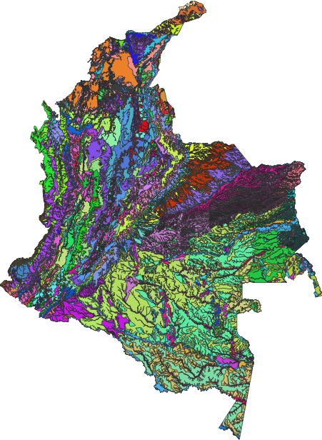
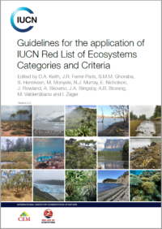
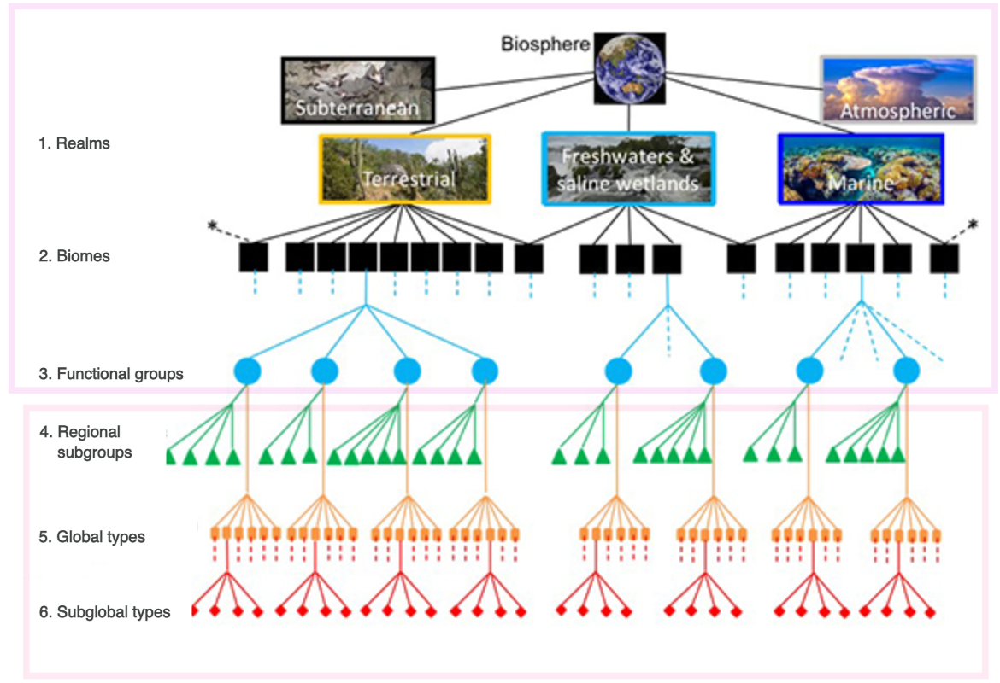
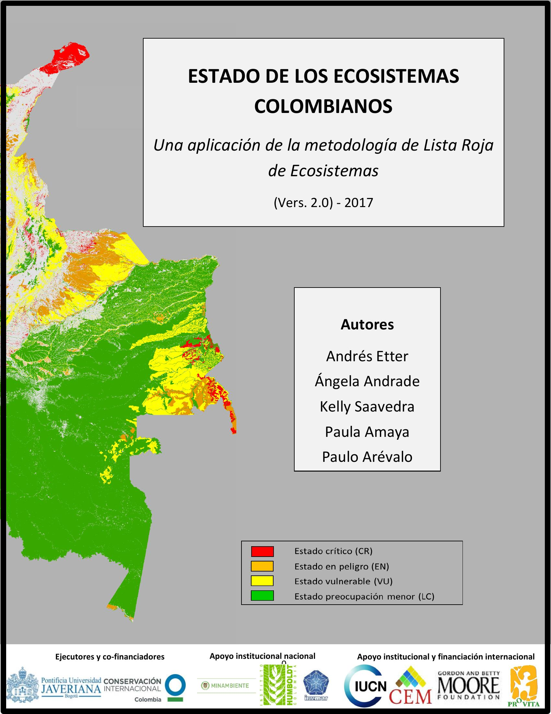
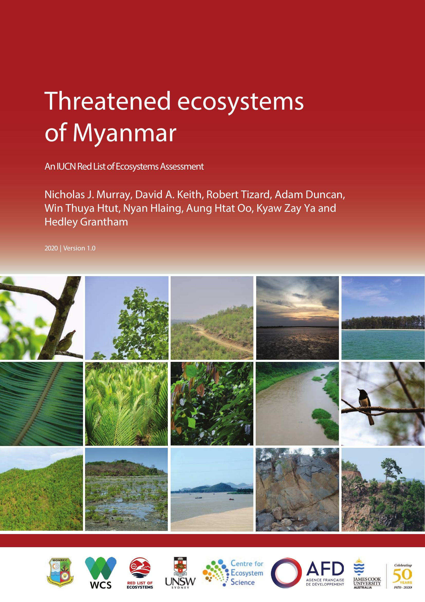
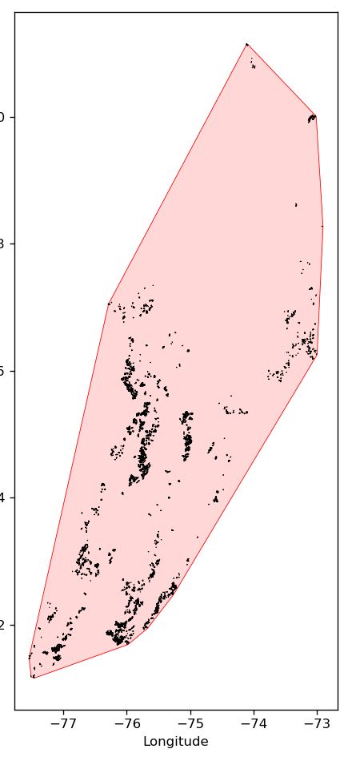
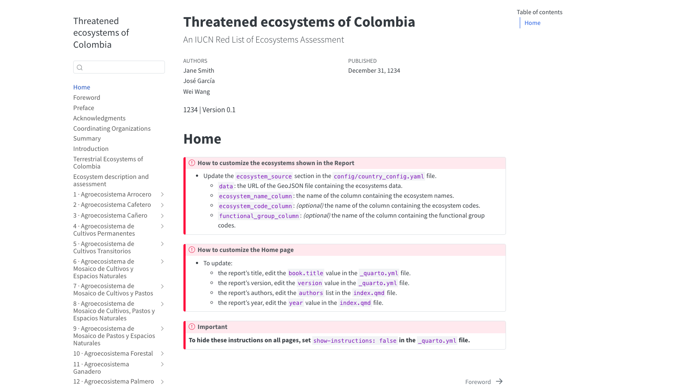
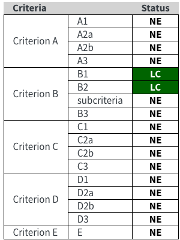

## {#slide-speaker}

::: {.absolute left=180 top=230}
::: {.a-rise .avatar}
{width=420 fig-alt="Tyler Erickson"}
:::
:::

::: {.absolute left=720 top=270 width=800}
[Tyler Erickson]{.statement .a-rise style="--d:0.2s"}

[[VorGeo]{.hl} · Founder]{.statement-sub .a-rise style="--d:0.4s"}

[[Radiant Earth]{.hl} · CTO]{.statement-sub .a-rise style="--d:0.6s"}

::: {.a-fade style="--d:1s"}
[linkedin.com/in/tylere](https://www.linkedin.com/in/tylere){.mono}

[github.com/tylere](https://github.com/tylere){.mono}

[analyze.earth](https://www.analyze.earth){.mono}
:::
:::


## {#slide-ecosystems}

```{=html}
<svg class="canvas eco side" viewBox="0 0 1600 900" aria-label="Ecosystem from night to dawn, day and dusk: eyes glow in the dark, then rows of trees grow toward distant mountains around a pond; the sun arcs overhead, lightning fells a tree, a beaver builds a dam, animals peek out, a deer drinks, a skunk walks by and a fish jumps">
  <defs>
    <linearGradient id="side-ground" x1="0" y1="0" x2="0" y2="1">
      <stop offset="0" stop-color="#26412d"/><stop offset="1" stop-color="#3e6d3b"/>
    </linearGradient>
    <radialGradient id="side-sun">
      <stop offset="0.45" stop-color="#FFD626" stop-opacity="0.45"/><stop offset="1" stop-color="#FFD626" stop-opacity="0"/>
    </radialGradient>
    <radialGradient id="side-water" cx="0.45" cy="0.4" r="0.6">
      <stop offset="0" stop-color="#3b84b5"/><stop offset="1" stop-color="#1f557c"/>
    </radialGradient>
  </defs>
  <defs>
    <radialGradient id="side-glow">
      <stop offset="0" stop-color="#ff9a4a" stop-opacity="0.55"/><stop offset="1" stop-color="#ff9a4a" stop-opacity="0"/>
    </radialGradient>
  </defs>
<rect class="daysky" x="-320" y="-260" width="2240" height="900"/>
<ellipse class="glow dawn" cx="60" cy="560" rx="900" ry="360" fill="url(#side-glow)"/>
<ellipse class="glow dusk" cx="1540" cy="560" rx="900" ry="360" fill="url(#side-glow)"/>
<g class="sun"><circle cx="800" cy="70" r="95" fill="url(#side-sun)"/><circle cx="800" cy="70" r="46" fill="#FFD626"/></g>
<g transform="translate(0 250)"><g class="cloud" style="--t:150s; --d:-30s; opacity:0.85"><g transform="scale(0.9)"><ellipse cx="0" cy="0" rx="70" ry="20" fill="#c9d0d8"/><circle cx="-30" cy="-12" r="26" fill="#e3e8ee"/><circle cx="8" cy="-24" r="32" fill="#e3e8ee"/><circle cx="42" cy="-8" r="22" fill="#e3e8ee"/><ellipse cx="0" cy="-4" rx="66" ry="16" fill="#e3e8ee"/></g></g></g>
<g transform="translate(0 330)"><g class="cloud" style="--t:115s; --d:-80s; opacity:0.85"><g transform="scale(0.65)"><ellipse cx="0" cy="0" rx="70" ry="20" fill="#c9d0d8"/><circle cx="-30" cy="-12" r="26" fill="#e3e8ee"/><circle cx="8" cy="-24" r="32" fill="#e3e8ee"/><circle cx="42" cy="-8" r="22" fill="#e3e8ee"/><ellipse cx="0" cy="-4" rx="66" ry="16" fill="#e3e8ee"/></g></g></g>
<g transform="translate(0 385)"><g class="cloud" style="--t:175s; --d:-130s; opacity:0.85"><g transform="scale(0.8)"><ellipse cx="0" cy="0" rx="70" ry="20" fill="#c9d0d8"/><circle cx="-30" cy="-12" r="26" fill="#e3e8ee"/><circle cx="8" cy="-24" r="32" fill="#e3e8ee"/><circle cx="42" cy="-8" r="22" fill="#e3e8ee"/><ellipse cx="0" cy="-4" rx="66" ry="16" fill="#e3e8ee"/></g></g></g>
<g transform="translate(0 290)"><g class="cloud" style="--t:130s; --d:-50s; opacity:0.85"><g transform="scale(0.55)"><ellipse cx="0" cy="0" rx="70" ry="20" fill="#c9d0d8"/><circle cx="-30" cy="-12" r="26" fill="#e3e8ee"/><circle cx="8" cy="-24" r="32" fill="#e3e8ee"/><circle cx="42" cy="-8" r="22" fill="#e3e8ee"/><ellipse cx="0" cy="-4" rx="66" ry="16" fill="#e3e8ee"/></g></g></g>
<g class="bird-fly rtl" style="--d:18.3s; --t:93s; --y:227px"><g class="bob" style="--b:3.0s; --bob:15px"><g transform="translate(0.0 0.0)"><g class="flap" style="animation-duration:0.42s; animation-delay:-0.10s"><path class="bird" d="M-17.6 0 Q-8.8 -9.5 0 0 Q8.8 -9.5 17.6 0"/></g></g><g transform="translate(-38.3 0.6)"><g class="flap" style="animation-duration:0.42s; animation-delay:-0.31s"><path class="bird" d="M-18.6 0 Q-9.3 -10.0 0 0 Q9.3 -10.0 18.6 0"/></g></g></g></g>
<g class="bird-fly rtl" style="--d:16.1s; --t:65s; --y:228px"><g class="bob" style="--b:3.1s; --bob:12px"><g transform="translate(0.0 0.0)"><g class="flap" style="animation-duration:0.51s; animation-delay:-0.10s"><path class="bird" d="M-25.4 0 Q-12.7 -13.7 0 0 Q12.7 -13.7 25.4 0"/></g></g><g transform="translate(-51.7 -9.9)"><g class="flap" style="animation-duration:0.46s; animation-delay:-0.24s"><path class="bird" d="M-25.0 0 Q-12.5 -13.5 0 0 Q12.5 -13.5 25.0 0"/></g></g></g></g>
<g class="bird-fly" style="--d:41.9s; --t:79s; --y:271px"><g class="bob" style="--b:4.1s; --bob:13px"><g transform="translate(0.0 0.0)"><g class="flap" style="animation-duration:0.39s; animation-delay:-0.44s"><path class="bird" d="M-21.6 0 Q-10.8 -11.6 0 0 Q10.8 -11.6 21.6 0"/></g></g><g transform="translate(-38.8 10.2)"><g class="flap" style="animation-duration:0.41s; animation-delay:-0.02s"><path class="bird" d="M-22.6 0 Q-11.3 -12.2 0 0 Q11.3 -12.2 22.6 0"/></g></g><g transform="translate(-73.3 6.8)"><g class="flap" style="animation-duration:0.41s; animation-delay:-0.05s"><path class="bird" d="M-25.9 0 Q-12.9 -14.0 0 0 Q12.9 -14.0 25.9 0"/></g></g></g></g>
<g class="bird-fly" style="--d:10.3s; --t:67s; --y:262px"><g class="bob" style="--b:3.4s; --bob:12px"><g transform="translate(0.0 0.0)"><g class="flap" style="animation-duration:0.35s; animation-delay:-0.45s"><path class="bird" d="M-19.2 0 Q-9.6 -10.4 0 0 Q9.6 -10.4 19.2 0"/></g></g><g transform="translate(-77.4 -13.2)"><g class="flap" style="animation-duration:0.48s; animation-delay:-0.02s"><path class="bird" d="M-21.9 0 Q-11.0 -11.8 0 0 Q11.0 -11.8 21.9 0"/></g></g></g></g>
<polygon points="-320.0,470.0 -180.0,410.0 -60.0,470.0 90.0,395.0 230.0,455.0 370.0,380.0 520.0,445.0 690.0,410.0 850.0,470.0 1010.0,385.0 1160.0,440.0 1300.0,375.0 1450.0,430.0 1600.0,400.0 1740.0,455.0 1920.0,405.0 1920.0,600.0 -320.0,600.0" fill="#404a55"/>
<polygon points="-180.0,410.0 -146.4,426.8 -174.0,432.0 -188.0,426.0 -219.2,426.8" fill="#8b9197"/>
<polygon points="90.0,395.0 129.2,411.8 96.0,417.0 82.0,411.0 48.0,416.0" fill="#8b9197"/>
<polygon points="370.0,380.0 412.0,398.2 376.0,402.0 362.0,396.0 330.8,401.0" fill="#8b9197"/>
<polygon points="690.0,410.0 734.8,426.8 696.0,432.0 682.0,426.0 642.4,419.8" fill="#8b9197"/>
<polygon points="1010.0,385.0 1052.0,400.4 1016.0,407.0 1002.0,401.0 965.2,408.8" fill="#8b9197"/>
<polygon points="1300.0,375.0 1342.0,390.4 1306.0,397.0 1292.0,391.0 1260.8,393.2" fill="#8b9197"/>
<polygon points="1600.0,400.0 1639.2,415.4 1606.0,422.0 1592.0,416.0 1558.0,408.4" fill="#8b9197"/>
<path d="M-320 600 L-320 530 Q-150 480 -20 540 Q120 470 300 525 Q470 575 640 520 Q820 465 1000 530 Q1180 585 1350 515 Q1500 470 1620 520 Q1760 565 1920 505 L1920 600 Z" fill="#284031"/>
<rect x="-320" y="585" width="2240" height="515" fill="url(#side-ground)"/>
<polygon points="339.0,546.3 296.8,574.0 367.4,601.1 333.2,633.6 437.0,664.7 535.7,708.1 544.3,687.9 443.0,647.3 342.8,622.4 376.6,594.9 303.2,570.0 341.0,549.7" fill="#2f6f9e"/>
<polyline class="flow" points="340.0,548.0 300.0,572.0 372.0,598.0 338.0,628.0 440.0,656.0 540.0,698.0" stroke="#7fc0ea" stroke-width="2.5" fill="none" stroke-linejoin="round"/>
<path d="M1069.3 822.5 L1072.3 813.6 M1075.3 822.5 L1075.3 810.6 M1081.3 822.5 L1078.3 813.6" stroke="#689952" stroke-width="2.2"/>
<path d="M1454.3 882.7 L1457.8 872.3 M1461.2 882.7 L1461.2 868.9 M1468.2 882.7 L1464.7 872.3" stroke="#6da055" stroke-width="2.6"/>
<path d="M1330.5 876.7 L1334.0 866.5 M1337.4 876.7 L1337.4 863.0 M1344.2 876.7 L1340.8 866.5" stroke="#6da054" stroke-width="2.6"/>
<path d="M-259.7 739.7 L-257.3 732.7 M-255.0 739.7 L-255.0 730.4 M-250.4 739.7 L-252.7 732.7" stroke="#618e4f" stroke-width="1.7"/>
<path d="M1787.6 794.7 L1790.4 786.4 M1793.1 794.7 L1793.1 783.7 M1798.6 794.7 L1795.9 786.4" stroke="#669551" stroke-width="2.1"/>
<path d="M1695.1 634.0 L1696.5 629.5 M1698.0 634.0 L1698.0 628.1 M1701.0 634.0 L1699.5 629.5" stroke="#59804a" stroke-width="1.1"/>
<path d="M892.9 772.2 L895.4 764.4 M898.0 772.2 L898.0 761.9 M903.2 772.2 L900.6 764.4" stroke="#649250" stroke-width="1.9"/>
<path d="M-294.1 665.0 L-292.3 659.9 M-290.6 665.0 L-290.6 658.1 M-287.2 665.0 L-288.9 659.9" stroke="#5b844b" stroke-width="1.3"/>
<path d="M299.2 874.9 L302.6 864.7 M306.0 874.9 L306.0 861.3 M312.8 874.9 L309.4 864.7" stroke="#6c9f54" stroke-width="2.5"/>
<path d="M1392.1 647.9 L1393.6 643.1 M1395.2 647.9 L1395.2 641.5 M1398.4 647.9 L1396.8 643.1" stroke="#5a824b" stroke-width="1.2"/>
<path d="M1462.5 641.6 L1464.1 637.0 M1465.6 641.6 L1465.6 635.5 M1468.7 641.6 L1467.1 637.0" stroke="#59814a" stroke-width="1.1"/>
<path d="M1060.1 638.0 L1061.6 633.5 M1063.1 638.0 L1063.1 632.0 M1066.1 638.0 L1064.6 633.5" stroke="#59814a" stroke-width="1.1"/>
<path d="M-322.6 861.4 L-319.3 851.5 M-316.0 861.4 L-316.0 848.3 M-309.4 861.4 L-312.7 851.5" stroke="#6b9e54" stroke-width="2.5"/>
<path d="M145.7 664.6 L147.5 659.5 M149.2 664.6 L149.2 657.8 M152.6 664.6 L150.9 659.5" stroke="#5b844b" stroke-width="1.3"/>
<path d="M1874.0 861.7 L1877.3 851.8 M1880.6 861.7 L1880.6 848.5 M1887.2 861.7 L1883.9 851.8" stroke="#6b9e54" stroke-width="2.5"/>
<path d="M321.0 888.4 L324.5 877.9 M328.0 888.4 L328.0 874.4 M335.1 888.4 L331.6 877.9" stroke="#6ea155" stroke-width="2.6"/>
<path d="M882.2 803.3 L885.0 794.9 M887.9 803.3 L887.9 792.0 M893.5 803.3 L890.7 794.9" stroke="#679651" stroke-width="2.1"/>
<path d="M131.8 882.3 L135.2 871.9 M138.7 882.3 L138.7 868.5 M145.6 882.3 L142.2 871.9" stroke="#6da055" stroke-width="2.6"/>
<path d="M1220.0 890.0 L1223.5 879.4 M1227.0 890.0 L1227.0 875.9 M1234.1 890.0 L1230.6 879.4" stroke="#6ea155" stroke-width="2.6"/>
<path d="M1678.1 689.6 L1680.1 683.9 M1682.0 689.6 L1682.0 682.0 M1685.8 689.6 L1683.9 683.9" stroke="#5d884c" stroke-width="1.4"/>
<path d="M485.9 649.8 L487.5 645.0 M489.1 649.8 L489.1 643.4 M492.3 649.8 L490.7 645.0" stroke="#5a824b" stroke-width="1.2"/>
<path d="M3.7 619.5 L5.0 615.5 M6.4 619.5 L6.4 614.1 M9.1 619.5 L7.7 615.5" stroke="#587f49" stroke-width="1.0"/>
<path d="M349.7 780.9 L352.4 773.0 M355.0 780.9 L355.0 770.3 M360.3 780.9 L357.7 773.0" stroke="#659350" stroke-width="2.0"/>
<path d="M-318.1 803.4 L-315.2 794.9 M-312.4 803.4 L-312.4 792.1 M-306.8 803.4 L-309.6 794.9" stroke="#679651" stroke-width="2.1"/>
<path d="M433.0 693.0 L434.9 687.2 M436.9 693.0 L436.9 685.2 M440.8 693.0 L438.8 687.2" stroke="#5e884d" stroke-width="1.5"/>
<path d="M1508.8 744.2 L1511.1 737.2 M1513.5 744.2 L1513.5 734.8 M1518.2 744.2 L1515.8 737.2" stroke="#628f4f" stroke-width="1.8"/>
<path d="M382.7 744.4 L385.0 737.3 M387.4 744.4 L387.4 734.9 M392.1 744.4 L389.7 737.3" stroke="#628f4f" stroke-width="1.8"/>
<path d="M1255.8 617.1 L1257.1 613.1 M1258.5 617.1 L1258.5 611.8 M1261.1 617.1 L1259.8 613.1" stroke="#577e49" stroke-width="1.0"/>
<path d="M1861.7 606.9 L1863.0 603.1 M1864.2 606.9 L1864.2 601.8 M1866.7 606.9 L1865.5 603.1" stroke="#567d49" stroke-width="0.9"/>
<path d="M1353.1 853.5 L1356.3 843.8 M1359.5 853.5 L1359.5 840.6 M1366.0 853.5 L1362.8 843.8" stroke="#6b9d53" stroke-width="2.4"/>
<path d="M-285.7 836.3 L-282.6 827.0 M-279.5 836.3 L-279.5 824.0 M-273.3 836.3 L-276.4 827.0" stroke="#699a53" stroke-width="2.3"/>
<path d="M495.1 773.6 L497.7 765.8 M500.3 773.6 L500.3 763.2 M505.4 773.6 L502.8 765.8" stroke="#649250" stroke-width="1.9"/>
<path d="M-302.3 614.0 L-301.0 610.1 M-299.7 614.0 L-299.7 608.8 M-297.0 614.0 L-298.4 610.1" stroke="#577e49" stroke-width="1.0"/>
<path d="M78.3 886.6 L81.8 876.1 M85.3 886.6 L85.3 872.6 M92.2 886.6 L88.8 876.1" stroke="#6da155" stroke-width="2.6"/>
<path d="M114.2 826.7 L117.2 817.7 M120.2 826.7 L120.2 814.7 M126.2 826.7 L123.2 817.7" stroke="#689952" stroke-width="2.3"/>
<path d="M1755.5 882.6 L1759.0 872.2 M1762.4 882.6 L1762.4 868.8 M1769.3 882.6 L1765.9 872.2" stroke="#6da055" stroke-width="2.6"/>
<path d="M447.3 706.4 L449.4 700.3 M451.4 706.4 L451.4 698.2 M455.5 706.4 L453.5 700.3" stroke="#5f8a4d" stroke-width="1.5"/>
<path d="M849.2 832.7 L852.3 823.5 M855.3 832.7 L855.3 820.4 M861.5 832.7 L858.4 823.5" stroke="#699a53" stroke-width="2.3"/>
<path d="M-84.0 824.5 L-81.0 815.5 M-78.0 824.5 L-78.0 812.5 M-72.0 824.5 L-75.0 815.5" stroke="#689952" stroke-width="2.2"/>
<path d="M1459.3 857.9 L1462.5 848.1 M1465.8 857.9 L1465.8 844.9 M1472.3 857.9 L1469.1 848.1" stroke="#6b9d54" stroke-width="2.4"/>
<path d="M-244.9 883.7 L-241.4 873.3 M-237.9 883.7 L-237.9 869.9 M-231.0 883.7 L-234.5 873.3" stroke="#6da055" stroke-width="2.6"/>
<path d="M-119.8 702.2 L-117.8 696.2 M-115.8 702.2 L-115.8 694.2 M-111.7 702.2 L-113.7 696.2" stroke="#5e894d" stroke-width="1.5"/>
<path d="M1041.4 875.4 L1044.9 865.2 M1048.3 875.4 L1048.3 861.8 M1055.1 875.4 L1051.7 865.2" stroke="#6c9f54" stroke-width="2.6"/>
<path d="M434.7 877.3 L438.1 867.0 M441.5 877.3 L441.5 863.6 M448.3 877.3 L444.9 867.0" stroke="#6da055" stroke-width="2.6"/>
<path d="M386.4 653.2 L388.0 648.4 M389.6 653.2 L389.6 646.7 M392.9 653.2 L391.3 648.4" stroke="#5a834b" stroke-width="1.2"/>
<path d="M-148.0 644.7 L-146.4 640.0 M-144.8 644.7 L-144.8 638.4 M-141.7 644.7 L-143.3 640.0" stroke="#5a824b" stroke-width="1.2"/>
<path d="M1216.6 899.0 L1220.2 888.2 M1223.8 899.0 L1223.8 884.6 M1230.9 899.0 L1227.3 888.2" stroke="#6ea255" stroke-width="2.7"/>
<path d="M39.2 614.6 L40.5 610.6 M41.8 614.6 L41.8 609.3 M44.5 614.6 L43.1 610.6" stroke="#577e49" stroke-width="1.0"/>
<path d="M1885.2 760.1 L1887.7 752.6 M1890.2 760.1 L1890.2 750.1 M1895.2 760.1 L1892.7 752.6" stroke="#63914f" stroke-width="1.9"/>
<path d="M1004.1 847.9 L1007.3 838.3 M1010.5 847.9 L1010.5 835.2 M1016.8 847.9 L1013.7 838.3" stroke="#6a9c53" stroke-width="2.4"/>
<path d="M-202.0 874.8 L-198.6 864.6 M-195.2 874.8 L-195.2 861.2 M-188.4 874.8 L-191.8 864.6" stroke="#6c9f54" stroke-width="2.5"/>
<path d="M-251.5 748.1 L-249.1 740.9 M-246.7 748.1 L-246.7 738.5 M-241.9 748.1 L-244.3 740.9" stroke="#628f4f" stroke-width="1.8"/>
<path d="M1555.1 639.2 L1556.6 634.6 M1558.1 639.2 L1558.1 633.1 M1561.1 639.2 L1559.6 634.6" stroke="#59814a" stroke-width="1.1"/>
<path d="M1312.0 884.9 L1315.4 874.5 M1318.9 884.9 L1318.9 871.0 M1325.9 884.9 L1322.4 874.5" stroke="#6da155" stroke-width="2.6"/>
<path d="M1085.9 836.4 L1089.0 827.1 M1092.1 836.4 L1092.1 824.0 M1098.3 836.4 L1095.2 827.1" stroke="#699a53" stroke-width="2.3"/>
<path d="M-85.6 730.4 L-83.4 723.6 M-81.1 730.4 L-81.1 721.4 M-76.7 730.4 L-78.9 723.6" stroke="#618d4e" stroke-width="1.7"/>
<path d="M7.9 853.4 L11.1 843.7 M14.3 853.4 L14.3 840.5 M20.8 853.4 L17.5 843.7" stroke="#6b9d53" stroke-width="2.4"/>
<path d="M335.8 735.9 L338.1 729.1 M340.4 735.9 L340.4 726.8 M345.0 735.9 L342.7 729.1" stroke="#618e4e" stroke-width="1.7"/>
<path d="M1911.9 855.7 L1915.2 845.9 M1918.4 855.7 L1918.4 842.7 M1924.9 855.7 L1921.7 845.9" stroke="#6b9d54" stroke-width="2.4"/>
<path d="M1861.7 736.1 L1864.0 729.2 M1866.3 736.1 L1866.3 726.9 M1870.8 736.1 L1868.5 729.2" stroke="#618e4e" stroke-width="1.7"/>
<path d="M767.6 818.9 L770.5 810.0 M773.5 818.9 L773.5 807.0 M779.4 818.9 L776.4 810.0" stroke="#689852" stroke-width="2.2"/>
<path d="M581.4 644.0 L582.9 639.3 M584.5 644.0 L584.5 637.7 M587.6 644.0 L586.0 639.3" stroke="#5a824a" stroke-width="1.2"/>
<path d="M517.3 896.5 L520.9 885.8 M524.5 896.5 L524.5 882.2 M531.6 896.5 L528.1 885.8" stroke="#6ea255" stroke-width="2.7"/>
<path d="M1824.6 788.1 L1827.3 780.0 M1830.0 788.1 L1830.0 777.3 M1835.4 788.1 L1832.7 780.0" stroke="#659451" stroke-width="2.0"/>
<path d="M-124.0 681.7 L-122.2 676.1 M-120.3 681.7 L-120.3 674.3 M-116.6 681.7 L-118.5 676.1" stroke="#5d874c" stroke-width="1.4"/>
<path d="M1425.2 860.2 L1428.4 850.4 M1431.7 860.2 L1431.7 847.1 M1438.3 860.2 L1435.0 850.4" stroke="#6b9d54" stroke-width="2.5"/>
<path d="M483.2 835.8 L486.3 826.5 M489.4 835.8 L489.4 823.5 M495.5 835.8 L492.5 826.5" stroke="#699a53" stroke-width="2.3"/>
<path d="M1410.0 808.4 L1412.9 799.8 M1415.8 808.4 L1415.8 796.9 M1421.5 808.4 L1418.6 799.8" stroke="#679752" stroke-width="2.2"/>
<path d="M1161.4 827.9 L1164.4 818.8 M1167.4 827.9 L1167.4 815.8 M1173.4 827.9 L1170.4 818.8" stroke="#699952" stroke-width="2.3"/>
<path d="M488.3 811.3 L491.2 802.7 M494.1 811.3 L494.1 799.8 M499.9 811.3 L497.0 802.7" stroke="#679752" stroke-width="2.2"/>
<path d="M304.4 745.7 L306.7 738.6 M309.1 745.7 L309.1 736.2 M313.8 745.7 L311.5 738.6" stroke="#628f4f" stroke-width="1.8"/>
<path d="M1398.5 807.3 L1401.4 798.7 M1404.2 807.3 L1404.2 795.8 M1410.0 807.3 L1407.1 798.7" stroke="#679752" stroke-width="2.1"/>
<path d="M331.3 883.7 L334.8 873.3 M338.2 883.7 L338.2 869.8 M345.2 883.7 L341.7 873.3" stroke="#6da055" stroke-width="2.6"/>
<path d="M1130.1 774.2 L1132.7 766.4 M1135.3 774.2 L1135.3 763.8 M1140.5 774.2 L1137.9 766.4" stroke="#649250" stroke-width="1.9"/>
<path d="M-299.1 764.1 L-296.6 756.6 M-294.1 764.1 L-294.1 754.0 M-289.0 764.1 L-291.5 756.6" stroke="#639150" stroke-width="1.9"/>
<path d="M235.9 801.5 L238.7 793.1 M241.6 801.5 L241.6 790.2 M247.2 801.5 L244.4 793.1" stroke="#669651" stroke-width="2.1"/>
<path d="M710.7 845.0 L713.8 835.5 M717.0 845.0 L717.0 832.4 M723.3 845.0 L720.1 835.5" stroke="#6a9b53" stroke-width="2.4"/>
<path d="M1124.0 839.3 L1127.1 829.9 M1130.3 839.3 L1130.3 826.8 M1136.5 839.3 L1133.4 829.9" stroke="#6a9b53" stroke-width="2.3"/>
<path d="M453.8 793.2 L456.5 785.0 M459.3 793.2 L459.3 782.2 M464.8 793.2 L462.0 785.0" stroke="#669551" stroke-width="2.1"/>
<path d="M1326.4 848.5 L1329.5 838.9 M1332.7 848.5 L1332.7 835.7 M1339.1 848.5 L1335.9 838.9" stroke="#6a9c53" stroke-width="2.4"/>
<path d="M457.7 852.9 L460.9 843.2 M464.1 852.9 L464.1 840.0 M470.5 852.9 L467.3 843.2" stroke="#6b9c53" stroke-width="2.4"/>
<path d="M1622.9 806.5 L1625.7 797.9 M1628.6 806.5 L1628.6 795.1 M1634.3 806.5 L1631.5 797.9" stroke="#679751" stroke-width="2.1"/>
<path d="M1859.5 887.0 L1863.0 876.5 M1866.5 887.0 L1866.5 873.0 M1873.5 887.0 L1870.0 876.5" stroke="#6da155" stroke-width="2.6"/>
<path d="M45.8 851.0 L49.0 841.4 M52.2 851.0 L52.2 838.2 M58.6 851.0 L55.4 841.4" stroke="#6a9c53" stroke-width="2.4"/>
<path d="M1775.0 743.2 L1777.4 736.1 M1779.7 743.2 L1779.7 733.8 M1784.4 743.2 L1782.1 736.1" stroke="#628e4f" stroke-width="1.8"/>
<path d="M1222.9 815.9 L1225.9 807.1 M1228.8 815.9 L1228.8 804.2 M1234.6 815.9 L1231.7 807.1" stroke="#689852" stroke-width="2.2"/>
<path d="M1312.8 651.5 L1314.4 646.7 M1316.0 651.5 L1316.0 645.1 M1319.2 651.5 L1317.6 646.7" stroke="#5a834b" stroke-width="1.2"/>
<path d="M1422.8 774.3 L1425.4 766.5 M1428.0 774.3 L1428.0 763.9 M1433.2 774.3 L1430.6 766.5" stroke="#649250" stroke-width="1.9"/>
<path d="M1166.4 726.2 L1168.6 719.6 M1170.8 726.2 L1170.8 717.4 M1175.3 726.2 L1173.1 719.6" stroke="#608c4e" stroke-width="1.7"/>
<path d="M1071.1 832.4 L1074.1 823.2 M1077.2 832.4 L1077.2 820.2 M1083.3 832.4 L1080.2 823.2" stroke="#699a53" stroke-width="2.3"/>
<path d="M1100.7 816.1 L1103.7 807.3 M1106.6 816.1 L1106.6 804.4 M1112.4 816.1 L1109.5 807.3" stroke="#689852" stroke-width="2.2"/>
<path d="M-261.3 648.0 L-259.7 643.3 M-258.1 648.0 L-258.1 641.7 M-255.0 648.0 L-256.5 643.3" stroke="#5a824b" stroke-width="1.2"/>
<path d="M662.5 795.0 L665.2 786.8 M668.0 795.0 L668.0 784.0 M673.5 795.0 L670.8 786.8" stroke="#669551" stroke-width="2.1"/>
<path d="M165.0 805.8 L167.8 797.2 M170.6 805.8 L170.6 794.4 M176.3 805.8 L173.5 797.2" stroke="#679651" stroke-width="2.1"/>
<path d="M1090.5 612.6 L1091.8 608.7 M1093.1 612.6 L1093.1 607.4 M1095.7 612.6 L1094.4 608.7" stroke="#577e49" stroke-width="1.0"/>
<path d="M-201.8 640.1 L-200.2 635.5 M-198.7 640.1 L-198.7 634.0 M-195.7 640.1 L-197.2 635.5" stroke="#59814a" stroke-width="1.1"/>
<path d="M387.6 654.5 L389.2 649.6 M390.9 654.5 L390.9 647.9 M394.1 654.5 L392.5 649.6" stroke="#5a834b" stroke-width="1.2"/>
<path d="M110.6 610.7 L111.8 606.8 M113.1 610.7 L113.1 605.6 M115.7 610.7 L114.4 606.8" stroke="#577d49" stroke-width="1.0"/>
<path d="M1045.2 777.0 L1047.8 769.2 M1050.4 777.0 L1050.4 766.6 M1055.7 777.0 L1053.0 769.2" stroke="#649350" stroke-width="2.0"/>
<path d="M206.0 871.0 L209.4 860.9 M212.8 871.0 L212.8 857.5 M219.5 871.0 L216.1 860.9" stroke="#6c9f54" stroke-width="2.5"/>
<path d="M-322.9 721.6 L-320.7 715.1 M-318.5 721.6 L-318.5 712.9 M-314.2 721.6 L-316.3 715.1" stroke="#608c4e" stroke-width="1.6"/>
<path d="M299.5 723.0 L301.7 716.5 M303.9 723.0 L303.9 714.3 M308.3 723.0 L306.1 716.5" stroke="#608c4e" stroke-width="1.6"/>
<path d="M-68.6 849.4 L-65.4 839.8 M-62.2 849.4 L-62.2 836.6 M-55.8 849.4 L-59.0 839.8" stroke="#6a9c53" stroke-width="2.4"/>
<path d="M514.9 610.8 L516.2 607.0 M517.5 610.8 L517.5 605.7 M520.1 610.8 L518.8 607.0" stroke="#577d49" stroke-width="1.0"/>
<path d="M1051.5 628.4 L1053.0 624.2 M1054.4 628.4 L1054.4 622.7 M1057.2 628.4 L1055.8 624.2" stroke="#58804a" stroke-width="1.1"/>
<path d="M974.2 887.5 L977.7 877.0 M981.2 887.5 L981.2 873.5 M988.2 887.5 L984.7 877.0" stroke="#6da155" stroke-width="2.6"/>
<path d="M1509.1 725.7 L1511.3 719.1 M1513.5 725.7 L1513.5 716.9 M1517.9 725.7 L1515.7 719.1" stroke="#608c4e" stroke-width="1.7"/>
<path d="M1495.6 792.7 L1498.4 784.5 M1501.1 792.7 L1501.1 781.7 M1506.6 792.7 L1503.8 784.5" stroke="#669551" stroke-width="2.1"/>
<path d="M504.5 642.6 L506.0 638.0 M507.6 642.6 L507.6 636.5 M510.6 642.6 L509.1 638.0" stroke="#59824a" stroke-width="1.2"/>
<path d="M1009.8 769.2 L1012.3 761.5 M1014.9 769.2 L1014.9 758.9 M1020.0 769.2 L1017.5 761.5" stroke="#649250" stroke-width="1.9"/>
<path d="M1817.1 890.4 L1820.6 879.8 M1824.2 890.4 L1824.2 876.3 M1831.2 890.4 L1827.7 879.8" stroke="#6ea155" stroke-width="2.6"/>
<path d="M1679.0 600.3 L1680.2 596.7 M1681.4 600.3 L1681.4 595.5 M1683.8 600.3 L1682.6 596.7" stroke="#567c49" stroke-width="0.9"/>
<path d="M-83.4 769.7 L-80.8 762.1 M-78.3 769.7 L-78.3 759.5 M-73.1 769.7 L-75.7 762.1" stroke="#649250" stroke-width="1.9"/>
<path d="M1054.9 642.2 L1056.4 637.6 M1058.0 642.2 L1058.0 636.1 M1061.1 642.2 L1059.5 637.6" stroke="#59824a" stroke-width="1.2"/>
<path d="M1083.3 867.4 L1086.6 857.4 M1090.0 867.4 L1090.0 854.0 M1096.7 867.4 L1093.3 857.4" stroke="#6c9e54" stroke-width="2.5"/>
<path d="M183.2 687.4 L185.1 681.7 M187.0 687.4 L187.0 679.9 M190.8 687.4 L188.9 681.7" stroke="#5d874c" stroke-width="1.4"/>
<path d="M1854.1 713.9 L1856.2 707.6 M1858.3 713.9 L1858.3 705.5 M1862.5 713.9 L1860.4 707.6" stroke="#5f8b4d" stroke-width="1.6"/>
<path d="M1826.2 874.1 L1829.6 863.9 M1833.0 874.1 L1833.0 860.6 M1839.7 874.1 L1836.3 863.9" stroke="#6c9f54" stroke-width="2.5"/>
<path d="M1872.6 748.9 L1875.0 741.7 M1877.4 748.9 L1877.4 739.3 M1882.2 748.9 L1879.8 741.7" stroke="#628f4f" stroke-width="1.8"/>
<path d="M1880.0 747.5 L1882.4 740.4 M1884.8 747.5 L1884.8 738.0 M1889.5 747.5 L1887.2 740.4" stroke="#628f4f" stroke-width="1.8"/>
<path d="M316.8 743.1 L319.2 736.0 M321.5 743.1 L321.5 733.7 M326.2 743.1 L323.9 736.0" stroke="#628e4f" stroke-width="1.8"/>
<path d="M-52.4 786.5 L-49.7 778.4 M-47.0 786.5 L-47.0 775.7 M-41.6 786.5 L-44.3 778.4" stroke="#659451" stroke-width="2.0"/>
<path d="M1424.7 848.0 L1427.8 838.5 M1431.0 848.0 L1431.0 835.3 M1437.4 848.0 L1434.2 838.5" stroke="#6a9c53" stroke-width="2.4"/>
<path d="M-295.4 759.8 L-292.9 752.3 M-290.4 759.8 L-290.4 749.9 M-285.5 759.8 L-287.9 752.3" stroke="#63914f" stroke-width="1.9"/>
<path d="M286.4 880.6 L289.8 870.2 M293.3 880.6 L293.3 866.8 M300.2 880.6 L296.7 870.2" stroke="#6da055" stroke-width="2.6"/>
<path d="M1427.9 673.7 L1429.7 668.3 M1431.5 673.7 L1431.5 666.5 M1435.1 673.7 L1433.3 668.3" stroke="#5c864c" stroke-width="1.3"/>
<path d="M276.5 646.4 L278.1 641.7 M279.6 646.4 L279.6 640.1 M282.8 646.4 L281.2 641.7" stroke="#5a824b" stroke-width="1.2"/>
<path d="M1891.2 688.0 L1893.1 682.2 M1895.0 688.0 L1895.0 680.3 M1898.8 688.0 L1896.9 682.2" stroke="#5d874c" stroke-width="1.4"/>
<path d="M1119.2 781.2 L1121.9 773.2 M1124.5 781.2 L1124.5 770.6 M1129.8 781.2 L1127.2 773.2" stroke="#659350" stroke-width="2.0"/>
<path d="M1342.4 635.5 L1343.9 631.0 M1345.4 635.5 L1345.4 629.5 M1348.3 635.5 L1346.9 631.0" stroke="#59814a" stroke-width="1.1"/>
<path d="M1379.4 690.2 L1381.4 684.4 M1383.3 690.2 L1383.3 682.5 M1387.1 690.2 L1385.2 684.4" stroke="#5d884c" stroke-width="1.4"/>
<path d="M339.9 759.0 L342.4 751.5 M344.9 759.0 L344.9 749.1 M349.8 759.0 L347.4 751.5" stroke="#63904f" stroke-width="1.9"/>
<g transform="translate(993.5 300)"><g class="storm"><path class="rain" style="animation-delay:-0.43s" d="M-60.0 20 l-4 14" stroke="#9fb4c8" stroke-width="2" stroke-linecap="round"/><path class="rain" style="animation-delay:-0.21s" d="M-46.0 20 l-4 14" stroke="#9fb4c8" stroke-width="2" stroke-linecap="round"/><path class="rain" style="animation-delay:-0.36s" d="M-32.0 20 l-4 14" stroke="#9fb4c8" stroke-width="2" stroke-linecap="round"/><path class="rain" style="animation-delay:-0.10s" d="M-18.0 20 l-4 14" stroke="#9fb4c8" stroke-width="2" stroke-linecap="round"/><path class="rain" style="animation-delay:-0.39s" d="M-4.0 20 l-4 14" stroke="#9fb4c8" stroke-width="2" stroke-linecap="round"/><path class="rain" style="animation-delay:-0.47s" d="M10.0 20 l-4 14" stroke="#9fb4c8" stroke-width="2" stroke-linecap="round"/><path class="rain" style="animation-delay:-0.47s" d="M24.0 20 l-4 14" stroke="#9fb4c8" stroke-width="2" stroke-linecap="round"/><path class="rain" style="animation-delay:-0.34s" d="M38.0 20 l-4 14" stroke="#9fb4c8" stroke-width="2" stroke-linecap="round"/><path class="rain" style="animation-delay:-0.34s" d="M52.0 20 l-4 14" stroke="#9fb4c8" stroke-width="2" stroke-linecap="round"/><path class="rain" style="animation-delay:-0.00s" d="M66.0 20 l-4 14" stroke="#9fb4c8" stroke-width="2" stroke-linecap="round"/><g transform="scale(0.85)"><ellipse cx="0" cy="0" rx="70" ry="20" fill="#3c424a"/><circle cx="-30" cy="-12" r="26" fill="#555c65"/><circle cx="8" cy="-24" r="32" fill="#555c65"/><circle cx="42" cy="-8" r="22" fill="#555c65"/><ellipse cx="0" cy="-4" rx="66" ry="16" fill="#555c65"/></g></g></g><polyline class="bolt" points="983.5,322.0 1005.5,380.0 985.5,410.0 1003.5,470.0 989.5,500.0 999.5,542.0" fill="none" stroke="#fff6c2" stroke-width="4" stroke-linejoin="round"/>
<g transform="translate(1666.4 559.2) scale(-1.0 1.0)"><g class="grow" style="--d:4.5s"><ellipse cx="9.6" cy="2" rx="20.5" ry="6.1" fill="rgba(0,0,0,0.28)"/><polygon points="-3.1,0.0 -1.7,-39.6 1.7,-39.6 3.1,0.0" fill="#46392e"/><path d="M0 -28.3 L-11.3 -42.7 M0 -32.4 L10.2 -45.7" stroke="#46392e" stroke-width="1.6" stroke-linecap="round" fill="none"/><circle cx="0.0" cy="-43.7" r="14.7" fill="#1e352c"/><circle cx="9.4" cy="-42.0" r="10.4" fill="#1e352c"/><circle cx="6.9" cy="-36.7" r="11.7" fill="#1e352c"/><circle cx="-4.3" cy="-35.4" r="10.0" fill="#1e352c"/><circle cx="-10.1" cy="-44.4" r="8.6" fill="#1e352c"/><circle cx="-4.7" cy="-51.9" r="10.5" fill="#1e352c"/><circle cx="4.8" cy="-51.7" r="10.0" fill="#1e352c"/><circle cx="-2.1" cy="-45.7" r="12.7" fill="#2c4c40"/><circle cx="8.0" cy="-43.4" r="8.9" fill="#2c4c40"/><circle cx="5.3" cy="-38.3" r="10.1" fill="#2c4c40"/><circle cx="-5.7" cy="-36.8" r="8.6" fill="#2c4c40"/><circle cx="-11.4" cy="-45.6" r="7.4" fill="#2c4c40"/><circle cx="-6.1" cy="-53.4" r="9.0" fill="#2c4c40"/><circle cx="3.5" cy="-53.1" r="8.6" fill="#2c4c40"/><circle cx="-7.8" cy="-55.3" r="3.7" fill="#49655a"/><circle cx="1.9" cy="-54.9" r="3.5" fill="#49655a"/></g></g>
<g transform="translate(446.7 559.5) scale(1.0 1.0)"><g class="grow" style="--d:2.7s"><ellipse cx="6.5" cy="2" rx="13.9" ry="4.2" fill="rgba(0,0,0,0.28)"/><rect x="-2.0" y="-11.6" width="4.1" height="11.6" fill="#40342b"/><polygon points="-0.1,-27.0 6.0,-18.8 8.8,-12.2 14.9,-6.4 8.0,-7.8 0.0,-5.5 -8.0,-7.8 -14.9,-6.4 -10.5,-12.2 -5.5,-18.8" fill="#1d352f"/><polygon points="-0.1,-27.0 6.0,-18.8 8.8,-12.2 14.9,-6.4 8.0,-7.8 0.0,-5.5" fill="rgba(0,0,0,0.22)"/><polygon points="0.1,-38.5 4.5,-30.3 7.7,-23.6 10.8,-17.9 5.9,-19.3 0.0,-17.0 -5.9,-19.3 -10.8,-17.9 -8.0,-23.6 -4.0,-30.3" fill="#1d352f"/><polygon points="0.1,-38.5 4.5,-30.3 7.7,-23.6 10.8,-17.9 5.9,-19.3 0.0,-17.0" fill="rgba(0,0,0,0.22)"/><polygon points="0.0,-50.0 3.6,-41.7 6.0,-35.1 9.1,-29.3 4.9,-30.8 0.0,-28.5 -4.9,-30.8 -9.1,-29.3 -5.7,-35.1 -3.7,-41.7" fill="#1d352f"/><polygon points="0.0,-50.0 3.6,-41.7 6.0,-35.1 9.1,-29.3 4.9,-30.8 0.0,-28.5" fill="rgba(0,0,0,0.22)"/><polygon points="0.1,-58.0 2.9,-51.2 4.1,-45.6 6.2,-40.8 3.3,-42.3 0.0,-40.0 -3.3,-42.3 -6.2,-40.8 -4.5,-45.6 -2.8,-51.2" fill="#1d352f"/><polygon points="0.1,-58.0 2.9,-51.2 4.1,-45.6 6.2,-40.8 3.3,-42.3 0.0,-40.0" fill="rgba(0,0,0,0.22)"/></g></g>
<g transform="translate(1730.9 559.7) scale(-1.0 1.0)"><g class="grow" style="--d:3.9s"><ellipse cx="9.1" cy="2" rx="19.4" ry="5.8" fill="rgba(0,0,0,0.28)"/><rect x="-2.8" y="-16.2" width="5.7" height="16.2" fill="#46392e"/><polygon points="-0.8,-45.9 7.2,-31.1 12.5,-19.3 20.7,-8.9 11.2,-10.9 0.0,-7.7 -11.2,-10.9 -20.7,-8.9 -12.3,-19.3 -6.9,-31.1" fill="#233e35"/><polygon points="-0.8,-45.9 7.2,-31.1 12.5,-19.3 20.7,-8.9 11.2,-10.9 0.0,-7.7" fill="rgba(0,0,0,0.22)"/><polygon points="-0.4,-66.5 5.1,-51.7 10.8,-39.8 15.4,-29.5 8.3,-31.5 0.0,-28.3 -8.3,-31.5 -15.4,-29.5 -9.7,-39.8 -5.9,-51.7" fill="#233e35"/><polygon points="-0.4,-66.5 5.1,-51.7 10.8,-39.8 15.4,-29.5 8.3,-31.5 0.0,-28.3" fill="rgba(0,0,0,0.22)"/><polygon points="0.1,-80.9 4.2,-68.5 7.3,-58.7 10.1,-50.0 5.4,-52.1 0.0,-48.8 -5.4,-52.1 -10.1,-50.0 -6.1,-58.7 -4.5,-68.5" fill="#233e35"/><polygon points="0.1,-80.9 4.2,-68.5 7.3,-58.7 10.1,-50.0 5.4,-52.1 0.0,-48.8" fill="rgba(0,0,0,0.22)"/></g></g>
<g transform="translate(-133.5 560.1) scale(1.0 1.0)"><g class="grow" style="--d:3.9s"><ellipse cx="8.2" cy="2" rx="17.6" ry="5.3" fill="rgba(0,0,0,0.28)"/><rect x="-2.6" y="-14.7" width="5.1" height="14.7" fill="#46392e"/><polygon points="-0.4,-34.2 8.4,-23.7 11.0,-15.4 18.8,-8.1 10.1,-9.9 0.0,-7.0 -10.1,-9.9 -18.8,-8.1 -11.7,-15.4 -8.9,-23.7" fill="#233e35"/><polygon points="-0.4,-34.2 8.4,-23.7 11.0,-15.4 18.8,-8.1 10.1,-9.9 0.0,-7.0" fill="rgba(0,0,0,0.22)"/><polygon points="0.8,-48.7 5.9,-38.2 8.5,-29.9 13.9,-22.6 7.5,-24.4 0.0,-21.5 -7.5,-24.4 -13.9,-22.6 -10.0,-29.9 -4.5,-38.2" fill="#233e35"/><polygon points="0.8,-48.7 5.9,-38.2 8.5,-29.9 13.9,-22.6 7.5,-24.4 0.0,-21.5" fill="rgba(0,0,0,0.22)"/><polygon points="0.4,-63.1 4.0,-52.7 7.9,-44.4 11.6,-37.1 6.3,-38.9 0.0,-36.0 -6.3,-38.9 -11.6,-37.1 -7.9,-44.4 -5.1,-52.7" fill="#233e35"/><polygon points="0.4,-63.1 4.0,-52.7 7.9,-44.4 11.6,-37.1 6.3,-38.9 0.0,-36.0" fill="rgba(0,0,0,0.22)"/><polygon points="0.1,-73.3 2.6,-64.6 4.5,-57.6 7.0,-51.6 3.8,-53.4 0.0,-50.5 -3.8,-53.4 -7.0,-51.6 -5.1,-57.6 -2.4,-64.6" fill="#233e35"/><polygon points="0.1,-73.3 2.6,-64.6 4.5,-57.6 7.0,-51.6 3.8,-53.4 0.0,-50.5" fill="rgba(0,0,0,0.22)"/></g></g>
<g transform="translate(806.7 560.1) scale(-1.0 1.0)"><g class="grow" style="--d:1.6s"><ellipse cx="9.0" cy="2" rx="19.2" ry="5.8" fill="rgba(0,0,0,0.28)"/><rect x="-2.8" y="-16.0" width="5.6" height="16.0" fill="#40342b"/><polygon points="-1.3,-37.3 9.0,-25.9 16.1,-16.8 22.0,-8.8 11.9,-10.8 0.0,-7.6 -11.9,-10.8 -22.0,-8.8 -13.2,-16.8 -10.3,-25.9" fill="#203931"/><polygon points="-1.3,-37.3 9.0,-25.9 16.1,-16.8 22.0,-8.8 11.9,-10.8 0.0,-7.6" fill="rgba(0,0,0,0.22)"/><polygon points="-0.7,-53.1 8.1,-41.7 10.5,-32.6 18.1,-24.6 9.8,-26.6 0.0,-23.4 -9.8,-26.6 -18.1,-24.6 -11.9,-32.6 -5.9,-41.7" fill="#203931"/><polygon points="-0.7,-53.1 8.1,-41.7 10.5,-32.6 18.1,-24.6 9.8,-26.6 0.0,-23.4" fill="rgba(0,0,0,0.22)"/><polygon points="0.5,-68.9 4.9,-57.5 7.3,-48.4 12.4,-40.4 6.7,-42.4 0.0,-39.2 -6.7,-42.4 -12.4,-40.4 -8.9,-48.4 -4.4,-57.5" fill="#203931"/><polygon points="0.5,-68.9 4.9,-57.5 7.3,-48.4 12.4,-40.4 6.7,-42.4 0.0,-39.2" fill="rgba(0,0,0,0.22)"/><polygon points="0.3,-80.0 3.8,-70.5 5.5,-62.9 8.0,-56.2 4.3,-58.2 0.0,-55.0 -4.3,-58.2 -8.0,-56.2 -5.1,-62.9 -3.1,-70.5" fill="#203931"/><polygon points="0.3,-80.0 3.8,-70.5 5.5,-62.9 8.0,-56.2 4.3,-58.2 0.0,-55.0" fill="rgba(0,0,0,0.22)"/></g></g>
<g transform="translate(1170.1 560.2) scale(1.0 1.0)"><g class="grow" style="--d:5.4s"><ellipse cx="10.2" cy="2" rx="21.9" ry="6.6" fill="rgba(0,0,0,0.28)"/><polygon points="-3.3,0.0 -1.8,-42.3 1.8,-42.3 3.3,0.0" fill="#46392e"/><path d="M0 -30.2 L-12.0 -45.6 M0 -34.6 L10.9 -48.8" stroke="#46392e" stroke-width="1.7" stroke-linecap="round" fill="none"/><circle cx="0.0" cy="-46.6" r="15.7" fill="#192e22"/><circle cx="10.3" cy="-46.9" r="11.4" fill="#192e22"/><circle cx="2.8" cy="-37.3" r="9.6" fill="#192e22"/><circle cx="-10.5" cy="-43.3" r="12.4" fill="#192e22"/><circle cx="-8.6" cy="-51.4" r="10.2" fill="#192e22"/><circle cx="0.3" cy="-54.9" r="12.3" fill="#192e22"/><circle cx="-2.2" cy="-48.9" r="13.5" fill="#254331"/><circle cx="8.7" cy="-48.5" r="9.8" fill="#254331"/><circle cx="1.4" cy="-38.7" r="8.3" fill="#254331"/><circle cx="-12.2" cy="-45.0" r="10.7" fill="#254331"/><circle cx="-10.1" cy="-52.8" r="8.7" fill="#254331"/><circle cx="-1.4" cy="-56.6" r="10.6" fill="#254331"/><circle cx="-14.2" cy="-47.2" r="4.3" fill="#435d4d"/><circle cx="-11.7" cy="-54.6" r="3.6" fill="#435d4d"/></g></g>
<g transform="translate(941.5 560.8) scale(-1.0 1.0)"><g class="grow" style="--d:1.6s"><ellipse cx="6.4" cy="2" rx="13.6" ry="4.1" fill="rgba(0,0,0,0.28)"/><rect x="-1.6" y="-29.2" width="3.2" height="29.2" fill="#46392e"/><ellipse cx="0" cy="-38.9" rx="9.7" ry="26.0" fill="#1e3324"/><ellipse cx="-1.8" cy="-40.2" rx="7.8" ry="23.9" fill="#2b4a34"/><ellipse cx="-3.9" cy="-48.0" rx="2.9" ry="7.8" fill="#486350"/></g></g>
<g transform="translate(1599.5 561.5) scale(1.0 1.0)"><g class="grow" style="--d:2.2s"><ellipse cx="8.2" cy="2" rx="17.5" ry="5.2" fill="rgba(0,0,0,0.28)"/><rect x="-2.5" y="-14.6" width="5.1" height="14.6" fill="#3a2f27"/><polygon points="0.1,-33.9 8.5,-23.6 13.7,-15.3 20.3,-8.0 11.0,-9.8 0.0,-6.9 -11.0,-9.8 -20.3,-8.0 -14.8,-15.3 -8.8,-23.6" fill="#243c31"/><polygon points="0.1,-33.9 8.5,-23.6 13.7,-15.3 20.3,-8.0 11.0,-9.8 0.0,-6.9" fill="rgba(0,0,0,0.22)"/><polygon points="-0.4,-48.3 5.7,-38.0 10.5,-29.7 15.0,-22.4 8.1,-24.2 0.0,-21.3 -8.1,-24.2 -15.0,-22.4 -10.4,-29.7 -6.7,-38.0" fill="#243c31"/><polygon points="-0.4,-48.3 5.7,-38.0 10.5,-29.7 15.0,-22.4 8.1,-24.2 0.0,-21.3" fill="rgba(0,0,0,0.22)"/><polygon points="-0.7,-62.7 4.9,-52.3 7.4,-44.1 12.2,-36.8 6.6,-38.6 0.0,-35.7 -6.6,-38.6 -12.2,-36.8 -7.1,-44.1 -5.0,-52.3" fill="#243c31"/><polygon points="-0.7,-62.7 4.9,-52.3 7.4,-44.1 12.2,-36.8 6.6,-38.6 0.0,-35.7" fill="rgba(0,0,0,0.22)"/><polygon points="0.3,-72.8 2.9,-64.2 4.5,-57.2 6.9,-51.2 3.7,-53.0 0.0,-50.1 -3.7,-53.0 -6.9,-51.2 -4.1,-57.2 -2.7,-64.2" fill="#243c31"/><polygon points="0.3,-72.8 2.9,-64.2 4.5,-57.2 6.9,-51.2 3.7,-53.0 0.0,-50.1" fill="rgba(0,0,0,0.22)"/></g></g>
<g transform="translate(1469.6 563.3) scale(-1.0 1.0)"><g class="grow" style="--d:0.8s"><ellipse cx="7.5" cy="2" rx="16.0" ry="4.8" fill="rgba(0,0,0,0.28)"/><rect x="-2.3" y="-13.3" width="4.7" height="13.3" fill="#40342b"/><polygon points="-0.9,-37.9 7.5,-25.7 12.1,-15.9 17.6,-7.3 9.5,-9.0 0.0,-6.3 -9.5,-9.0 -17.6,-7.3 -12.0,-15.9 -8.1,-25.7" fill="#233e35"/><polygon points="-0.9,-37.9 7.5,-25.7 12.1,-15.9 17.6,-7.3 9.5,-9.0 0.0,-6.3" fill="rgba(0,0,0,0.22)"/><polygon points="-0.1,-54.8 5.5,-42.6 7.2,-32.9 12.2,-24.3 6.6,-26.0 0.0,-23.3 -6.6,-26.0 -12.2,-24.3 -7.3,-32.9 -3.9,-42.6" fill="#233e35"/><polygon points="-0.1,-54.8 5.5,-42.6 7.2,-32.9 12.2,-24.3 6.6,-26.0 0.0,-23.3" fill="rgba(0,0,0,0.22)"/><polygon points="0.1,-66.7 2.7,-56.5 4.7,-48.4 7.7,-41.3 4.1,-42.9 0.0,-40.3 -4.1,-42.9 -7.7,-41.3 -4.6,-48.4 -2.8,-56.5" fill="#233e35"/><polygon points="0.1,-66.7 2.7,-56.5 4.7,-48.4 7.7,-41.3 4.1,-42.9 0.0,-40.3" fill="rgba(0,0,0,0.22)"/></g></g>
<g transform="translate(1350.7 563.7) scale(-1.0 1.0)"><g class="grow" style="--d:2.2s"><ellipse cx="9.3" cy="2" rx="20.0" ry="6.0" fill="rgba(0,0,0,0.28)"/><rect x="-2.9" y="-16.6" width="5.8" height="16.6" fill="#3a2f27"/><polygon points="0.2,-38.8 9.9,-26.9 12.8,-17.4 21.2,-9.2 11.4,-11.2 0.0,-7.9 -11.4,-11.2 -21.2,-9.2 -14.8,-17.4 -8.5,-26.9" fill="#233e35"/><polygon points="0.2,-38.8 9.9,-26.9 12.8,-17.4 21.2,-9.2 11.4,-11.2 0.0,-7.9" fill="rgba(0,0,0,0.22)"/><polygon points="0.8,-55.2 7.0,-43.4 11.8,-33.9 17.2,-25.6 9.3,-27.7 0.0,-24.4 -9.3,-27.7 -17.2,-25.6 -11.6,-33.9 -6.1,-43.4" fill="#233e35"/><polygon points="0.8,-55.2 7.0,-43.4 11.8,-33.9 17.2,-25.6 9.3,-27.7 0.0,-24.4" fill="rgba(0,0,0,0.22)"/><polygon points="-0.3,-71.7 4.6,-59.8 8.5,-50.3 13.6,-42.1 7.4,-44.1 0.0,-40.8 -7.4,-44.1 -13.6,-42.1 -9.3,-50.3 -4.6,-59.8" fill="#233e35"/><polygon points="-0.3,-71.7 4.6,-59.8 8.5,-50.3 13.6,-42.1 7.4,-44.1 0.0,-40.8" fill="rgba(0,0,0,0.22)"/><polygon points="0.1,-83.2 3.3,-73.3 5.8,-65.4 7.9,-58.5 4.2,-60.6 0.0,-57.3 -4.2,-60.6 -7.9,-58.5 -5.7,-65.4 -2.8,-73.3" fill="#233e35"/><polygon points="0.1,-83.2 3.3,-73.3 5.8,-65.4 7.9,-58.5 4.2,-60.6 0.0,-57.3" fill="rgba(0,0,0,0.22)"/></g></g>
<g transform="translate(1046.6 563.8) scale(-1.0 1.0)"><g class="grow" style="--d:5.5s"><ellipse cx="9.3" cy="2" rx="19.9" ry="6.0" fill="rgba(0,0,0,0.28)"/><rect x="-2.9" y="-16.6" width="5.8" height="16.6" fill="#3a2f27"/><polygon points="-0.7,-38.6 9.7,-26.8 14.7,-17.4 23.6,-9.1 12.7,-11.2 0.0,-7.9 -12.7,-11.2 -23.6,-9.1 -15.4,-17.4 -8.5,-26.8" fill="#263e2e"/><polygon points="-0.7,-38.6 9.7,-26.8 14.7,-17.4 23.6,-9.1 12.7,-11.2 0.0,-7.9" fill="rgba(0,0,0,0.22)"/><polygon points="-0.0,-55.0 6.8,-43.2 9.1,-33.8 15.6,-25.5 8.4,-27.6 0.0,-24.3 -8.4,-27.6 -15.6,-25.5 -9.6,-33.8 -6.4,-43.2" fill="#263e2e"/><polygon points="-0.0,-55.0 6.8,-43.2 9.1,-33.8 15.6,-25.5 8.4,-27.6 0.0,-24.3" fill="rgba(0,0,0,0.22)"/><polygon points="0.2,-71.4 5.6,-59.6 7.4,-50.2 12.6,-41.9 6.8,-44.0 0.0,-40.7 -6.8,-44.0 -12.6,-41.9 -8.3,-50.2 -6.0,-59.6" fill="#263e2e"/><polygon points="0.2,-71.4 5.6,-59.6 7.4,-50.2 12.6,-41.9 6.8,-44.0 0.0,-40.7" fill="rgba(0,0,0,0.22)"/><polygon points="-0.1,-82.9 2.6,-73.1 5.1,-65.2 8.1,-58.3 4.4,-60.4 0.0,-57.1 -4.4,-60.4 -8.1,-58.3 -5.4,-65.2 -3.0,-73.1" fill="#263e2e"/><polygon points="-0.1,-82.9 2.6,-73.1 5.1,-65.2 8.1,-58.3 4.4,-60.4 0.0,-57.1" fill="rgba(0,0,0,0.22)"/></g></g>
<g transform="translate(1290.3 564.0) scale(-1.0 1.0)"><g class="grow" style="--d:3.9s"><ellipse cx="8.7" cy="2" rx="18.7" ry="5.6" fill="rgba(0,0,0,0.28)"/><polygon points="-2.8,0.0 -1.6,-36.2 1.6,-36.2 2.8,0.0" fill="#40342b"/><path d="M0 -25.9 L-10.3 -39.0 M0 -29.6 L9.4 -41.8" stroke="#40342b" stroke-width="1.5" stroke-linecap="round" fill="none"/><circle cx="0.0" cy="-39.9" r="13.5" fill="#1e352c"/><circle cx="8.7" cy="-38.1" r="10.2" fill="#1e352c"/><circle cx="7.0" cy="-35.2" r="10.0" fill="#1e352c"/><circle cx="-4.7" cy="-33.8" r="10.0" fill="#1e352c"/><circle cx="-8.7" cy="-37.9" r="8.7" fill="#1e352c"/><circle cx="-8.2" cy="-42.6" r="9.6" fill="#1e352c"/><circle cx="0.2" cy="-47.0" r="8.6" fill="#1e352c"/><circle cx="5.7" cy="-46.1" r="8.2" fill="#1e352c"/><circle cx="-1.9" cy="-41.8" r="11.6" fill="#2c4c40"/><circle cx="7.2" cy="-39.5" r="8.7" fill="#2c4c40"/><circle cx="5.6" cy="-36.7" r="8.6" fill="#2c4c40"/><circle cx="-6.1" cy="-35.2" r="8.6" fill="#2c4c40"/><circle cx="-10.0" cy="-39.2" r="7.5" fill="#2c4c40"/><circle cx="-9.6" cy="-44.0" r="8.3" fill="#2c4c40"/><circle cx="-1.0" cy="-48.2" r="7.4" fill="#2c4c40"/><circle cx="4.6" cy="-47.3" r="7.0" fill="#2c4c40"/><circle cx="-7.7" cy="-37.0" r="3.5" fill="#49655a"/><circle cx="5.6" cy="-41.4" r="3.6" fill="#49655a"/></g></g>
<g transform="translate(1858.0 564.0) scale(1.0 1.0)"><g class="grow" style="--d:3.7s"><ellipse cx="9.6" cy="2" rx="20.5" ry="6.2" fill="rgba(0,0,0,0.28)"/><polygon points="-3.1,0.0 -1.7,-39.7 1.7,-39.7 3.1,0.0" fill="#3a2f27"/><path d="M0 -28.4 L-11.3 -42.8 M0 -32.5 L10.3 -45.8" stroke="#3a2f27" stroke-width="1.6" stroke-linecap="round" fill="none"/><circle cx="0.0" cy="-43.8" r="14.8" fill="#223729"/><circle cx="10.1" cy="-44.1" r="9.5" fill="#223729"/><circle cx="6.3" cy="-37.2" r="10.6" fill="#223729"/><circle cx="-4.4" cy="-36.9" r="10.9" fill="#223729"/><circle cx="-8.6" cy="-39.7" r="8.6" fill="#223729"/><circle cx="-10.5" cy="-45.6" r="8.6" fill="#223729"/><circle cx="-2.4" cy="-52.9" r="9.8" fill="#223729"/><circle cx="7.8" cy="-48.4" r="8.6" fill="#223729"/><circle cx="-2.1" cy="-45.9" r="12.7" fill="#314f3b"/><circle cx="8.8" cy="-45.4" r="8.2" fill="#314f3b"/><circle cx="4.8" cy="-38.7" r="9.1" fill="#314f3b"/><circle cx="-5.9" cy="-38.4" r="9.3" fill="#314f3b"/><circle cx="-9.8" cy="-40.9" r="7.4" fill="#314f3b"/><circle cx="-11.7" cy="-46.8" r="7.4" fill="#314f3b"/><circle cx="-3.8" cy="-54.3" r="8.5" fill="#314f3b"/><circle cx="6.6" cy="-49.6" r="7.4" fill="#314f3b"/><circle cx="7.2" cy="-47.1" r="3.3" fill="#4d6756"/><circle cx="-5.3" cy="-56.1" r="3.4" fill="#4d6756"/></g></g>
<g transform="translate(315.4 564.2) scale(-1.0 1.0)"><g class="grow" style="--d:2.3s"><ellipse cx="7.7" cy="2" rx="16.5" ry="4.9" fill="rgba(0,0,0,0.28)"/><rect x="-2.4" y="-13.7" width="4.8" height="13.7" fill="#46392e"/><polygon points="-0.1,-32.0 7.7,-22.2 12.7,-14.4 17.4,-7.6 9.4,-9.3 0.0,-6.5 -9.4,-9.3 -17.4,-7.6 -11.4,-14.4 -5.7,-22.2" fill="#233e35"/><polygon points="-0.1,-32.0 7.7,-22.2 12.7,-14.4 17.4,-7.6 9.4,-9.3 0.0,-6.5" fill="rgba(0,0,0,0.22)"/><polygon points="-0.7,-45.6 6.5,-35.8 9.3,-28.0 14.4,-21.2 7.8,-22.9 0.0,-20.1 -7.8,-22.9 -14.4,-21.2 -10.5,-28.0 -4.7,-35.8" fill="#233e35"/><polygon points="-0.7,-45.6 6.5,-35.8 9.3,-28.0 14.4,-21.2 7.8,-22.9 0.0,-20.1" fill="rgba(0,0,0,0.22)"/><polygon points="0.1,-59.2 3.7,-49.4 6.8,-41.6 9.4,-34.7 5.1,-36.5 0.0,-33.7 -5.1,-36.5 -9.4,-34.7 -6.4,-41.6 -4.2,-49.4" fill="#233e35"/><polygon points="0.1,-59.2 3.7,-49.4 6.8,-41.6 9.4,-34.7 5.1,-36.5 0.0,-33.7" fill="rgba(0,0,0,0.22)"/><polygon points="-0.2,-68.7 2.7,-60.6 4.2,-54.1 6.5,-48.3 3.5,-50.1 0.0,-47.3 -3.5,-50.1 -6.5,-48.3 -4.0,-54.1 -2.9,-60.6" fill="#233e35"/><polygon points="-0.2,-68.7 2.7,-60.6 4.2,-54.1 6.5,-48.3 3.5,-50.1 0.0,-47.3" fill="rgba(0,0,0,0.22)"/></g></g>
<g transform="translate(685.5 564.3) scale(-1.0 1.0)"><g class="grow" style="--d:4.4s"><ellipse cx="8.8" cy="2" rx="18.9" ry="5.7" fill="rgba(0,0,0,0.28)"/><rect x="-2.8" y="-15.7" width="5.5" height="15.7" fill="#3a2f27"/><polygon points="0.3,-36.7 10.6,-25.5 13.3,-16.5 22.3,-8.7 12.1,-10.6 0.0,-7.5 -12.1,-10.6 -22.3,-8.7 -16.1,-16.5 -10.5,-25.5" fill="#233e35"/><polygon points="0.3,-36.7 10.6,-25.5 13.3,-16.5 22.3,-8.7 12.1,-10.6 0.0,-7.5" fill="rgba(0,0,0,0.22)"/><polygon points="-0.2,-52.2 5.9,-41.0 10.4,-32.1 15.1,-24.2 8.1,-26.2 0.0,-23.0 -8.1,-26.2 -15.1,-24.2 -9.4,-32.1 -7.0,-41.0" fill="#233e35"/><polygon points="-0.2,-52.2 5.9,-41.0 10.4,-32.1 15.1,-24.2 8.1,-26.2 0.0,-23.0" fill="rgba(0,0,0,0.22)"/><polygon points="0.1,-67.8 4.5,-56.6 7.0,-47.6 11.7,-39.8 6.3,-41.8 0.0,-38.6 -6.3,-41.8 -11.7,-39.8 -7.6,-47.6 -4.9,-56.6" fill="#233e35"/><polygon points="0.1,-67.8 4.5,-56.6 7.0,-47.6 11.7,-39.8 6.3,-41.8 0.0,-38.6" fill="rgba(0,0,0,0.22)"/><polygon points="-0.0,-78.7 3.9,-69.4 6.0,-61.9 8.2,-55.4 4.4,-57.3 0.0,-54.2 -4.4,-57.3 -8.2,-55.4 -6.0,-61.9 -2.9,-69.4" fill="#233e35"/><polygon points="-0.0,-78.7 3.9,-69.4 6.0,-61.9 8.2,-55.4 4.4,-57.3 0.0,-54.2" fill="rgba(0,0,0,0.22)"/></g></g>
<g transform="translate(-26.6 564.5) scale(-1.0 1.0)"><g class="grow" style="--d:2.2s"><ellipse cx="5.6" cy="2" rx="12.0" ry="3.6" fill="rgba(0,0,0,0.28)"/><rect x="-1.4" y="-25.7" width="2.9" height="25.7" fill="#3a2f27"/><ellipse cx="0" cy="-34.3" rx="8.6" ry="22.8" fill="#223729"/><ellipse cx="-1.5" cy="-35.4" rx="6.9" ry="21.0" fill="#314f3b"/><ellipse cx="-3.4" cy="-42.2" rx="2.6" ry="6.9" fill="#4d6756"/></g></g>
<g transform="translate(996.0 564.6) scale(-1.0 1.0)"><g class="grow" style="--d:3.5s"><ellipse cx="8.5" cy="2" rx="18.1" ry="5.4" fill="rgba(0,0,0,0.28)"/><rect x="-2.6" y="-15.1" width="5.3" height="15.1" fill="#40342b"/><polygon points="0.4,-35.2 5.7,-24.4 11.4,-15.8 17.6,-8.3 9.5,-10.2 0.0,-7.2 -9.5,-10.2 -17.6,-8.3 -12.6,-15.8 -6.6,-24.4" fill="#203931"/><polygon points="0.4,-35.2 5.7,-24.4 11.4,-15.8 17.6,-8.3 9.5,-10.2 0.0,-7.2" fill="rgba(0,0,0,0.22)"/><polygon points="-0.0,-50.1 6.1,-39.4 10.7,-30.8 16.3,-23.2 8.8,-25.1 0.0,-22.1 -8.8,-25.1 -16.3,-23.2 -10.9,-30.8 -7.6,-39.4" fill="#203931"/><polygon points="-0.0,-50.1 6.1,-39.4 10.7,-30.8 16.3,-23.2 8.8,-25.1 0.0,-22.1" fill="rgba(0,0,0,0.22)"/><polygon points="0.2,-65.1 3.6,-54.3 7.9,-45.7 11.2,-38.2 6.0,-40.1 0.0,-37.1 -6.0,-40.1 -11.2,-38.2 -8.1,-45.7 -5.1,-54.3" fill="#203931"/><polygon points="0.2,-65.1 3.6,-54.3 7.9,-45.7 11.2,-38.2 6.0,-40.1 0.0,-37.1" fill="rgba(0,0,0,0.22)"/><polygon points="-0.2,-75.5 2.8,-66.6 4.9,-59.4 7.8,-53.1 4.2,-55.0 0.0,-52.0 -4.2,-55.0 -7.8,-53.1 -4.7,-59.4 -2.6,-66.6" fill="#203931"/><polygon points="-0.2,-75.5 2.8,-66.6 4.9,-59.4 7.8,-53.1 4.2,-55.0 0.0,-52.0" fill="rgba(0,0,0,0.22)"/></g></g>
<g transform="translate(736.3 564.7) scale(-1.0 1.0)"><g class="grow" style="--d:3.4s"><ellipse cx="8.7" cy="2" rx="18.7" ry="5.6" fill="rgba(0,0,0,0.28)"/><rect x="-2.7" y="-15.5" width="5.4" height="15.5" fill="#46392e"/><polygon points="-0.0,-44.1 8.2,-29.9 13.5,-18.5 19.1,-8.5 10.3,-10.5 0.0,-7.4 -10.3,-10.5 -19.1,-8.5 -12.4,-18.5 -8.3,-29.9" fill="#1d352f"/><polygon points="-0.0,-44.1 8.2,-29.9 13.5,-18.5 19.1,-8.5 10.3,-10.5 0.0,-7.4" fill="rgba(0,0,0,0.22)"/><polygon points="0.6,-63.9 5.8,-49.6 8.4,-38.3 14.3,-28.3 7.7,-30.3 0.0,-27.1 -7.7,-30.3 -14.3,-28.3 -9.6,-38.3 -6.3,-49.6" fill="#1d352f"/><polygon points="0.6,-63.9 5.8,-49.6 8.4,-38.3 14.3,-28.3 7.7,-30.3 0.0,-27.1" fill="rgba(0,0,0,0.22)"/><polygon points="-0.5,-77.7 3.7,-65.9 6.0,-56.4 10.1,-48.1 5.5,-50.0 0.0,-46.9 -5.5,-50.0 -10.1,-48.1 -6.7,-56.4 -3.3,-65.9" fill="#1d352f"/><polygon points="-0.5,-77.7 3.7,-65.9 6.0,-56.4 10.1,-48.1 5.5,-50.0 0.0,-46.9" fill="rgba(0,0,0,0.22)"/></g></g>
<g transform="translate(561.2 565.3) scale(-1.0 1.0)"><g class="grow" style="--d:2.1s"><ellipse cx="8.5" cy="2" rx="18.2" ry="5.5" fill="rgba(0,0,0,0.28)"/><rect x="-2.7" y="-15.2" width="5.3" height="15.2" fill="#46392e"/><polygon points="0.4,-35.4 7.3,-24.5 12.4,-15.9 17.8,-8.3 9.6,-10.2 0.0,-7.2 -9.6,-10.2 -17.8,-8.3 -12.1,-15.9 -6.0,-24.5" fill="#1d352f"/><polygon points="0.4,-35.4 7.3,-24.5 12.4,-15.9 17.8,-8.3 9.6,-10.2 0.0,-7.2" fill="rgba(0,0,0,0.22)"/><polygon points="-0.3,-50.4 5.3,-39.6 9.9,-30.9 14.5,-23.3 7.9,-25.2 0.0,-22.2 -7.9,-25.2 -14.5,-23.3 -8.7,-30.9 -6.6,-39.6" fill="#1d352f"/><polygon points="-0.3,-50.4 5.3,-39.6 9.9,-30.9 14.5,-23.3 7.9,-25.2 0.0,-22.2" fill="rgba(0,0,0,0.22)"/><polygon points="0.4,-65.4 4.2,-54.6 7.0,-45.9 11.9,-38.4 6.4,-40.2 0.0,-37.2 -6.4,-40.2 -11.9,-38.4 -7.7,-45.9 -4.1,-54.6" fill="#1d352f"/><polygon points="0.4,-65.4 4.2,-54.6 7.0,-45.9 11.9,-38.4 6.4,-40.2 0.0,-37.2" fill="rgba(0,0,0,0.22)"/><polygon points="0.2,-75.9 3.2,-66.9 5.3,-59.7 8.2,-53.4 4.4,-55.3 0.0,-52.2 -4.4,-55.3 -8.2,-53.4 -5.4,-59.7 -2.8,-66.9" fill="#1d352f"/><polygon points="0.2,-75.9 3.2,-66.9 5.3,-59.7 8.2,-53.4 4.4,-55.3 0.0,-52.2" fill="rgba(0,0,0,0.22)"/></g></g>
<g transform="translate(-197.6 565.7) scale(-1.0 1.0)"><g class="grow" style="--d:4.0s"><ellipse cx="9.9" cy="2" rx="21.3" ry="6.4" fill="rgba(0,0,0,0.28)"/><polygon points="-3.2,0.0 -1.8,-41.1 1.8,-41.1 3.2,0.0" fill="#40342b"/><path d="M0 -29.4 L-11.7 -44.3 M0 -33.7 L10.6 -47.5" stroke="#40342b" stroke-width="1.7" stroke-linecap="round" fill="none"/><circle cx="0.0" cy="-45.4" r="15.3" fill="#192e22"/><circle cx="12.1" cy="-44.9" r="9.4" fill="#192e22"/><circle cx="7.1" cy="-38.5" r="10.8" fill="#192e22"/><circle cx="-5.2" cy="-38.5" r="11.6" fill="#192e22"/><circle cx="-9.3" cy="-39.9" r="12.4" fill="#192e22"/><circle cx="-10.4" cy="-49.2" r="11.0" fill="#192e22"/><circle cx="-4.4" cy="-53.6" r="9.4" fill="#192e22"/><circle cx="5.4" cy="-53.6" r="9.6" fill="#192e22"/><circle cx="-2.1" cy="-47.5" r="13.2" fill="#254331"/><circle cx="10.8" cy="-46.2" r="8.1" fill="#254331"/><circle cx="5.6" cy="-40.0" r="9.3" fill="#254331"/><circle cx="-6.8" cy="-40.1" r="10.0" fill="#254331"/><circle cx="-11.1" cy="-41.7" r="10.7" fill="#254331"/><circle cx="-12.0" cy="-50.7" r="9.5" fill="#254331"/><circle cx="-5.7" cy="-55.0" r="8.1" fill="#254331"/><circle cx="4.1" cy="-54.9" r="8.3" fill="#254331"/><circle cx="-7.3" cy="-56.7" r="3.3" fill="#435d4d"/><circle cx="9.3" cy="-47.9" r="3.3" fill="#435d4d"/></g></g>
<g transform="translate(1232.4 565.8) scale(-1.0 1.0)"><g class="grow" style="--d:4.0s"><ellipse cx="6.2" cy="2" rx="13.2" ry="4.0" fill="rgba(0,0,0,0.28)"/><rect x="-1.6" y="-28.3" width="3.1" height="28.3" fill="#777877"/><rect x="-1.0" y="-5.0" width="1.4" height="0.8" fill="#2a2d31"/><rect x="-0.7" y="-10.7" width="1.4" height="0.8" fill="#2a2d31"/><rect x="-0.8" y="-17.0" width="1.4" height="0.8" fill="#2a2d31"/><rect x="-0.7" y="-22.7" width="1.4" height="0.8" fill="#2a2d31"/><ellipse cx="0" cy="-37.8" rx="9.4" ry="25.2" fill="#1e3324"/><ellipse cx="-1.7" cy="-39.0" rx="7.6" ry="23.2" fill="#2b4a34"/><ellipse cx="-3.8" cy="-46.6" rx="2.8" ry="7.6" fill="#486350"/></g></g>
<g transform="translate(1538.2 566.7) scale(1.0 1.0)"><g class="grow" style="--d:4.3s"><ellipse cx="8.1" cy="2" rx="17.3" ry="5.2" fill="rgba(0,0,0,0.28)"/><rect x="-2.5" y="-14.4" width="5.0" height="14.4" fill="#3a2f27"/><polygon points="-0.7,-33.6 7.4,-23.3 11.5,-15.1 17.5,-7.9 9.5,-9.7 0.0,-6.8 -9.5,-9.7 -17.5,-7.9 -11.8,-15.1 -6.4,-23.3" fill="#263e2e"/><polygon points="-0.7,-33.6 7.4,-23.3 11.5,-15.1 17.5,-7.9 9.5,-9.7 0.0,-6.8" fill="rgba(0,0,0,0.22)"/><polygon points="0.2,-47.8 5.3,-37.6 9.8,-29.3 13.4,-22.2 7.3,-24.0 0.0,-21.1 -7.3,-24.0 -13.4,-22.2 -8.3,-29.3 -5.5,-37.6" fill="#263e2e"/><polygon points="0.2,-47.8 5.3,-37.6 9.8,-29.3 13.4,-22.2 7.3,-24.0 0.0,-21.1" fill="rgba(0,0,0,0.22)"/><polygon points="-0.3,-62.1 4.4,-51.8 7.2,-43.6 10.3,-36.4 5.6,-38.2 0.0,-35.3 -5.6,-38.2 -10.3,-36.4 -7.2,-43.6 -4.2,-51.8" fill="#263e2e"/><polygon points="-0.3,-62.1 4.4,-51.8 7.2,-43.6 10.3,-36.4 5.6,-38.2 0.0,-35.3" fill="rgba(0,0,0,0.22)"/><polygon points="0.3,-72.0 3.0,-63.5 4.7,-56.6 7.5,-50.7 4.0,-52.5 0.0,-49.6 -4.0,-52.5 -7.5,-50.7 -4.5,-56.6 -2.8,-63.5" fill="#263e2e"/><polygon points="0.3,-72.0 3.0,-63.5 4.7,-56.6 7.5,-50.7 4.0,-52.5 0.0,-49.6" fill="rgba(0,0,0,0.22)"/></g></g>
<g transform="translate(202.6 566.9) scale(-1.0 1.0)"><g class="grow" style="--d:0.8s"><ellipse cx="7.2" cy="2" rx="15.5" ry="4.7" fill="rgba(0,0,0,0.28)"/><rect x="-1.8" y="-33.3" width="3.7" height="33.3" fill="#777877"/><rect x="-1.5" y="-5.9" width="1.6" height="0.9" fill="#2a2d31"/><rect x="-0.6" y="-12.6" width="1.6" height="0.9" fill="#2a2d31"/><rect x="-1.3" y="-20.0" width="1.6" height="0.9" fill="#2a2d31"/><rect x="-1.7" y="-26.6" width="1.6" height="0.9" fill="#2a2d31"/><ellipse cx="0" cy="-44.3" rx="11.1" ry="29.6" fill="#2c3d22"/><ellipse cx="-2.0" cy="-45.8" rx="8.9" ry="27.2" fill="#3f5831"/><ellipse cx="-4.4" cy="-54.7" rx="3.3" ry="8.9" fill="#596f4d"/></g></g>
<g transform="translate(256.9 567.1) scale(1.0 1.0)"><g class="grow" style="--d:1.2s"><ellipse cx="6.4" cy="2" rx="13.7" ry="4.1" fill="rgba(0,0,0,0.28)"/><rect x="-2.0" y="-11.4" width="4.0" height="11.4" fill="#40342b"/><polygon points="0.8,-32.3 6.1,-21.9 8.7,-13.6 13.4,-6.3 7.3,-7.7 0.0,-5.4 -7.3,-7.7 -13.4,-6.3 -9.4,-13.6 -4.4,-21.9" fill="#263e2e"/><polygon points="0.8,-32.3 6.1,-21.9 8.7,-13.6 13.4,-6.3 7.3,-7.7 0.0,-5.4" fill="rgba(0,0,0,0.22)"/><polygon points="0.0,-46.8 3.3,-36.4 6.0,-28.0 9.7,-20.7 5.3,-22.2 0.0,-19.9 -5.3,-22.2 -9.7,-20.7 -6.6,-28.0 -4.4,-36.4" fill="#263e2e"/><polygon points="0.0,-46.8 3.3,-36.4 6.0,-28.0 9.7,-20.7 5.3,-22.2 0.0,-19.9" fill="rgba(0,0,0,0.22)"/><polygon points="-0.3,-57.0 3.5,-48.3 4.6,-41.3 7.3,-35.2 4.0,-36.7 0.0,-34.4 -4.0,-36.7 -7.3,-35.2 -4.7,-41.3 -2.8,-48.3" fill="#263e2e"/><polygon points="-0.3,-57.0 3.5,-48.3 4.6,-41.3 7.3,-35.2 4.0,-36.7 0.0,-34.4" fill="rgba(0,0,0,0.22)"/></g></g>
<g transform="translate(1107.3 567.6) scale(-1.0 1.0)"><g class="grow" style="--d:0.7s"><ellipse cx="7.9" cy="2" rx="16.9" ry="5.1" fill="rgba(0,0,0,0.28)"/><rect x="-2.0" y="-36.2" width="4.0" height="36.2" fill="#777877"/><rect x="-0.6" y="-6.4" width="1.8" height="1.0" fill="#2a2d31"/><rect x="-1.1" y="-13.7" width="1.8" height="1.0" fill="#2a2d31"/><rect x="-0.9" y="-21.7" width="1.8" height="1.0" fill="#2a2d31"/><rect x="-1.0" y="-29.0" width="1.8" height="1.0" fill="#2a2d31"/><ellipse cx="0" cy="-48.3" rx="12.1" ry="32.2" fill="#273b25"/><ellipse cx="-2.2" cy="-49.9" rx="9.7" ry="29.6" fill="#395535"/><ellipse cx="-4.8" cy="-59.5" rx="3.6" ry="9.7" fill="#546c51"/></g></g>
<g transform="translate(-320.0 567.9) scale(1.0 1.0)"><g class="grow" style="--d:1.3s"><ellipse cx="7.1" cy="2" rx="15.3" ry="4.6" fill="rgba(0,0,0,0.28)"/><polygon points="-2.3,0.0 -1.3,-29.6 1.3,-29.6 2.3,0.0" fill="#3a2f27"/><path d="M0 -21.2 L-8.4 -31.9 M0 -24.2 L7.7 -34.2" stroke="#3a2f27" stroke-width="1.2" stroke-linecap="round" fill="none"/><circle cx="0.0" cy="-32.7" r="11.0" fill="#192e22"/><circle cx="7.3" cy="-31.9" r="7.0" fill="#192e22"/><circle cx="4.8" cy="-27.1" r="8.3" fill="#192e22"/><circle cx="-6.1" cy="-27.8" r="8.7" fill="#192e22"/><circle cx="-8.6" cy="-32.6" r="8.9" fill="#192e22"/><circle cx="-4.6" cy="-37.8" r="6.4" fill="#192e22"/><circle cx="5.3" cy="-37.8" r="7.7" fill="#192e22"/><circle cx="-1.5" cy="-34.2" r="9.5" fill="#254331"/><circle cx="6.3" cy="-32.9" r="6.0" fill="#254331"/><circle cx="3.6" cy="-28.3" r="7.2" fill="#254331"/><circle cx="-7.3" cy="-29.0" r="7.5" fill="#254331"/><circle cx="-9.9" cy="-33.8" r="7.7" fill="#254331"/><circle cx="-5.5" cy="-38.7" r="5.5" fill="#254331"/><circle cx="4.3" cy="-38.8" r="6.6" fill="#254331"/><circle cx="-8.7" cy="-30.6" r="3.1" fill="#435d4d"/><circle cx="2.3" cy="-29.8" r="2.9" fill="#435d4d"/></g></g>
<g transform="translate(135.0 568.2) scale(-1.0 1.0)"><g class="grow" style="--d:3.6s"><ellipse cx="7.5" cy="2" rx="16.1" ry="4.8" fill="rgba(0,0,0,0.28)"/><polygon points="-2.4,0.0 -1.3,-31.2 1.3,-31.2 2.4,0.0" fill="#46392e"/><path d="M0 -22.3 L-8.9 -33.6 M0 -25.5 L8.1 -36.0" stroke="#46392e" stroke-width="1.3" stroke-linecap="round" fill="none"/><circle cx="0.0" cy="-34.4" r="11.6" fill="#1e3324"/><circle cx="9.4" cy="-34.6" r="7.1" fill="#1e3324"/><circle cx="5.4" cy="-29.3" r="9.1" fill="#1e3324"/><circle cx="-0.9" cy="-28.5" r="7.5" fill="#1e3324"/><circle cx="-6.5" cy="-30.0" r="7.5" fill="#1e3324"/><circle cx="-9.0" cy="-35.5" r="7.3" fill="#1e3324"/><circle cx="-2.9" cy="-40.0" r="8.0" fill="#1e3324"/><circle cx="4.9" cy="-40.1" r="9.4" fill="#1e3324"/><circle cx="-1.6" cy="-36.0" r="10.0" fill="#2b4a34"/><circle cx="8.4" cy="-35.6" r="6.1" fill="#2b4a34"/><circle cx="4.2" cy="-30.6" r="7.9" fill="#2b4a34"/><circle cx="-1.9" cy="-29.5" r="6.4" fill="#2b4a34"/><circle cx="-7.5" cy="-31.0" r="6.4" fill="#2b4a34"/><circle cx="-10.0" cy="-36.5" r="6.3" fill="#2b4a34"/><circle cx="-4.0" cy="-41.1" r="6.9" fill="#2b4a34"/><circle cx="3.6" cy="-41.5" r="8.1" fill="#2b4a34"/><circle cx="-5.3" cy="-42.5" r="2.8" fill="#486350"/><circle cx="2.7" cy="-32.2" r="3.2" fill="#486350"/></g></g>
<g transform="translate(495.2 568.2) scale(-1.0 1.0)"><g class="grow" style="--d:4.1s"><ellipse cx="7.1" cy="2" rx="15.3" ry="4.6" fill="rgba(0,0,0,0.28)"/><rect x="-2.2" y="-12.8" width="4.5" height="12.8" fill="#40342b"/><polygon points="0.7,-29.7 7.9,-20.7 10.9,-13.4 16.8,-7.0 9.1,-8.6 0.0,-6.1 -9.1,-8.6 -16.8,-7.0 -9.8,-13.4 -8.0,-20.7" fill="#203931"/><polygon points="0.7,-29.7 7.9,-20.7 10.9,-13.4 16.8,-7.0 9.1,-8.6 0.0,-6.1" fill="rgba(0,0,0,0.22)"/><polygon points="-0.5,-42.4 4.7,-33.3 8.5,-26.0 14.3,-19.6 7.7,-21.2 0.0,-18.7 -7.7,-21.2 -14.3,-19.6 -8.4,-26.0 -6.2,-33.3" fill="#203931"/><polygon points="-0.5,-42.4 4.7,-33.3 8.5,-26.0 14.3,-19.6 7.7,-21.2 0.0,-18.7" fill="rgba(0,0,0,0.22)"/><polygon points="0.3,-55.0 4.4,-45.9 6.4,-38.6 9.4,-32.3 5.1,-33.9 0.0,-31.3 -5.1,-33.9 -9.4,-32.3 -6.1,-38.6 -3.8,-45.9" fill="#203931"/><polygon points="0.3,-55.0 4.4,-45.9 6.4,-38.6 9.4,-32.3 5.1,-33.9 0.0,-31.3" fill="rgba(0,0,0,0.22)"/><polygon points="-0.3,-63.8 2.2,-56.2 4.1,-50.2 5.8,-44.9 3.1,-46.5 0.0,-43.9 -3.1,-46.5 -5.8,-44.9 -3.9,-50.2 -1.9,-56.2" fill="#203931"/><polygon points="-0.3,-63.8 2.2,-56.2 4.1,-50.2 5.8,-44.9 3.1,-46.5 0.0,-43.9" fill="rgba(0,0,0,0.22)"/></g></g>
<g transform="translate(1917.5 568.6) scale(1.0 1.0)"><g class="grow" style="--d:0.7s"><ellipse cx="10.6" cy="2" rx="22.7" ry="6.8" fill="rgba(0,0,0,0.28)"/><polygon points="-3.4,0.0 -1.9,-43.9 1.9,-43.9 3.4,0.0" fill="#3a2f27"/><path d="M0 -31.4 L-12.5 -47.3 M0 -36.0 L11.4 -50.7" stroke="#3a2f27" stroke-width="1.8" stroke-linecap="round" fill="none"/><circle cx="0.0" cy="-48.5" r="16.4" fill="#1e352c"/><circle cx="11.7" cy="-50.3" r="12.9" fill="#1e352c"/><circle cx="7.3" cy="-40.5" r="9.8" fill="#1e352c"/><circle cx="-5.8" cy="-40.0" r="12.0" fill="#1e352c"/><circle cx="-12.6" cy="-46.2" r="10.9" fill="#1e352c"/><circle cx="-4.0" cy="-57.0" r="12.3" fill="#1e352c"/><circle cx="3.6" cy="-56.5" r="12.2" fill="#1e352c"/><circle cx="-2.3" cy="-50.8" r="14.1" fill="#2c4c40"/><circle cx="9.9" cy="-52.1" r="11.1" fill="#2c4c40"/><circle cx="5.9" cy="-41.9" r="8.5" fill="#2c4c40"/><circle cx="-7.5" cy="-41.7" r="10.3" fill="#2c4c40"/><circle cx="-14.1" cy="-47.8" r="9.3" fill="#2c4c40"/><circle cx="-5.7" cy="-58.7" r="10.6" fill="#2c4c40"/><circle cx="1.9" cy="-58.2" r="10.5" fill="#2c4c40"/><circle cx="-0.1" cy="-60.4" r="4.3" fill="#49655a"/><circle cx="7.8" cy="-54.4" r="4.5" fill="#49655a"/></g></g>
<g transform="translate(872.1 568.7) scale(1.0 1.0)"><g class="grow" style="--d:5.9s"><ellipse cx="6.4" cy="2" rx="13.7" ry="4.1" fill="rgba(0,0,0,0.28)"/><rect x="-1.6" y="-29.3" width="3.3" height="29.3" fill="#40342b"/><ellipse cx="0" cy="-39.1" rx="9.8" ry="26.1" fill="#273b25"/><ellipse cx="-1.8" cy="-40.4" rx="7.8" ry="24.0" fill="#395535"/><ellipse cx="-3.9" cy="-48.3" rx="2.9" ry="7.8" fill="#546c51"/></g></g>
<g transform="translate(386.9 569.1) scale(1.0 1.0)"><g class="grow" style="--d:1.2s"><ellipse cx="6.9" cy="2" rx="14.8" ry="4.5" fill="rgba(0,0,0,0.28)"/><rect x="-1.8" y="-31.8" width="3.5" height="31.8" fill="#46392e"/><ellipse cx="0" cy="-42.4" rx="10.6" ry="28.3" fill="#273b25"/><ellipse cx="-1.9" cy="-43.8" rx="8.5" ry="26.0" fill="#395535"/><ellipse cx="-4.2" cy="-52.3" rx="3.2" ry="8.5" fill="#546c51"/></g></g>
<g transform="translate(1413.9 569.1) scale(1.0 1.0)"><g class="grow" style="--d:4.0s"><ellipse cx="7.2" cy="2" rx="15.4" ry="4.6" fill="rgba(0,0,0,0.28)"/><polygon points="-2.3,0.0 -1.3,-29.8 1.3,-29.8 2.3,0.0" fill="#46392e"/><path d="M0 -21.3 L-8.5 -32.1 M0 -24.4 L7.7 -34.4" stroke="#46392e" stroke-width="1.2" stroke-linecap="round" fill="none"/><circle cx="0.0" cy="-32.9" r="11.1" fill="#1e352c"/><circle cx="8.7" cy="-32.4" r="7.6" fill="#1e352c"/><circle cx="3.0" cy="-27.7" r="8.5" fill="#1e352c"/><circle cx="-7.1" cy="-29.3" r="7.3" fill="#1e352c"/><circle cx="-8.4" cy="-35.8" r="9.0" fill="#1e352c"/><circle cx="2.3" cy="-38.9" r="7.1" fill="#1e352c"/><circle cx="-1.6" cy="-34.4" r="9.5" fill="#2c4c40"/><circle cx="7.7" cy="-33.5" r="6.5" fill="#2c4c40"/><circle cx="1.8" cy="-28.9" r="7.3" fill="#2c4c40"/><circle cx="-8.1" cy="-30.3" r="6.3" fill="#2c4c40"/><circle cx="-9.7" cy="-37.1" r="7.7" fill="#2c4c40"/><circle cx="1.3" cy="-39.8" r="6.1" fill="#2c4c40"/><circle cx="6.5" cy="-34.8" r="2.7" fill="#49655a"/><circle cx="-9.3" cy="-31.7" r="2.6" fill="#49655a"/></g></g>
<g transform="translate(-75.1 569.2) scale(-1.0 1.0)"><g class="grow" style="--d:2.2s"><ellipse cx="9.3" cy="2" rx="20.0" ry="6.0" fill="rgba(0,0,0,0.28)"/><polygon points="-3.0,0.0 -1.7,-38.6 1.7,-38.6 3.0,0.0" fill="#40342b"/><path d="M0 -27.6 L-11.0 -41.6 M0 -31.6 L10.0 -44.6" stroke="#40342b" stroke-width="1.6" stroke-linecap="round" fill="none"/><circle cx="0.0" cy="-42.6" r="14.4" fill="#1e352c"/><circle cx="9.3" cy="-44.0" r="9.1" fill="#1e352c"/><circle cx="8.1" cy="-36.5" r="10.8" fill="#1e352c"/><circle cx="-1.4" cy="-34.8" r="11.8" fill="#1e352c"/><circle cx="-10.0" cy="-41.0" r="9.1" fill="#1e352c"/><circle cx="-8.1" cy="-47.3" r="11.5" fill="#1e352c"/><circle cx="-2.6" cy="-49.8" r="11.3" fill="#1e352c"/><circle cx="8.2" cy="-47.6" r="11.6" fill="#1e352c"/><circle cx="-2.0" cy="-44.6" r="12.4" fill="#2c4c40"/><circle cx="8.0" cy="-45.3" r="7.8" fill="#2c4c40"/><circle cx="6.6" cy="-38.0" r="9.3" fill="#2c4c40"/><circle cx="-3.0" cy="-36.5" r="10.1" fill="#2c4c40"/><circle cx="-11.3" cy="-42.3" r="7.8" fill="#2c4c40"/><circle cx="-9.7" cy="-48.9" r="9.9" fill="#2c4c40"/><circle cx="-4.2" cy="-51.4" r="9.7" fill="#2c4c40"/><circle cx="6.6" cy="-49.2" r="10.0" fill="#2c4c40"/><circle cx="-4.9" cy="-38.6" r="4.1" fill="#49655a"/><circle cx="4.7" cy="-51.3" r="4.1" fill="#49655a"/></g></g>
<g transform="translate(76.9 569.8) scale(-1.0 1.0)"><g class="grow" style="--d:2.9s"><ellipse cx="10.7" cy="2" rx="22.9" ry="6.9" fill="rgba(0,0,0,0.28)"/><polygon points="-3.4,0.0 -1.9,-44.2 1.9,-44.2 3.4,0.0" fill="#3a2f27"/><path d="M0 -31.6 L-12.6 -47.6 M0 -36.2 L11.4 -51.1" stroke="#3a2f27" stroke-width="1.8" stroke-linecap="round" fill="none"/><circle cx="0.0" cy="-48.8" r="16.5" fill="#1e3324"/><circle cx="12.2" cy="-47.9" r="9.8" fill="#1e3324"/><circle cx="1.4" cy="-39.0" r="13.2" fill="#1e3324"/><circle cx="-10.5" cy="-45.3" r="12.2" fill="#1e3324"/><circle cx="-10.3" cy="-53.3" r="12.9" fill="#1e3324"/><circle cx="0.9" cy="-57.4" r="9.9" fill="#1e3324"/><circle cx="-2.3" cy="-51.1" r="14.2" fill="#2b4a34"/><circle cx="10.8" cy="-49.3" r="8.4" fill="#2b4a34"/><circle cx="-0.5" cy="-40.8" r="11.4" fill="#2b4a34"/><circle cx="-12.3" cy="-47.0" r="10.5" fill="#2b4a34"/><circle cx="-12.1" cy="-55.1" r="11.1" fill="#2b4a34"/><circle cx="-0.5" cy="-58.8" r="8.5" fill="#2b4a34"/><circle cx="-2.6" cy="-43.2" r="4.6" fill="#486350"/><circle cx="9.3" cy="-51.0" r="3.4" fill="#486350"/></g></g>
<g transform="translate(623.7 570.6) scale(1.0 1.0)"><g class="grow" style="--d:2.5s"><ellipse cx="6.3" cy="2" rx="13.4" ry="4.0" fill="rgba(0,0,0,0.28)"/><rect x="-2.0" y="-11.2" width="3.9" height="11.2" fill="#46392e"/><polygon points="0.1,-26.1 5.7,-18.1 9.2,-11.7 14.6,-6.2 7.9,-7.6 0.0,-5.3 -7.9,-7.6 -14.6,-6.2 -10.5,-11.7 -5.2,-18.1" fill="#203931"/><polygon points="0.1,-26.1 5.7,-18.1 9.2,-11.7 14.6,-6.2 7.9,-7.6 0.0,-5.3" fill="rgba(0,0,0,0.22)"/><polygon points="-0.6,-37.1 5.2,-29.2 6.6,-22.8 11.0,-17.2 6.0,-18.6 0.0,-16.4 -6.0,-18.6 -11.0,-17.2 -7.2,-22.8 -5.2,-29.2" fill="#203931"/><polygon points="-0.6,-37.1 5.2,-29.2 6.6,-22.8 11.0,-17.2 6.0,-18.6 0.0,-16.4" fill="rgba(0,0,0,0.22)"/><polygon points="-0.0,-48.2 3.0,-40.2 5.7,-33.9 7.9,-28.3 4.3,-29.7 0.0,-27.4 -4.3,-29.7 -7.9,-28.3 -4.7,-33.9 -3.0,-40.2" fill="#203931"/><polygon points="-0.0,-48.2 3.0,-40.2 5.7,-33.9 7.9,-28.3 4.3,-29.7 0.0,-27.4" fill="rgba(0,0,0,0.22)"/><polygon points="0.2,-55.9 1.9,-49.3 4.1,-44.0 6.0,-39.3 3.2,-40.7 0.0,-38.5 -3.2,-40.7 -6.0,-39.3 -4.3,-44.0 -2.5,-49.3" fill="#203931"/><polygon points="0.2,-55.9 1.9,-49.3 4.1,-44.0 6.0,-39.3 3.2,-40.7 0.0,-38.5" fill="rgba(0,0,0,0.22)"/></g></g>
<g transform="translate(1791.0 570.6) scale(1.0 1.0)"><g class="grow" style="--d:5.2s"><ellipse cx="7.8" cy="2" rx="16.7" ry="5.0" fill="rgba(0,0,0,0.28)"/><polygon points="-2.5,0.0 -1.4,-32.3 1.4,-32.3 2.5,0.0" fill="#46392e"/><path d="M0 -23.1 L-9.2 -34.8 M0 -26.4 L8.3 -37.3" stroke="#46392e" stroke-width="1.3" stroke-linecap="round" fill="none"/><circle cx="0.0" cy="-35.6" r="12.0" fill="#1e352c"/><circle cx="8.5" cy="-36.8" r="7.2" fill="#1e352c"/><circle cx="4.7" cy="-29.7" r="9.3" fill="#1e352c"/><circle cx="-5.7" cy="-30.8" r="7.4" fill="#1e352c"/><circle cx="-5.2" cy="-41.6" r="7.8" fill="#1e352c"/><circle cx="2.7" cy="-42.5" r="9.5" fill="#1e352c"/><circle cx="-1.7" cy="-37.3" r="10.3" fill="#2c4c40"/><circle cx="7.5" cy="-37.8" r="6.2" fill="#2c4c40"/><circle cx="3.4" cy="-31.0" r="8.0" fill="#2c4c40"/><circle cx="-6.7" cy="-31.8" r="6.4" fill="#2c4c40"/><circle cx="-6.3" cy="-42.7" r="6.7" fill="#2c4c40"/><circle cx="1.3" cy="-43.8" r="8.2" fill="#2c4c40"/><circle cx="-7.9" cy="-33.2" r="2.6" fill="#49655a"/><circle cx="6.4" cy="-39.1" r="2.5" fill="#49655a"/></g></g>
<g transform="translate(-250.7 570.7) scale(-1.0 1.0)"><g class="grow" style="--d:4.9s"><ellipse cx="8.7" cy="2" rx="18.6" ry="5.6" fill="rgba(0,0,0,0.28)"/><polygon points="-2.8,0.0 -1.5,-35.9 1.5,-35.9 2.8,0.0" fill="#40342b"/><path d="M0 -25.7 L-10.2 -38.7 M0 -29.4 L9.3 -41.5" stroke="#40342b" stroke-width="1.5" stroke-linecap="round" fill="none"/><circle cx="0.0" cy="-39.6" r="13.4" fill="#1e352c"/><circle cx="9.2" cy="-38.7" r="8.0" fill="#1e352c"/><circle cx="0.5" cy="-32.1" r="8.0" fill="#1e352c"/><circle cx="-7.7" cy="-35.2" r="8.2" fill="#1e352c"/><circle cx="-8.3" cy="-44.1" r="10.8" fill="#1e352c"/><circle cx="6.0" cy="-45.9" r="8.4" fill="#1e352c"/><circle cx="-1.9" cy="-41.5" r="11.5" fill="#2c4c40"/><circle cx="8.1" cy="-39.8" r="6.9" fill="#2c4c40"/><circle cx="-0.7" cy="-33.2" r="6.9" fill="#2c4c40"/><circle cx="-8.8" cy="-36.4" r="7.1" fill="#2c4c40"/><circle cx="-9.8" cy="-45.6" r="9.3" fill="#2c4c40"/><circle cx="4.9" cy="-47.0" r="7.2" fill="#2c4c40"/><circle cx="-1.9" cy="-34.6" r="2.8" fill="#49655a"/><circle cx="-11.5" cy="-47.5" r="3.8" fill="#49655a"/></g></g>
<g transform="translate(27.2 570.9) scale(-1.0 1.0)"><g class="grow" style="--d:2.4s"><ellipse cx="8.6" cy="2" rx="18.5" ry="5.5" fill="rgba(0,0,0,0.28)"/><rect x="-2.7" y="-15.4" width="5.4" height="15.4" fill="#40342b"/><polygon points="-0.2,-35.9 8.5,-24.9 11.5,-16.1 18.0,-8.5 9.7,-10.4 0.0,-7.3 -9.7,-10.4 -18.0,-8.5 -12.4,-16.1 -7.3,-24.9" fill="#263e2e"/><polygon points="-0.2,-35.9 8.5,-24.9 11.5,-16.1 18.0,-8.5 9.7,-10.4 0.0,-7.3" fill="rgba(0,0,0,0.22)"/><polygon points="0.4,-51.1 6.5,-40.2 9.1,-31.4 15.0,-23.7 8.1,-25.6 0.0,-22.5 -8.1,-25.6 -15.0,-23.7 -10.5,-31.4 -5.6,-40.2" fill="#263e2e"/><polygon points="0.4,-51.1 6.5,-40.2 9.1,-31.4 15.0,-23.7 8.1,-25.6 0.0,-22.5" fill="rgba(0,0,0,0.22)"/><polygon points="0.2,-66.4 5.0,-55.4 9.5,-46.6 12.9,-38.9 7.0,-40.9 0.0,-37.8 -7.0,-40.9 -12.9,-38.9 -9.5,-46.6 -6.1,-55.4" fill="#263e2e"/><polygon points="0.2,-66.4 5.0,-55.4 9.5,-46.6 12.9,-38.9 7.0,-40.9 0.0,-37.8" fill="rgba(0,0,0,0.22)"/><polygon points="-0.1,-77.0 2.7,-67.9 5.5,-60.6 8.2,-54.2 4.4,-56.1 0.0,-53.0 -4.4,-56.1 -8.2,-54.2 -4.7,-60.6 -3.2,-67.9" fill="#263e2e"/><polygon points="-0.1,-77.0 2.7,-67.9 5.5,-60.6 8.2,-54.2 4.4,-56.1 0.0,-53.0" fill="rgba(0,0,0,0.22)"/></g></g>
<g transform="translate(1446.9 635.8) scale(1.0 1.0)"><g class="grow" style="--d:3.5s"><ellipse cx="15.8" cy="2" rx="33.9" ry="10.2" fill="rgba(0,0,0,0.28)"/><rect x="-4.9" y="-28.2" width="9.9" height="28.2" fill="#5e4630"/><polygon points="-0.9,-80.1 15.9,-54.3 23.5,-33.6 35.6,-15.5 19.2,-19.1 0.0,-13.4 -19.2,-19.1 -35.6,-15.5 -25.4,-33.6 -12.1,-54.3" fill="#274e3b"/><polygon points="-0.9,-80.1 15.9,-54.3 23.5,-33.6 35.6,-15.5 19.2,-19.1 0.0,-13.4" fill="rgba(0,0,0,0.22)"/><polygon points="-1.6,-116.0 11.6,-90.2 18.2,-69.5 29.6,-51.4 16.0,-54.9 0.0,-49.3 -16.0,-54.9 -29.6,-51.4 -18.9,-69.5 -12.5,-90.2" fill="#274e3b"/><polygon points="-1.6,-116.0 11.6,-90.2 18.2,-69.5 29.6,-51.4 16.0,-54.9 0.0,-49.3" fill="rgba(0,0,0,0.22)"/><polygon points="-0.4,-141.2 7.1,-119.6 11.2,-102.4 16.9,-87.3 9.1,-90.8 0.0,-85.2 -9.1,-90.8 -16.9,-87.3 -11.2,-102.4 -6.3,-119.6" fill="#274e3b"/><polygon points="-0.4,-141.2 7.1,-119.6 11.2,-102.4 16.9,-87.3 9.1,-90.8 0.0,-85.2" fill="rgba(0,0,0,0.22)"/></g></g>
<g transform="translate(70.3 636.0) scale(1.0 1.0)"><g class="grow" style="--d:1.2s"><ellipse cx="15.9" cy="2" rx="34.2" ry="10.3" fill="rgba(0,0,0,0.28)"/><rect x="-5.0" y="-28.5" width="10.0" height="28.5" fill="#533e2b"/><polygon points="0.6,-80.8 17.7,-54.8 28.9,-33.9 39.9,-15.7 21.5,-19.2 0.0,-13.5 -21.5,-19.2 -39.9,-15.7 -25.8,-33.9 -13.3,-54.8" fill="#1e4032"/><polygon points="0.6,-80.8 17.7,-54.8 28.9,-33.9 39.9,-15.7 21.5,-19.2 0.0,-13.5" fill="rgba(0,0,0,0.22)"/><polygon points="-0.5,-117.0 10.2,-91.0 18.6,-70.1 26.4,-51.9 14.2,-55.4 0.0,-49.7 -14.2,-55.4 -26.4,-51.9 -18.2,-70.1 -11.0,-91.0" fill="#1e4032"/><polygon points="-0.5,-117.0 10.2,-91.0 18.6,-70.1 26.4,-51.9 14.2,-55.4 0.0,-49.7" fill="rgba(0,0,0,0.22)"/><polygon points="0.9,-142.4 7.6,-120.7 11.8,-103.3 16.8,-88.1 9.1,-91.6 0.0,-85.9 -9.1,-91.6 -16.8,-88.1 -11.2,-103.3 -7.5,-120.7" fill="#1e4032"/><polygon points="0.9,-142.4 7.6,-120.7 11.8,-103.3 16.8,-88.1 9.1,-91.6 0.0,-85.9" fill="rgba(0,0,0,0.22)"/></g></g>
<g transform="translate(733.4 637.0) scale(-1.0 1.0)"><g class="grow" style="--d:5.8s"><ellipse cx="10.8" cy="2" rx="23.1" ry="6.9" fill="rgba(0,0,0,0.28)"/><rect x="-2.7" y="-49.5" width="5.5" height="49.5" fill="#a9a7a1"/><rect x="-1.0" y="-8.8" width="2.4" height="1.3" fill="#313335"/><rect x="-2.2" y="-18.7" width="2.4" height="1.3" fill="#313335"/><rect x="-1.3" y="-29.7" width="2.4" height="1.3" fill="#313335"/><rect x="-1.5" y="-39.6" width="2.4" height="1.3" fill="#313335"/><ellipse cx="0" cy="-66.0" rx="16.5" ry="44.0" fill="#1c3b25"/><ellipse cx="-3.0" cy="-68.2" rx="13.2" ry="40.5" fill="#295535"/><ellipse cx="-6.6" cy="-81.4" rx="4.9" ry="13.2" fill="#466c51"/></g></g>
<g transform="translate(824.9 638.1) scale(1.0 1.0)"><g class="grow" style="--d:2.7s"><ellipse cx="11.7" cy="2" rx="25.1" ry="7.5" fill="rgba(0,0,0,0.28)"/><rect x="-3.7" y="-20.9" width="7.3" height="20.9" fill="#533e2b"/><polygon points="0.8,-59.3 12.1,-40.2 16.4,-24.9 25.8,-11.5 13.9,-14.1 0.0,-9.9 -13.9,-14.1 -25.8,-11.5 -18.1,-24.9 -11.2,-40.2" fill="#214635"/><polygon points="0.8,-59.3 12.1,-40.2 16.4,-24.9 25.8,-11.5 13.9,-14.1 0.0,-9.9" fill="rgba(0,0,0,0.22)"/><polygon points="-0.1,-85.9 7.0,-66.8 13.7,-51.5 20.6,-38.1 11.1,-40.7 0.0,-36.5 -11.1,-40.7 -20.6,-38.1 -14.3,-51.5 -9.4,-66.8" fill="#214635"/><polygon points="-0.1,-85.9 7.0,-66.8 13.7,-51.5 20.6,-38.1 11.1,-40.7 0.0,-36.5" fill="rgba(0,0,0,0.22)"/><polygon points="-0.7,-104.5 5.4,-88.6 9.8,-75.8 13.9,-64.6 7.5,-67.3 0.0,-63.1 -7.5,-67.3 -13.9,-64.6 -9.1,-75.8 -4.7,-88.6" fill="#214635"/><polygon points="-0.7,-104.5 5.4,-88.6 9.8,-75.8 13.9,-64.6 7.5,-67.3 0.0,-63.1" fill="rgba(0,0,0,0.22)"/></g></g>
<g transform="translate(1749.3 638.2) scale(-1.0 1.0)"><g class="grow" style="--d:2.2s"><ellipse cx="12.2" cy="2" rx="26.1" ry="7.8" fill="rgba(0,0,0,0.28)"/><rect x="-3.8" y="-21.7" width="7.6" height="21.7" fill="#533e2b"/><polygon points="0.5,-50.7 9.2,-35.2 17.5,-22.8 27.4,-12.0 14.8,-14.7 0.0,-10.3 -14.8,-14.7 -27.4,-12.0 -19.7,-22.8 -9.3,-35.2" fill="#2c4d30"/><polygon points="0.5,-50.7 9.2,-35.2 17.5,-22.8 27.4,-12.0 14.8,-14.7 0.0,-10.3" fill="rgba(0,0,0,0.22)"/><polygon points="0.2,-72.2 7.4,-56.7 13.7,-44.3 20.0,-33.5 10.8,-36.2 0.0,-31.8 -10.8,-36.2 -20.0,-33.5 -14.0,-44.3 -6.9,-56.7" fill="#2c4d30"/><polygon points="0.2,-72.2 7.4,-56.7 13.7,-44.3 20.0,-33.5 10.8,-36.2 0.0,-31.8" fill="rgba(0,0,0,0.22)"/><polygon points="0.6,-93.7 7.7,-78.2 11.2,-65.8 18.4,-55.0 9.9,-57.7 0.0,-53.3 -9.9,-57.7 -18.4,-55.0 -10.8,-65.8 -6.7,-78.2" fill="#2c4d30"/><polygon points="0.6,-93.7 7.7,-78.2 11.2,-65.8 18.4,-55.0 9.9,-57.7 0.0,-53.3" fill="rgba(0,0,0,0.22)"/><polygon points="0.5,-108.7 3.6,-95.8 6.8,-85.5 10.8,-76.5 5.9,-79.2 0.0,-74.8 -5.9,-79.2 -10.8,-76.5 -6.9,-85.5 -4.2,-95.8" fill="#2c4d30"/><polygon points="0.5,-108.7 3.6,-95.8 6.8,-85.5 10.8,-76.5 5.9,-79.2 0.0,-74.8" fill="rgba(0,0,0,0.22)"/></g></g>
<g transform="translate(354.9 638.5) scale(-1.0 1.0)"><g class="grow" style="--d:5.4s"><ellipse cx="16.2" cy="2" rx="34.8" ry="10.4" fill="rgba(0,0,0,0.28)"/><polygon points="-5.2,0.0 -2.9,-67.3 2.9,-67.3 5.2,0.0" fill="#5e4630"/><path d="M0 -48.2 L-19.1 -72.5 M0 -55.1 L17.4 -77.7" stroke="#5e4630" stroke-width="2.8" stroke-linecap="round" fill="none"/><circle cx="0.0" cy="-74.3" r="25.1" fill="#395225"/><circle cx="18.6" cy="-77.0" r="19.3" fill="#395225"/><circle cx="5.0" cy="-58.6" r="15.8" fill="#395225"/><circle cx="-14.2" cy="-65.6" r="16.4" fill="#395225"/><circle cx="-11.9" cy="-85.3" r="16.6" fill="#395225"/><circle cx="1.4" cy="-89.1" r="20.5" fill="#395225"/><circle cx="-3.5" cy="-77.8" r="21.6" fill="#527635"/><circle cx="15.9" cy="-79.7" r="16.6" fill="#527635"/><circle cx="2.8" cy="-60.9" r="13.5" fill="#527635"/><circle cx="-16.4" cy="-67.9" r="14.1" fill="#527635"/><circle cx="-14.2" cy="-87.6" r="14.3" fill="#527635"/><circle cx="-1.5" cy="-92.0" r="17.7" fill="#527635"/><circle cx="-16.9" cy="-90.6" r="5.8" fill="#6a8951"/><circle cx="-4.7" cy="-95.7" r="7.2" fill="#6a8951"/></g></g>
<g transform="translate(1646.3 639.3) scale(1.0 1.0)"><g class="grow" style="--d:3.5s"><ellipse cx="11.8" cy="2" rx="25.3" ry="7.6" fill="rgba(0,0,0,0.28)"/><rect x="-3.7" y="-21.1" width="7.4" height="21.1" fill="#4a3626"/><polygon points="-0.2,-49.2 11.3,-34.1 19.1,-22.1 26.3,-11.6 14.2,-14.2 0.0,-10.0 -14.2,-14.2 -26.3,-11.6 -16.5,-22.1 -11.7,-34.1" fill="#214635"/><polygon points="-0.2,-49.2 11.3,-34.1 19.1,-22.1 26.3,-11.6 14.2,-14.2 0.0,-10.0" fill="rgba(0,0,0,0.22)"/><polygon points="-0.9,-70.0 9.9,-55.0 16.4,-43.0 24.0,-32.5 12.9,-35.1 0.0,-30.9 -12.9,-35.1 -24.0,-32.5 -16.6,-43.0 -8.1,-55.0" fill="#214635"/><polygon points="-0.9,-70.0 9.9,-55.0 16.4,-43.0 24.0,-32.5 12.9,-35.1 0.0,-30.9" fill="rgba(0,0,0,0.22)"/><polygon points="0.4,-90.9 5.6,-75.9 11.7,-63.9 16.5,-53.3 8.9,-56.0 0.0,-51.8 -8.9,-56.0 -16.5,-53.3 -11.4,-63.9 -6.3,-75.9" fill="#214635"/><polygon points="0.4,-90.9 5.6,-75.9 11.7,-63.9 16.5,-53.3 8.9,-56.0 0.0,-51.8" fill="rgba(0,0,0,0.22)"/><polygon points="-0.2,-105.5 4.0,-93.0 7.0,-83.0 11.1,-74.2 6.0,-76.8 0.0,-72.6 -6.0,-76.8 -11.1,-74.2 -6.5,-83.0 -4.2,-93.0" fill="#214635"/><polygon points="-0.2,-105.5 4.0,-93.0 7.0,-83.0 11.1,-74.2 6.0,-76.8 0.0,-72.6" fill="rgba(0,0,0,0.22)"/></g></g>
<g transform="translate(-105.3 640.9) scale(-1.0 1.0)"><g class="grow" style="--d:2.5s"><ellipse cx="13.6" cy="2" rx="29.1" ry="8.7" fill="rgba(0,0,0,0.28)"/><rect x="-4.2" y="-24.2" width="8.5" height="24.2" fill="#533e2b"/><polygon points="0.7,-56.5 12.1,-39.2 21.5,-25.4 30.0,-13.3 16.2,-16.4 0.0,-11.5 -16.2,-16.4 -30.0,-13.3 -18.2,-25.4 -11.4,-39.2" fill="#1e4032"/><polygon points="0.7,-56.5 12.1,-39.2 21.5,-25.4 30.0,-13.3 16.2,-16.4 0.0,-11.5" fill="rgba(0,0,0,0.22)"/><polygon points="-1.0,-80.4 10.6,-63.2 16.9,-49.4 26.7,-37.3 14.4,-40.3 0.0,-35.5 -14.4,-40.3 -26.7,-37.3 -17.1,-49.4 -12.4,-63.2" fill="#1e4032"/><polygon points="-1.0,-80.4 10.6,-63.2 16.9,-49.4 26.7,-37.3 14.4,-40.3 0.0,-35.5" fill="rgba(0,0,0,0.22)"/><polygon points="-0.3,-104.4 8.9,-87.2 14.6,-73.3 20.0,-61.3 10.8,-64.3 0.0,-59.5 -10.8,-64.3 -20.0,-61.3 -11.8,-73.3 -8.4,-87.2" fill="#1e4032"/><polygon points="-0.3,-104.4 8.9,-87.2 14.6,-73.3 20.0,-61.3 10.8,-64.3 0.0,-59.5" fill="rgba(0,0,0,0.22)"/><polygon points="0.8,-121.2 4.4,-106.8 9.1,-95.3 13.1,-85.2 7.0,-88.3 0.0,-83.4 -7.0,-88.3 -13.1,-85.2 -8.1,-95.3 -5.3,-106.8" fill="#1e4032"/><polygon points="0.8,-121.2 4.4,-106.8 9.1,-95.3 13.1,-85.2 7.0,-88.3 0.0,-83.4" fill="rgba(0,0,0,0.22)"/></g></g>
<g transform="translate(-300.0 641.1) scale(1.0 1.0)"><g class="grow" style="--d:1.1s"><ellipse cx="12.9" cy="2" rx="27.7" ry="8.3" fill="rgba(0,0,0,0.28)"/><rect x="-4.0" y="-23.0" width="8.1" height="23.0" fill="#4a3626"/><polygon points="0.1,-65.4 15.1,-44.3 23.4,-27.4 32.8,-12.7 17.7,-15.6 0.0,-10.9 -17.7,-15.6 -32.8,-12.7 -21.1,-27.4 -15.3,-44.3" fill="#284a35"/><polygon points="0.1,-65.4 15.1,-44.3 23.4,-27.4 32.8,-12.7 17.7,-15.6 0.0,-10.9" fill="rgba(0,0,0,0.22)"/><polygon points="-0.2,-94.7 7.4,-73.6 14.6,-56.7 21.4,-42.0 11.6,-44.9 0.0,-40.2 -11.6,-44.9 -21.4,-42.0 -14.4,-56.7 -6.9,-73.6" fill="#284a35"/><polygon points="-0.2,-94.7 7.4,-73.6 14.6,-56.7 21.4,-42.0 11.6,-44.9 0.0,-40.2" fill="rgba(0,0,0,0.22)"/><polygon points="-0.3,-115.2 5.3,-97.6 9.9,-83.6 15.6,-71.3 8.4,-74.1 0.0,-69.5 -8.4,-74.1 -15.6,-71.3 -9.5,-83.6 -6.3,-97.6" fill="#284a35"/><polygon points="-0.3,-115.2 5.3,-97.6 9.9,-83.6 15.6,-71.3 8.4,-74.1 0.0,-69.5" fill="rgba(0,0,0,0.22)"/></g></g>
<g transform="translate(1833.1 641.2) scale(-1.0 1.0)"><g class="grow" style="--d:4.4s"><ellipse cx="15.6" cy="2" rx="33.5" ry="10.0" fill="rgba(0,0,0,0.28)"/><rect x="-4.9" y="-27.9" width="9.8" height="27.9" fill="#4a3626"/><polygon points="-2.0,-79.2 14.1,-53.7 24.1,-33.2 34.1,-15.3 18.4,-18.8 0.0,-13.3 -18.4,-18.8 -34.1,-15.3 -22.0,-33.2 -11.0,-53.7" fill="#284a35"/><polygon points="-2.0,-79.2 14.1,-53.7 24.1,-33.2 34.1,-15.3 18.4,-18.8 0.0,-13.3" fill="rgba(0,0,0,0.22)"/><polygon points="0.7,-114.7 9.8,-89.1 16.9,-68.7 25.1,-50.8 13.5,-54.3 0.0,-48.7 -13.5,-54.3 -25.1,-50.8 -17.4,-68.7 -11.1,-89.1" fill="#284a35"/><polygon points="0.7,-114.7 9.8,-89.1 16.9,-68.7 25.1,-50.8 13.5,-54.3 0.0,-48.7" fill="rgba(0,0,0,0.22)"/><polygon points="0.2,-139.5 8.2,-118.2 12.0,-101.2 17.7,-86.3 9.5,-89.8 0.0,-84.2 -9.5,-89.8 -17.7,-86.3 -11.7,-101.2 -6.6,-118.2" fill="#284a35"/><polygon points="0.2,-139.5 8.2,-118.2 12.0,-101.2 17.7,-86.3 9.5,-89.8 0.0,-84.2" fill="rgba(0,0,0,0.22)"/></g></g>
<g transform="translate(1335.0 497.6) scale(0.75)"><g class="peek" style="--d:35s; --p:21s; --dx:0px; --dy:55px"><path d="M-20 40 L-20 -10 L-16 -26 L-7 -17 L7 -17 L16 -26 L20 -10 L20 40 Z" fill="#8a7a66"/><circle cx="-8" cy="-6" r="8" fill="#cbbb9f"/><circle cx="8" cy="-6" r="8" fill="#cbbb9f"/><circle cx="-8" cy="-6" r="4.5" fill="#FFD626"/><circle cx="8" cy="-6" r="4.5" fill="#FFD626"/><circle cx="-8" cy="-6" r="2" fill="#1a1a1a"/><circle cx="8" cy="-6" r="2" fill="#1a1a1a"/><polygon points="-3,2 3,2 0,8" fill="#e3a83a"/></g></g>
<g transform="translate(1335.0 497.6) scale(0.75)"><g class="night-pose late"><path d="M-20 40 L-20 -10 L-16 -26 L-7 -17 L7 -17 L16 -26 L20 -10 L20 40 Z" fill="#8a7a66"/><circle cx="-8" cy="-6" r="8" fill="#cbbb9f"/><circle cx="8" cy="-6" r="8" fill="#cbbb9f"/><circle cx="-8" cy="-6" r="4.5" fill="#FFD626"/><circle cx="8" cy="-6" r="4.5" fill="#FFD626"/><circle cx="-8" cy="-6" r="2" fill="#1a1a1a"/><circle cx="8" cy="-6" r="2" fill="#1a1a1a"/><polygon points="-3,2 3,2 0,8" fill="#e3a83a"/></g></g>
<g transform="translate(1330.0 642.0) scale(1.0 1.0)"><g class="grow" style="--d:1.4s"><ellipse cx="21.0" cy="2" rx="45.0" ry="13.5" fill="rgba(0,0,0,0.28)"/><polygon points="-6.8,0.0 -3.8,-87.0 3.8,-87.0 6.8,0.0" fill="#533e2b"/><path d="M0 -62.2 L-24.8 -93.8 M0 -71.2 L22.5 -100.5" stroke="#533e2b" stroke-width="3.6" stroke-linecap="round" fill="none"/><circle cx="0.0" cy="-96.0" r="32.4" fill="#234227"/><circle cx="24.8" cy="-101.1" r="26.9" fill="#234227"/><circle cx="13.9" cy="-80.8" r="22.3" fill="#234227"/><circle cx="-1.6" cy="-77.4" r="26.5" fill="#234227"/><circle cx="-21.3" cy="-92.6" r="26.5" fill="#234227"/><circle cx="-21.1" cy="-105.1" r="24.3" fill="#234227"/><circle cx="-2.2" cy="-112.8" r="21.5" fill="#234227"/><circle cx="18.6" cy="-106.2" r="21.1" fill="#234227"/><circle cx="-4.5" cy="-100.5" r="27.9" fill="#335f39"/><circle cx="21.0" cy="-104.8" r="23.1" fill="#335f39"/><circle cx="10.7" cy="-84.0" r="19.2" fill="#335f39"/><circle cx="-5.3" cy="-81.1" r="22.8" fill="#335f39"/><circle cx="-25.1" cy="-96.3" r="22.8" fill="#335f39"/><circle cx="-24.5" cy="-108.5" r="20.9" fill="#335f39"/><circle cx="-5.2" cy="-115.8" r="18.5" fill="#335f39"/><circle cx="15.7" cy="-109.1" r="18.2" fill="#335f39"/><circle cx="16.7" cy="-109.7" r="9.4" fill="#4f7554"/><circle cx="12.3" cy="-112.9" r="7.4" fill="#4f7554"/></g></g>
<g transform="translate(263.9 644.6) scale(1.0 1.0)"><g class="grow" style="--d:4.3s"><ellipse cx="14.7" cy="2" rx="31.5" ry="9.4" fill="rgba(0,0,0,0.28)"/><polygon points="-4.7,0.0 -2.6,-60.8 2.6,-60.8 4.7,0.0" fill="#533e2b"/><path d="M0 -43.5 L-17.3 -65.5 M0 -49.8 L15.7 -70.3" stroke="#533e2b" stroke-width="2.5" stroke-linecap="round" fill="none"/><circle cx="0.0" cy="-67.1" r="22.6" fill="#395225"/><circle cx="15.2" cy="-65.0" r="16.7" fill="#395225"/><circle cx="1.9" cy="-55.1" r="15.7" fill="#395225"/><circle cx="-11.6" cy="-58.0" r="16.6" fill="#395225"/><circle cx="-12.1" cy="-77.0" r="16.8" fill="#395225"/><circle cx="6.6" cy="-81.0" r="13.3" fill="#395225"/><circle cx="-3.2" cy="-70.3" r="19.5" fill="#527635"/><circle cx="12.8" cy="-67.4" r="14.4" fill="#527635"/><circle cx="-0.3" cy="-57.3" r="13.5" fill="#527635"/><circle cx="-13.9" cy="-60.3" r="14.2" fill="#527635"/><circle cx="-14.5" cy="-79.4" r="14.5" fill="#527635"/><circle cx="4.7" cy="-82.9" r="11.4" fill="#527635"/><circle cx="10.2" cy="-70.4" r="5.8" fill="#6a8951"/><circle cx="-2.8" cy="-60.1" r="5.5" fill="#6a8951"/></g></g>
<g transform="translate(1177.4 644.7) scale(1.0 1.0)"><g class="grow" style="--d:3.6s"><ellipse cx="14.3" cy="2" rx="30.7" ry="9.2" fill="rgba(0,0,0,0.28)"/><rect x="-4.5" y="-25.6" width="9.0" height="25.6" fill="#533e2b"/><polygon points="0.6,-59.6 14.6,-41.4 21.6,-26.8 31.3,-14.1 16.9,-17.3 0.0,-12.1 -16.9,-17.3 -31.3,-14.1 -23.0,-26.8 -13.3,-41.4" fill="#274e3b"/><polygon points="0.6,-59.6 14.6,-41.4 21.6,-26.8 31.3,-14.1 16.9,-17.3 0.0,-12.1" fill="rgba(0,0,0,0.22)"/><polygon points="-1.0,-84.9 9.0,-66.7 16.8,-52.1 25.3,-39.4 13.7,-42.6 0.0,-37.4 -13.7,-42.6 -25.3,-39.4 -17.2,-52.1 -11.1,-66.7" fill="#274e3b"/><polygon points="-1.0,-84.9 9.0,-66.7 16.8,-52.1 25.3,-39.4 13.7,-42.6 0.0,-37.4" fill="rgba(0,0,0,0.22)"/><polygon points="1.0,-110.2 7.9,-92.0 13.4,-77.4 19.1,-64.7 10.3,-67.8 0.0,-62.7 -10.3,-67.8 -19.1,-64.7 -11.3,-77.4 -9.1,-92.0" fill="#274e3b"/><polygon points="1.0,-110.2 7.9,-92.0 13.4,-77.4 19.1,-64.7 10.3,-67.8 0.0,-62.7" fill="rgba(0,0,0,0.22)"/><polygon points="-0.7,-127.9 4.9,-112.7 9.7,-100.6 13.8,-89.9 7.5,-93.1 0.0,-88.0 -7.5,-93.1 -13.8,-89.9 -8.6,-100.6 -5.3,-112.7" fill="#274e3b"/><polygon points="-0.7,-127.9 4.9,-112.7 9.7,-100.6 13.8,-89.9 7.5,-93.1 0.0,-88.0" fill="rgba(0,0,0,0.22)"/></g></g>
<g transform="translate(993.5 645.4) scale(-1.0 1.0)"><g class="struck"><g class="grow" style="--d:5.2s"><rect x="-4.5" y="-25.7" width="9.0" height="25.7" fill="#533e2b"/><polygon points="0.2,-59.8 15.2,-41.5 23.8,-26.9 32.8,-14.1 17.7,-17.3 0.0,-12.2 -17.7,-17.3 -32.8,-14.1 -22.9,-26.9 -14.5,-41.5" fill="#284a35"/><polygon points="0.2,-59.8 15.2,-41.5 23.8,-26.9 32.8,-14.1 17.7,-17.3 0.0,-12.2" fill="rgba(0,0,0,0.22)"/><polygon points="-0.8,-85.1 9.5,-66.9 17.8,-52.3 26.2,-39.5 14.2,-42.7 0.0,-37.6 -14.2,-42.7 -26.2,-39.5 -15.3,-52.3 -10.3,-66.9" fill="#284a35"/><polygon points="-0.8,-85.1 9.5,-66.9 17.8,-52.3 26.2,-39.5 14.2,-42.7 0.0,-37.6" fill="rgba(0,0,0,0.22)"/><polygon points="-0.2,-110.5 9.3,-92.3 14.2,-77.6 21.7,-64.9 11.7,-68.1 0.0,-62.9 -11.7,-68.1 -21.7,-64.9 -15.8,-77.6 -9.8,-92.3" fill="#284a35"/><polygon points="-0.2,-110.5 9.3,-92.3 14.2,-77.6 21.7,-64.9 11.7,-68.1 0.0,-62.9" fill="rgba(0,0,0,0.22)"/><polygon points="0.0,-128.3 5.5,-113.1 7.3,-100.9 12.0,-90.2 6.5,-93.4 0.0,-88.3 -6.5,-93.4 -12.0,-90.2 -8.2,-100.9 -4.5,-113.1" fill="#284a35"/><polygon points="0.0,-128.3 5.5,-113.1 7.3,-100.9 12.0,-90.2 6.5,-93.4 0.0,-88.3" fill="rgba(0,0,0,0.22)"/></g></g></g>
<g transform="translate(554.0 646.2) scale(-1.0 1.0)"><g class="grow" style="--d:2.2s"><ellipse cx="17.9" cy="2" rx="38.4" ry="11.5" fill="rgba(0,0,0,0.28)"/><polygon points="-5.8,0.0 -3.2,-74.2 3.2,-74.2 5.8,0.0" fill="#4a3626"/><path d="M0 -53.1 L-21.1 -79.9 M0 -60.7 L19.2 -85.7" stroke="#4a3626" stroke-width="3.1" stroke-linecap="round" fill="none"/><circle cx="0.0" cy="-81.8" r="27.6" fill="#334f29"/><circle cx="18.9" cy="-84.5" r="17.6" fill="#334f29"/><circle cx="14.3" cy="-71.9" r="19.3" fill="#334f29"/><circle cx="-5.5" cy="-65.9" r="16.2" fill="#334f29"/><circle cx="-20.4" cy="-77.2" r="16.9" fill="#334f29"/><circle cx="-21.7" cy="-84.9" r="19.2" fill="#334f29"/><circle cx="-7.4" cy="-94.6" r="21.6" fill="#334f29"/><circle cx="13.8" cy="-94.8" r="21.3" fill="#334f29"/><circle cx="-3.9" cy="-85.7" r="23.8" fill="#49723b"/><circle cx="16.4" cy="-87.0" r="15.2" fill="#49723b"/><circle cx="11.6" cy="-74.6" r="16.6" fill="#49723b"/><circle cx="-7.8" cy="-68.2" r="13.9" fill="#49723b"/><circle cx="-22.8" cy="-79.5" r="14.5" fill="#49723b"/><circle cx="-24.4" cy="-87.6" r="16.5" fill="#49723b"/><circle cx="-10.4" cy="-97.6" r="18.5" fill="#49723b"/><circle cx="10.8" cy="-97.8" r="18.3" fill="#49723b"/><circle cx="-10.4" cy="-71.1" r="5.7" fill="#628556"/><circle cx="-13.9" cy="-101.5" r="7.5" fill="#628556"/></g></g>
<g transform="translate(1542.3 646.7) scale(-1.0 1.0)"><g class="grow" style="--d:1.8s"><ellipse cx="12.0" cy="2" rx="25.7" ry="7.7" fill="rgba(0,0,0,0.28)"/><rect x="-3.1" y="-55.2" width="6.1" height="55.2" fill="#a9a7a1"/><rect x="-1.1" y="-9.8" width="2.7" height="1.5" fill="#313335"/><rect x="-1.3" y="-20.8" width="2.7" height="1.5" fill="#313335"/><rect x="-2.6" y="-33.1" width="2.7" height="1.5" fill="#313335"/><rect x="-2.0" y="-44.1" width="2.7" height="1.5" fill="#313335"/><ellipse cx="0" cy="-73.6" rx="18.4" ry="49.0" fill="#244534"/><ellipse cx="-3.3" cy="-76.0" rx="14.7" ry="45.1" fill="#34634b"/><ellipse cx="-7.4" cy="-90.7" rx="5.5" ry="14.7" fill="#507864"/></g></g>
<g transform="translate(651.9 647.6) scale(-1.0 1.0)"><g class="grow" style="--d:2.7s"><ellipse cx="10.9" cy="2" rx="23.4" ry="7.0" fill="rgba(0,0,0,0.28)"/><rect x="-2.8" y="-50.2" width="5.6" height="50.2" fill="#4a3626"/><ellipse cx="0" cy="-67.0" rx="16.7" ry="44.7" fill="#2a482f"/><ellipse cx="-3.0" cy="-69.2" rx="13.4" ry="41.1" fill="#3c6744"/><ellipse cx="-6.7" cy="-82.6" rx="5.0" ry="13.4" fill="#577c5e"/></g></g>
<g transform="translate(906.4 648.3) scale(1.0 1.0)"><g class="grow" style="--d:3.6s"><ellipse cx="13.3" cy="2" rx="28.5" ry="8.6" fill="rgba(0,0,0,0.28)"/><polygon points="-4.3,0.0 -2.4,-55.2 2.4,-55.2 4.3,0.0" fill="#4a3626"/><path d="M0 -39.5 L-15.7 -59.4 M0 -45.2 L14.3 -63.7" stroke="#4a3626" stroke-width="2.3" stroke-linecap="round" fill="none"/><circle cx="0.0" cy="-60.9" r="20.5" fill="#1c3b25"/><circle cx="13.6" cy="-61.6" r="13.6" fill="#1c3b25"/><circle cx="8.2" cy="-50.8" r="15.2" fill="#1c3b25"/><circle cx="-2.4" cy="-48.0" r="13.4" fill="#1c3b25"/><circle cx="-15.2" cy="-56.1" r="14.4" fill="#1c3b25"/><circle cx="-14.4" cy="-66.8" r="14.7" fill="#1c3b25"/><circle cx="-8.0" cy="-70.3" r="15.0" fill="#1c3b25"/><circle cx="10.5" cy="-69.2" r="13.0" fill="#1c3b25"/><circle cx="-2.9" cy="-63.7" r="17.7" fill="#295535"/><circle cx="11.7" cy="-63.5" r="11.7" fill="#295535"/><circle cx="6.1" cy="-52.9" r="13.1" fill="#295535"/><circle cx="-4.3" cy="-49.8" r="11.5" fill="#295535"/><circle cx="-17.2" cy="-58.1" r="12.4" fill="#295535"/><circle cx="-16.4" cy="-68.8" r="12.6" fill="#295535"/><circle cx="-10.1" cy="-72.4" r="12.9" fill="#295535"/><circle cx="8.7" cy="-71.1" r="11.2" fill="#295535"/><circle cx="-12.5" cy="-75.1" r="5.2" fill="#466c51"/><circle cx="6.7" cy="-73.4" r="4.5" fill="#466c51"/></g></g>
<g transform="translate(-195.5 648.9) scale(-1.0 1.0)"><g class="grow" style="--d:6.1s"><ellipse cx="17.7" cy="2" rx="37.8" ry="11.4" fill="rgba(0,0,0,0.28)"/><polygon points="-5.7,0.0 -3.2,-73.2 3.2,-73.2 5.7,0.0" fill="#5e4630"/><path d="M0 -52.3 L-20.8 -78.8 M0 -59.9 L18.9 -84.5" stroke="#5e4630" stroke-width="3.0" stroke-linecap="round" fill="none"/><circle cx="0.0" cy="-80.7" r="27.2" fill="#1c3b25"/><circle cx="19.9" cy="-77.8" r="19.3" fill="#1c3b25"/><circle cx="6.4" cy="-66.0" r="20.4" fill="#1c3b25"/><circle cx="-11.0" cy="-67.9" r="16.8" fill="#1c3b25"/><circle cx="-22.4" cy="-80.2" r="18.4" fill="#1c3b25"/><circle cx="-9.3" cy="-93.6" r="18.9" fill="#1c3b25"/><circle cx="11.0" cy="-91.8" r="21.0" fill="#1c3b25"/><circle cx="-3.8" cy="-84.5" r="23.4" fill="#295535"/><circle cx="17.2" cy="-80.5" r="16.6" fill="#295535"/><circle cx="3.6" cy="-68.8" r="17.5" fill="#295535"/><circle cx="-13.4" cy="-70.3" r="14.4" fill="#295535"/><circle cx="-24.9" cy="-82.8" r="15.8" fill="#295535"/><circle cx="-11.9" cy="-96.2" r="16.3" fill="#295535"/><circle cx="8.0" cy="-94.8" r="18.1" fill="#295535"/><circle cx="14.1" cy="-84.0" r="6.8" fill="#466c51"/><circle cx="4.6" cy="-98.5" r="7.4" fill="#466c51"/></g></g>
<g transform="translate(-10.9 648.9) scale(-1.0 1.0)"><g class="grow" style="--d:2.2s"><ellipse cx="14.6" cy="2" rx="31.2" ry="9.4" fill="rgba(0,0,0,0.28)"/><polygon points="-4.7,0.0 -2.6,-60.3 2.6,-60.3 4.7,0.0" fill="#533e2b"/><path d="M0 -43.1 L-17.1 -65.0 M0 -49.4 L15.6 -69.6" stroke="#533e2b" stroke-width="2.5" stroke-linecap="round" fill="none"/><circle cx="0.0" cy="-66.5" r="22.5" fill="#244534"/><circle cx="16.3" cy="-63.7" r="15.2" fill="#244534"/><circle cx="10.0" cy="-56.9" r="17.0" fill="#244534"/><circle cx="-11.9" cy="-58.2" r="13.7" fill="#244534"/><circle cx="-14.9" cy="-66.9" r="15.0" fill="#244534"/><circle cx="-4.5" cy="-77.8" r="13.3" fill="#244534"/><circle cx="7.5" cy="-79.1" r="18.7" fill="#244534"/><circle cx="-3.1" cy="-69.7" r="19.3" fill="#34634b"/><circle cx="14.2" cy="-65.8" r="13.1" fill="#34634b"/><circle cx="7.6" cy="-59.3" r="14.6" fill="#34634b"/><circle cx="-13.8" cy="-60.2" r="11.8" fill="#34634b"/><circle cx="-17.0" cy="-69.0" r="12.9" fill="#34634b"/><circle cx="-6.4" cy="-79.7" r="11.4" fill="#34634b"/><circle cx="4.9" cy="-81.8" r="16.1" fill="#34634b"/><circle cx="-16.0" cy="-62.6" r="4.8" fill="#507864"/><circle cx="1.9" cy="-85.1" r="6.5" fill="#507864"/></g></g>
<g transform="translate(176.7 649.1) scale(-1.0 1.0)"><g class="grow" style="--d:2.6s"><ellipse cx="14.6" cy="2" rx="31.2" ry="9.4" fill="rgba(0,0,0,0.28)"/><rect x="-4.6" y="-26.0" width="9.1" height="26.0" fill="#5e4630"/><polygon points="-0.9,-60.6 11.8,-42.1 18.0,-27.3 30.0,-14.3 16.2,-17.6 0.0,-12.4 -16.2,-17.6 -30.0,-14.3 -21.8,-27.3 -13.2,-42.1" fill="#214635"/><polygon points="-0.9,-60.6 11.8,-42.1 18.0,-27.3 30.0,-14.3 16.2,-17.6 0.0,-12.4" fill="rgba(0,0,0,0.22)"/><polygon points="1.4,-86.4 10.3,-67.8 18.5,-53.0 25.9,-40.0 14.0,-43.3 0.0,-38.1 -14.0,-43.3 -25.9,-40.0 -16.1,-53.0 -10.0,-67.8" fill="#214635"/><polygon points="1.4,-86.4 10.3,-67.8 18.5,-53.0 25.9,-40.0 14.0,-43.3 0.0,-38.1" fill="rgba(0,0,0,0.22)"/><polygon points="-0.2,-112.1 7.1,-93.6 13.0,-78.7 19.0,-65.8 10.3,-69.0 0.0,-63.8 -10.3,-69.0 -19.0,-65.8 -11.5,-78.7 -6.7,-93.6" fill="#214635"/><polygon points="-0.2,-112.1 7.1,-93.6 13.0,-78.7 19.0,-65.8 10.3,-69.0 0.0,-63.8" fill="rgba(0,0,0,0.22)"/><polygon points="-0.5,-130.1 4.0,-114.7 8.3,-102.3 12.4,-91.5 6.7,-94.8 0.0,-89.6 -6.7,-94.8 -12.4,-91.5 -8.7,-102.3 -5.9,-114.7" fill="#214635"/><polygon points="-0.5,-130.1 4.0,-114.7 8.3,-102.3 12.4,-91.5 6.7,-94.8 0.0,-89.6" fill="rgba(0,0,0,0.22)"/></g></g>
<g transform="translate(1081.3 649.1) scale(-1.0 1.0)"><g class="grow" style="--d:3.6s"><ellipse cx="12.1" cy="2" rx="25.9" ry="7.8" fill="rgba(0,0,0,0.28)"/><rect x="-3.1" y="-55.6" width="6.2" height="55.6" fill="#a9a7a1"/><rect x="-2.0" y="-9.9" width="2.7" height="1.5" fill="#313335"/><rect x="-2.7" y="-21.0" width="2.7" height="1.5" fill="#313335"/><rect x="-2.2" y="-33.4" width="2.7" height="1.5" fill="#313335"/><rect x="-2.8" y="-44.5" width="2.7" height="1.5" fill="#313335"/><ellipse cx="0" cy="-74.1" rx="18.5" ry="49.4" fill="#244534"/><ellipse cx="-3.3" cy="-76.6" rx="14.8" ry="45.5" fill="#34634b"/><ellipse cx="-7.4" cy="-91.4" rx="5.6" ry="14.8" fill="#507864"/></g></g>
<g transform="translate(448.7 649.7) scale(1.0 1.0)"><g class="grow" style="--d:3.7s"><ellipse cx="17.7" cy="2" rx="37.9" ry="11.4" fill="rgba(0,0,0,0.28)"/><polygon points="-5.7,0.0 -3.2,-73.2 3.2,-73.2 5.7,0.0" fill="#4a3626"/><path d="M0 -52.4 L-20.8 -78.9 M0 -59.9 L18.9 -84.6" stroke="#4a3626" stroke-width="3.0" stroke-linecap="round" fill="none"/><circle cx="0.0" cy="-80.8" r="27.3" fill="#334f29"/><circle cx="22.5" cy="-78.1" r="16.2" fill="#334f29"/><circle cx="6.5" cy="-66.5" r="20.6" fill="#334f29"/><circle cx="-15.9" cy="-70.2" r="20.5" fill="#334f29"/><circle cx="-13.6" cy="-93.6" r="20.7" fill="#334f29"/><circle cx="3.2" cy="-96.9" r="16.3" fill="#334f29"/><circle cx="-3.8" cy="-84.6" r="23.4" fill="#49723b"/><circle cx="20.2" cy="-80.4" r="13.9" fill="#49723b"/><circle cx="3.6" cy="-69.3" r="17.7" fill="#49723b"/><circle cx="-18.8" cy="-73.1" r="17.6" fill="#49723b"/><circle cx="-16.5" cy="-96.5" r="17.8" fill="#49723b"/><circle cx="0.9" cy="-99.1" r="14.0" fill="#49723b"/><circle cx="0.3" cy="-73.0" r="7.2" fill="#628556"/><circle cx="-19.8" cy="-100.3" r="7.2" fill="#628556"/></g></g>
<g transform="translate(690.0 655.0) scale(1.0 1.0)"><g><ellipse cx="2.7" cy="1" rx="13.7" ry="3.2" fill="rgba(0,0,0,0.28)"/><polygon points="-11.4,0.0 -10.5,-7.8 -4.6,-13.7 5.5,-12.8 11.4,-5.9 10.7,0.0" fill="#636971"/><polygon points="-10.5,-7.8 -4.6,-13.7 5.5,-12.8 1.8,-7.5" fill="#7f848a"/><polygon points="5.5,-12.8 11.4,-5.9 10.7,0.0 2.3,0.0 1.8,-7.5" fill="#4a4e54"/></g></g>
<ellipse class="dam-pool" cx="471" cy="672" rx="30" ry="7" fill="#2f6f9e"/>
<g><ellipse cx="800.0" cy="706.0" rx="314.0" ry="51.0" fill="#9c8a62"/><ellipse cx="800.0" cy="706.0" rx="300.0" ry="42.0" fill="url(#side-water)"/><ellipse cx="1076.8" cy="726.6" rx="4.2" ry="2.2" fill="#8a8f96"/><ellipse cx="1076.1" cy="726.8" rx="4.7" ry="2.2" fill="#958f86"/><ellipse cx="515.8" cy="724.1" rx="4.6" ry="2.2" fill="#958f86"/><ellipse cx="814.5" cy="752.9" rx="3.4" ry="2.2" fill="#8a8f96"/><ellipse cx="1066.1" cy="729.7" rx="4.2" ry="2.2" fill="#6f747b"/><ellipse cx="769.6" cy="752.8" rx="4.3" ry="2.2" fill="#958f86"/><ellipse cx="857.6" cy="752.2" rx="4.0" ry="2.2" fill="#8a8f96"/><ellipse cx="540.7" cy="680.6" rx="2.9" ry="2.2" fill="#8a8f96"/><ellipse cx="512.7" cy="722.9" rx="3.0" ry="2.2" fill="#7b8088"/><ellipse cx="662.6" cy="663.9" rx="4.5" ry="2.2" fill="#958f86"/><ellipse cx="492.3" cy="707.9" rx="2.7" ry="2.2" fill="#7b8088"/><ellipse cx="661.2" cy="664.0" rx="3.3" ry="2.2" fill="#7b8088"/><ellipse cx="875.0" cy="660.4" rx="3.9" ry="2.2" fill="#7b8088"/><ellipse cx="516.4" cy="687.7" rx="4.6" ry="2.2" fill="#7b8088"/><ellipse cx="937.2" cy="663.9" rx="3.7" ry="2.2" fill="#7b8088"/><ellipse cx="500.4" cy="695.1" rx="3.1" ry="2.2" fill="#958f86"/><ellipse cx="990.4" cy="669.1" rx="4.3" ry="2.2" fill="#958f86"/><ellipse cx="616.8" cy="743.8" rx="2.6" ry="2.2" fill="#7b8088"/><ellipse cx="723.5" cy="660.5" rx="3.7" ry="2.2" fill="#6f747b"/><ellipse cx="855.2" cy="752.2" rx="4.9" ry="2.2" fill="#958f86"/><ellipse cx="538.4" cy="681.2" rx="3.1" ry="2.2" fill="#8a8f96"/><ellipse cx="1105.1" cy="699.6" rx="2.9" ry="2.2" fill="#8a8f96"/><ellipse cx="1018.2" cy="739.2" rx="4.0" ry="2.2" fill="#958f86"/><ellipse cx="1106.5" cy="710.6" rx="4.7" ry="2.2" fill="#958f86"/><ellipse cx="887.6" cy="751.1" rx="3.1" ry="2.2" fill="#958f86"/><ellipse cx="1081.9" cy="687.1" rx="2.9" ry="2.2" fill="#958f86"/><ellipse cx="1066.3" cy="682.4" rx="3.2" ry="2.2" fill="#6f747b"/><ellipse cx="500.2" cy="695.2" rx="4.2" ry="2.2" fill="#6f747b"/><ellipse cx="1105.8" cy="700.3" rx="3.4" ry="2.2" fill="#6f747b"/><ellipse cx="923.6" cy="749.1" rx="3.6" ry="2.2" fill="#8a8f96"/><ellipse cx="492.6" cy="709.0" rx="4.5" ry="2.2" fill="#7b8088"/><ellipse cx="955.4" cy="746.6" rx="4.2" ry="2.2" fill="#6f747b"/><ellipse cx="1107.9" cy="704.7" rx="4.5" ry="2.2" fill="#7b8088"/><ellipse cx="1058.1" cy="680.4" rx="4.9" ry="2.2" fill="#7b8088"/><path d="M590.0 718.0 m-9 0 a9 4.5 0 1 0 18 0 l-9 0 z" fill="#4f8a3c"/><path d="M615.0 728.0 m-9 0 a9 4.5 0 1 0 18 0 l-9 0 z" fill="#4f8a3c"/><path d="M990.0 698.0 m-9 0 a9 4.5 0 1 0 18 0 l-9 0 z" fill="#4f8a3c"/><path d="M950.0 726.0 m-9 0 a9 4.5 0 1 0 18 0 l-9 0 z" fill="#4f8a3c"/><ellipse class="ripple" style="animation-delay:0s" cx="860.0" cy="700.0" rx="16" ry="6" fill="none" stroke="#9fd0ee" stroke-width="1.5"/><ellipse class="ripple" style="animation-delay:1.7s" cx="710.0" cy="718.0" rx="16" ry="6" fill="none" stroke="#9fd0ee" stroke-width="1.5"/><ellipse class="ripple" style="animation-delay:3.1s" cx="780.0" cy="688.0" rx="16" ry="6" fill="none" stroke="#9fd0ee" stroke-width="1.5"/><ellipse class="drink-ripple" cx="1072.0" cy="695.2" rx="10" ry="4" fill="none" stroke="#bfe0f5" stroke-width="1.5"/></g>
<g transform="translate(1530.0 680.0) scale(1.0 1.0)"><g><ellipse cx="3.2" cy="1" rx="16.1" ry="3.8" fill="rgba(0,0,0,0.28)"/><polygon points="-13.4,0.0 -12.3,-9.1 -5.4,-16.1 6.4,-15.0 13.4,-7.0 12.6,0.0" fill="#5c6269"/><polygon points="-12.3,-9.1 -5.4,-16.1 6.4,-15.0 2.1,-8.8" fill="#797e84"/><polygon points="6.4,-15.0 13.4,-7.0 12.6,0.0 2.7,0.0 2.1,-8.8" fill="#45494e"/></g></g>
<g transform="translate(130.0 690.0) scale(1.0 1.0)"><g><ellipse cx="3.4" cy="1" rx="17.0" ry="4.0" fill="rgba(0,0,0,0.28)"/><polygon points="-14.2,0.0 -13.1,-9.7 -5.7,-17.0 6.8,-15.9 14.2,-7.4 13.3,0.0" fill="#73787f"/><polygon points="-13.1,-9.7 -5.7,-17.0 6.8,-15.9 2.3,-9.4" fill="#8c9096"/><polygon points="6.8,-15.9 14.2,-7.4 13.3,0.0 2.8,0.0 2.3,-9.4" fill="#565a5f"/></g></g>
<g transform="translate(1240.0 690.0) scale(1.0 1.0)"><g><ellipse cx="3.4" cy="1" rx="17.0" ry="4.0" fill="rgba(0,0,0,0.28)"/><polygon points="-14.2,0.0 -13.1,-9.7 -5.7,-17.0 6.8,-15.9 14.2,-7.4 13.3,0.0" fill="#7b7872"/><polygon points="-13.1,-9.7 -5.7,-17.0 6.8,-15.9 2.3,-9.4" fill="#92908b"/><polygon points="6.8,-15.9 14.2,-7.4 13.3,0.0 2.8,0.0 2.3,-9.4" fill="#5c5a55"/></g></g>
<g class="dam"><ellipse cx="515" cy="689" rx="36" ry="7" fill="#6b4a2b"/><line x1="481.0" y1="686.4" x2="495.0" y2="676.0" stroke="#5e3f24" stroke-width="3" stroke-linecap="round"/><line x1="488.0" y1="686.0" x2="502.0" y2="674.1" stroke="#5e3f24" stroke-width="3" stroke-linecap="round"/><line x1="495.0" y1="692.8" x2="509.0" y2="674.3" stroke="#5e3f24" stroke-width="3" stroke-linecap="round"/><line x1="502.0" y1="692.1" x2="516.0" y2="676.5" stroke="#5e3f24" stroke-width="3" stroke-linecap="round"/><line x1="509.0" y1="686.0" x2="523.0" y2="676.6" stroke="#5e3f24" stroke-width="3" stroke-linecap="round"/><line x1="516.0" y1="689.1" x2="530.0" y2="674.3" stroke="#5e3f24" stroke-width="3" stroke-linecap="round"/><line x1="523.0" y1="689.3" x2="537.0" y2="674.0" stroke="#5e3f24" stroke-width="3" stroke-linecap="round"/><line x1="530.0" y1="687.4" x2="544.0" y2="678.3" stroke="#5e3f24" stroke-width="3" stroke-linecap="round"/><line x1="537.0" y1="691.8" x2="551.0" y2="675.1" stroke="#5e3f24" stroke-width="3" stroke-linecap="round"/></g>
<g transform="translate(760.0 712.0)">
  <ellipse class="splash s1" cx="0" cy="0" rx="14" ry="5" fill="none" stroke="#bfe0f5" stroke-width="2"/>
  <ellipse class="splash s2" cx="56" cy="0" rx="14" ry="5" fill="none" stroke="#bfe0f5" stroke-width="2"/>
  <g class="fish"><path d="M-14 0 Q-4 -9 10 -2 L18 -8 L16 0 L18 8 L10 2 Q-4 9 -14 0 Z" fill="#f08a3c"/><circle cx="-8" cy="-1" r="1.6" fill="#1a1a1a"/></g>
</g>
<g transform="translate(1132.0 720.0) scale(1.1)">
  <ellipse cx="6" cy="2" rx="34" ry="6" fill="rgba(0,0,0,0.28)"/>
  <rect x="-20" y="-28" width="5" height="28" fill="#6f4e32"/><rect x="-11" y="-28" width="5" height="28" fill="#976c46"/>
  <rect x="14" y="-28" width="5" height="28" fill="#6f4e32"/><rect x="22" y="-28" width="5" height="28" fill="#976c46"/>
  <ellipse cx="4" cy="-36" rx="28" ry="13" fill="#976c46"/>
  <ellipse cx="31" cy="-40" rx="4" ry="6" fill="#f0e8dc"/>
  <g class="drink">
    <polygon points="-18,-44 -30,-70 -21,-74 -8,-38" fill="#976c46"/>
    <ellipse cx="-31" cy="-74" rx="12" ry="7" transform="rotate(-20 -31 -74)" fill="#976c46"/>
    <polygon points="-24,-80 -18,-90 -16,-78" fill="#6f4e32"/>
    <path d="M-27 -80 Q-30 -96 -40 -100 M-29 -91 L-22 -98 M-23 -80 Q-16 -95 -8 -98" stroke="#6f4e32" stroke-width="2.5" fill="none" stroke-linecap="round"/>
    <circle cx="-33" cy="-76" r="1.8" fill="#1a1a1a"/>
    <circle cx="-42" cy="-71" r="2" fill="#1a1a1a"/>
  </g>
</g>
<g transform="translate(470.0 745.0) scale(1.0 1.0)"><g><ellipse cx="4.5" cy="1" rx="22.3" ry="5.2" fill="rgba(0,0,0,0.28)"/><polygon points="-18.6,0.0 -17.1,-12.6 -7.4,-22.3 8.9,-20.8 18.6,-9.7 17.5,0.0" fill="#62676e"/><polygon points="-17.1,-12.6 -7.4,-22.3 8.9,-20.8 3.0,-12.3" fill="#7e8288"/><polygon points="8.9,-20.8 18.6,-9.7 17.5,0.0 3.7,0.0 3.0,-12.3" fill="#494d52"/></g></g>
<g transform="translate(610 748)"><g class="log-move" style="--mx:-35px; --my:-58px"><g class="log-fall"><g class="grow" style="--d:1.5s"><polygon points="-5.2,0.0 -2.9,-66.7 2.9,-66.7 5.2,0.0" fill="#725132"/><path d="M0 -47.7 L-19.0 -71.9 M0 -54.6 L17.2 -77.1" stroke="#725132" stroke-width="2.8" stroke-linecap="round" fill="none"/><circle cx="0.0" cy="-73.6" r="24.8" fill="#3c602d"/><circle cx="19.3" cy="-75.9" r="15.4" fill="#3c602d"/><circle cx="8.7" cy="-61.8" r="20.1" fill="#3c602d"/><circle cx="-6.2" cy="-61.0" r="17.2" fill="#3c602d"/><circle cx="-18.1" cy="-75.8" r="17.3" fill="#3c602d"/><circle cx="-7.1" cy="-85.7" r="18.8" fill="#3c602d"/><circle cx="7.2" cy="-85.3" r="17.8" fill="#3c602d"/><circle cx="-3.5" cy="-77.1" r="21.4" fill="#568a41"/><circle cx="17.2" cy="-78.1" r="13.2" fill="#568a41"/><circle cx="5.9" cy="-64.6" r="17.3" fill="#568a41"/><circle cx="-8.6" cy="-63.4" r="14.8" fill="#568a41"/><circle cx="-20.5" cy="-78.2" r="14.9" fill="#568a41"/><circle cx="-9.8" cy="-88.3" r="16.2" fill="#568a41"/><circle cx="4.7" cy="-87.8" r="15.3" fill="#568a41"/><circle cx="-12.8" cy="-91.7" r="6.6" fill="#6d9a5b"/><circle cx="-11.4" cy="-66.5" r="6.0" fill="#6d9a5b"/></g></g></g></g>
<g transform="translate(616 748)"><g class="chips"><circle class="chip" style="animation-delay:0.00s" cx="-1.3" cy="-6.8" r="2.2" fill="#d9b38c"/><circle class="chip" style="animation-delay:-0.13s" cx="-4.1" cy="-8.5" r="2.2" fill="#d9b38c"/><circle class="chip" style="animation-delay:-0.26s" cx="-0.5" cy="-9.3" r="2.2" fill="#d9b38c"/><circle class="chip" style="animation-delay:-0.39s" cx="-1.4" cy="-13.3" r="2.2" fill="#d9b38c"/><circle class="chip" style="animation-delay:-0.52s" cx="1.0" cy="-11.6" r="2.2" fill="#d9b38c"/></g></g>
<g transform="translate(650.0 752.0)"><g class="beaver" style="--mx:-35px; --my:-58px"><g transform="scale(1.25)">
  <ellipse cx="2" cy="1" rx="26" ry="4" fill="rgba(0,0,0,0.28)"/>
  <ellipse cx="25" cy="-5" rx="15" ry="5" fill="#3b2a1d"/>
  <ellipse cx="0" cy="-12" rx="21" ry="12" fill="#6b4428"/>
  <ellipse cx="-10" cy="-1" rx="5" ry="3" fill="#3b2a1d"/><ellipse cx="9" cy="-1" rx="5" ry="3" fill="#3b2a1d"/>
  <g class="beaver-head">
    <circle cx="-19" cy="-17" r="10" fill="#6b4428"/>
    <circle cx="-15" cy="-26" r="3" fill="#3b2a1d"/>
    <circle cx="-23" cy="-19" r="1.7" fill="#111"/>
    <circle cx="-29" cy="-15" r="2.4" fill="#111"/>
    <rect x="-28" y="-11" width="4" height="4" fill="#e3a83a"/>
  </g>
</g></g></g>
<g transform="translate(1390.0 760.0) scale(1.0 1.0)"><g><ellipse cx="4.8" cy="1" rx="23.8" ry="5.5" fill="rgba(0,0,0,0.28)"/><polygon points="-19.8,0.0 -18.2,-13.5 -7.9,-23.8 9.5,-22.2 19.8,-10.3 18.6,0.0" fill="#847f79"/><polygon points="-18.2,-13.5 -7.9,-23.8 9.5,-22.2 3.2,-13.1" fill="#9a9691"/><polygon points="9.5,-22.2 19.8,-10.3 18.6,0.0 4.0,0.0 3.2,-13.1" fill="#635f5a"/></g></g>
<g transform="translate(300.0 760.0) scale(1.0 1.0)"><g><ellipse cx="4.8" cy="1" rx="23.8" ry="5.5" fill="rgba(0,0,0,0.28)"/><polygon points="-19.8,0.0 -18.2,-13.5 -7.9,-23.8 9.5,-22.2 19.8,-10.3 18.6,0.0" fill="#63686f"/><polygon points="-18.2,-13.5 -7.9,-23.8 9.5,-22.2 3.2,-13.1" fill="#7f8388"/><polygon points="9.5,-22.2 19.8,-10.3 18.6,0.0 4.0,0.0 3.2,-13.1" fill="#4a4e53"/></g></g>
<g transform="translate(1577.8 806.6) scale(-1.0 1.0)"><g class="grow" style="--d:6.1s"><ellipse cx="20.2" cy="2" rx="43.3" ry="13.0" fill="rgba(0,0,0,0.28)"/><rect x="-5.2" y="-92.7" width="10.3" height="92.7" fill="#5b3d24"/><ellipse cx="0" cy="-123.7" rx="30.9" ry="82.4" fill="#325a36"/><ellipse cx="-5.6" cy="-127.8" rx="24.7" ry="75.8" fill="#48814e"/><ellipse cx="-12.4" cy="-152.5" rx="9.3" ry="24.7" fill="#619266"/></g></g>
<g transform="translate(-87.1 809.6) scale(1.0 1.0)"><g class="grow" style="--d:7.6s"><ellipse cx="32.1" cy="2" rx="68.8" ry="20.6" fill="rgba(0,0,0,0.28)"/><polygon points="-10.3,0.0 -5.7,-133.0 5.7,-133.0 10.3,0.0" fill="#67482b"/><path d="M0 -95.1 L-37.8 -143.3 M0 -108.9 L34.4 -153.6" stroke="#67482b" stroke-width="5.5" stroke-linecap="round" fill="none"/><circle cx="0.0" cy="-146.7" r="49.5" fill="#3e642e"/><circle cx="39.5" cy="-152.7" r="36.8" fill="#3e642e"/><circle cx="29.0" cy="-125.6" r="29.4" fill="#3e642e"/><circle cx="-4.4" cy="-121.3" r="39.9" fill="#3e642e"/><circle cx="-37.2" cy="-137.5" r="32.9" fill="#3e642e"/><circle cx="-36.4" cy="-158.0" r="33.1" fill="#3e642e"/><circle cx="-2.1" cy="-174.4" r="38.4" fill="#3e642e"/><circle cx="16.0" cy="-175.2" r="36.1" fill="#3e642e"/><circle cx="-6.9" cy="-153.6" r="42.6" fill="#598f42"/><circle cx="34.3" cy="-157.9" r="31.7" fill="#598f42"/><circle cx="24.8" cy="-129.7" r="25.3" fill="#598f42"/><circle cx="-10.0" cy="-126.9" r="34.3" fill="#598f42"/><circle cx="-41.8" cy="-142.1" r="28.3" fill="#598f42"/><circle cx="-41.1" cy="-162.6" r="28.5" fill="#598f42"/><circle cx="-7.4" cy="-179.8" r="33.0" fill="#598f42"/><circle cx="10.9" cy="-180.2" r="31.1" fill="#598f42"/><circle cx="5.1" cy="-186.7" r="12.6" fill="#709e5c"/><circle cx="20.1" cy="-135.0" r="10.3" fill="#709e5c"/></g></g>
<g transform="translate(337.2 814.4) scale(1.0 1.0)"><g class="grow" style="--d:5.6s"><ellipse cx="32.0" cy="2" rx="68.7" ry="20.6" fill="rgba(0,0,0,0.28)"/><polygon points="-10.3,0.0 -5.7,-132.8 5.7,-132.8 10.3,0.0" fill="#5b3d24"/><path d="M0 -95.0 L-37.8 -143.1 M0 -108.7 L34.3 -153.4" stroke="#5b3d24" stroke-width="5.5" stroke-linecap="round" fill="none"/><circle cx="0.0" cy="-146.5" r="49.4" fill="#204827"/><circle cx="38.5" cy="-145.5" r="31.9" fill="#204827"/><circle cx="2.0" cy="-116.6" r="32.1" fill="#204827"/><circle cx="-29.3" cy="-130.8" r="31.0" fill="#204827"/><circle cx="-20.0" cy="-166.8" r="38.0" fill="#204827"/><circle cx="7.9" cy="-176.4" r="41.0" fill="#204827"/><circle cx="-6.9" cy="-153.4" r="42.5" fill="#2e6839"/><circle cx="34.0" cy="-150.0" r="27.4" fill="#2e6839"/><circle cx="-2.5" cy="-121.1" r="27.6" fill="#2e6839"/><circle cx="-33.6" cy="-135.1" r="26.7" fill="#2e6839"/><circle cx="-25.3" cy="-172.1" r="32.7" fill="#2e6839"/><circle cx="2.2" cy="-182.1" r="35.2" fill="#2e6839"/><circle cx="-7.6" cy="-126.8" r="11.2" fill="#4b7d54"/><circle cx="-31.4" cy="-178.9" r="13.3" fill="#4b7d54"/></g></g>
<g transform="translate(1108.0 781.0) scale(1.3)"><g class="peek" style="--d:10s; --p:17s; --dx:50px; --dy:8px"><polygon points="-24,-28 -12,-8 12,-8 24,-28 22,2 0,22 -22,2" fill="#d9662b"/><polygon points="-20,-22 -13,-10 -8,-10" fill="#2a1c14"/><polygon points="20,-22 13,-10 8,-10" fill="#2a1c14"/><polygon points="-22,2 -8,6 0,22" fill="#f3ece2"/><polygon points="22,2 8,6 0,22" fill="#f3ece2"/><circle cx="-8" cy="-2" r="2.6" fill="#2a1c14"/><circle cx="8" cy="-2" r="2.6" fill="#2a1c14"/><circle cx="0" cy="19" r="3" fill="#2a1c14"/></g></g>
<g transform="translate(509.0 743.0) scale(1.0)"><g class="peek" style="--d:12s; --p:19s; --dx:0px; --dy:61px"><ellipse cx="-8" cy="-40" rx="6" ry="22" fill="#b9b4ac"/><ellipse cx="8" cy="-40" rx="6" ry="22" fill="#b9b4ac"/><ellipse cx="-8" cy="-40" rx="2.5" ry="15" fill="#e3a2a2"/><ellipse cx="8" cy="-40" rx="2.5" ry="15" fill="#e3a2a2"/><circle cx="0" cy="-8" r="15" fill="#b9b4ac"/><circle cx="-6" cy="-11" r="2.3" fill="#2a2a2a"/><circle cx="6" cy="-11" r="2.3" fill="#2a2a2a"/><circle cx="0" cy="-4" r="2" fill="#d98c8c"/></g></g>
<g transform="translate(1108.0 781.0) scale(1.3)"><g class="night-pose"><polygon points="-24,-28 -12,-8 12,-8 24,-28 22,2 0,22 -22,2" fill="#d9662b"/><polygon points="-20,-22 -13,-10 -8,-10" fill="#2a1c14"/><polygon points="20,-22 13,-10 8,-10" fill="#2a1c14"/><polygon points="-22,2 -8,6 0,22" fill="#f3ece2"/><polygon points="22,2 8,6 0,22" fill="#f3ece2"/><circle cx="-8" cy="-2" r="2.6" fill="#2a1c14"/><circle cx="8" cy="-2" r="2.6" fill="#2a1c14"/><circle cx="0" cy="19" r="3" fill="#2a1c14"/></g></g>
<g transform="translate(509.0 743.0) scale(1.0)"><g class="night-pose"><ellipse cx="-8" cy="-40" rx="6" ry="22" fill="#b9b4ac"/><ellipse cx="8" cy="-40" rx="6" ry="22" fill="#b9b4ac"/><ellipse cx="-8" cy="-40" rx="2.5" ry="15" fill="#e3a2a2"/><ellipse cx="8" cy="-40" rx="2.5" ry="15" fill="#e3a2a2"/><circle cx="0" cy="-8" r="15" fill="#b9b4ac"/><circle cx="-6" cy="-11" r="2.3" fill="#2a2a2a"/><circle cx="6" cy="-11" r="2.3" fill="#2a2a2a"/><circle cx="0" cy="-4" r="2" fill="#d98c8c"/></g></g>
<g transform="translate(1726.9 814.8) scale(-1.0 1.0)"><g class="grow" style="--d:5.0s"><ellipse cx="28.2" cy="2" rx="60.4" ry="18.1" fill="rgba(0,0,0,0.28)"/><polygon points="-9.1,0.0 -5.0,-116.7 5.0,-116.7 9.1,0.0" fill="#67482b"/><path d="M0 -83.5 L-33.2 -125.8 M0 -95.6 L30.2 -134.9" stroke="#67482b" stroke-width="4.8" stroke-linecap="round" fill="none"/><circle cx="0.0" cy="-128.8" r="43.5" fill="#3e642e"/><circle cx="34.0" cy="-135.4" r="35.4" fill="#3e642e"/><circle cx="8.2" cy="-104.8" r="31.4" fill="#3e642e"/><circle cx="-20.2" cy="-110.6" r="31.9" fill="#3e642e"/><circle cx="-22.0" cy="-146.4" r="30.1" fill="#3e642e"/><circle cx="4.4" cy="-152.5" r="34.7" fill="#3e642e"/><circle cx="-6.1" cy="-134.9" r="37.4" fill="#598f42"/><circle cx="29.1" cy="-140.4" r="30.4" fill="#598f42"/><circle cx="3.8" cy="-109.2" r="27.0" fill="#598f42"/><circle cx="-24.6" cy="-115.1" r="27.4" fill="#598f42"/><circle cx="-26.2" cy="-150.6" r="25.9" fill="#598f42"/><circle cx="-0.4" cy="-157.4" r="29.8" fill="#598f42"/><circle cx="-1.2" cy="-114.8" r="11.0" fill="#709e5c"/><circle cx="-31.1" cy="-156.0" r="10.5" fill="#709e5c"/></g></g>
<g transform="translate(1170.0 815.0) scale(1.0 1.0)"><g><ellipse cx="12.0" cy="1" rx="60.0" ry="14.0" fill="rgba(0,0,0,0.28)"/><polygon points="-50.0,0.0 -46.0,-34.0 -20.0,-60.0 24.0,-56.0 50.0,-26.0 47.0,0.0" fill="#777c84"/><polygon points="-46.0,-34.0 -20.0,-60.0 24.0,-56.0 8.0,-33.0" fill="#8f939a"/><polygon points="24.0,-56.0 50.0,-26.0 47.0,0.0 10.0,0.0 8.0,-33.0" fill="#595d63"/></g></g>
<g transform="translate(505.0 815.0) scale(1.0 1.0)"><g class="grow" style="--d:5.7s"><ellipse cx="16.0" cy="2" rx="72.0" ry="17.6" fill="rgba(0,0,0,0.25)"/><circle cx="0.0" cy="-33.6" r="35.7" fill="#355d29"/><circle cx="29.5" cy="-33.8" r="27.8" fill="#355d29"/><circle cx="-3.8" cy="-14.8" r="25.2" fill="#355d29"/><circle cx="-24.2" cy="-30.4" r="22.9" fill="#355d29"/><circle cx="5.5" cy="-53.4" r="21.1" fill="#355d29"/><circle cx="-5.0" cy="-38.6" r="30.7" fill="#4d853b"/><circle cx="25.6" cy="-37.7" r="23.9" fill="#4d853b"/><circle cx="-7.3" cy="-18.3" r="21.7" fill="#4d853b"/><circle cx="-27.5" cy="-33.6" r="19.7" fill="#4d853b"/><circle cx="2.5" cy="-56.3" r="18.1" fill="#4d853b"/><circle cx="-11.4" cy="-22.9" r="8.8" fill="#659656"/><circle cx="21.2" cy="-42.7" r="9.7" fill="#659656"/></g></g>
<g transform="translate(-257.3 815.5) scale(1.0 1.0)"><g class="grow" style="--d:7.3s"><ellipse cx="20.4" cy="2" rx="43.7" ry="13.1" fill="rgba(0,0,0,0.28)"/><rect x="-5.2" y="-93.7" width="10.4" height="93.7" fill="#765332"/><ellipse cx="0" cy="-125.0" rx="31.2" ry="83.3" fill="#325a36"/><ellipse cx="-5.6" cy="-129.1" rx="25.0" ry="76.6" fill="#48814e"/><ellipse cx="-12.5" cy="-154.1" rx="9.4" ry="25.0" fill="#619266"/></g></g>
<g transform="translate(1458.2 817.3) scale(-1.0 1.0)"><g class="grow" style="--d:6.5s"><ellipse cx="26.7" cy="2" rx="57.2" ry="17.2" fill="rgba(0,0,0,0.28)"/><rect x="-8.3" y="-47.7" width="16.7" height="47.7" fill="#5b3d24"/><polygon points="1.7,-135.4 26.3,-91.7 42.3,-56.8 66.8,-26.2 36.1,-32.2 0.0,-22.7 -36.1,-32.2 -66.8,-26.2 -47.8,-56.8 -26.3,-91.7" fill="#1e4b35"/><polygon points="1.7,-135.4 26.3,-91.7 42.3,-56.8 66.8,-26.2 36.1,-32.2 0.0,-22.7" fill="rgba(0,0,0,0.22)"/><polygon points="-1.6,-196.0 22.1,-152.3 35.4,-117.4 48.6,-86.9 26.2,-92.8 0.0,-83.3 -26.2,-92.8 -48.6,-86.9 -34.5,-117.4 -18.0,-152.3" fill="#1e4b35"/><polygon points="-1.6,-196.0 22.1,-152.3 35.4,-117.4 48.6,-86.9 26.2,-92.8 0.0,-83.3" fill="rgba(0,0,0,0.22)"/><polygon points="-0.1,-238.4 12.0,-202.1 20.1,-173.0 28.9,-147.5 15.6,-153.4 0.0,-143.9 -15.6,-153.4 -28.9,-147.5 -20.1,-173.0 -13.6,-202.1" fill="#1e4b35"/><polygon points="-0.1,-238.4 12.0,-202.1 20.1,-173.0 28.9,-147.5 15.6,-153.4 0.0,-143.9" fill="rgba(0,0,0,0.22)"/></g></g>
<g transform="translate(215.1 821.7) scale(-1.0 1.0)"><g class="grow" style="--d:5.2s"><ellipse cx="23.8" cy="2" rx="51.0" ry="15.3" fill="rgba(0,0,0,0.28)"/><rect x="-7.4" y="-42.5" width="14.9" height="42.5" fill="#765332"/><polygon points="-1.5,-99.0 21.0,-68.7 37.0,-44.5 56.0,-23.4 30.2,-28.7 0.0,-20.2 -30.2,-28.7 -56.0,-23.4 -40.0,-44.5 -23.4,-68.7" fill="#1e4b35"/><polygon points="-1.5,-99.0 21.0,-68.7 37.0,-44.5 56.0,-23.4 30.2,-28.7 0.0,-20.2" fill="rgba(0,0,0,0.22)"/><polygon points="0.7,-141.0 18.0,-110.8 28.5,-86.6 39.3,-65.4 21.2,-70.7 0.0,-62.2 -21.2,-70.7 -39.3,-65.4 -25.3,-86.6 -16.5,-110.8" fill="#1e4b35"/><polygon points="0.7,-141.0 18.0,-110.8 28.5,-86.6 39.3,-65.4 21.2,-70.7 0.0,-62.2" fill="rgba(0,0,0,0.22)"/><polygon points="0.2,-183.0 11.4,-152.8 21.9,-128.6 32.8,-107.4 17.7,-112.7 0.0,-104.2 -17.7,-112.7 -32.8,-107.4 -21.7,-128.6 -14.7,-152.8" fill="#1e4b35"/><polygon points="0.2,-183.0 11.4,-152.8 21.9,-128.6 32.8,-107.4 17.7,-112.7 0.0,-104.2" fill="rgba(0,0,0,0.22)"/><polygon points="0.8,-212.5 8.8,-187.2 13.2,-167.1 20.9,-149.4 11.3,-154.7 0.0,-146.2 -11.3,-154.7 -20.9,-149.4 -14.7,-167.1 -7.9,-187.2" fill="#1e4b35"/><polygon points="0.8,-212.5 8.8,-187.2 13.2,-167.1 20.9,-149.4 11.3,-154.7 0.0,-146.2" fill="rgba(0,0,0,0.22)"/></g></g>
<g transform="translate(1874.2 823.9) scale(-1.0 1.0)"><g class="grow" style="--d:3.3s"><ellipse cx="31.8" cy="2" rx="68.1" ry="20.4" fill="rgba(0,0,0,0.28)"/><polygon points="-10.2,0.0 -5.7,-131.7 5.7,-131.7 10.2,0.0" fill="#5b3d24"/><path d="M0 -94.2 L-37.5 -141.9 M0 -107.8 L34.0 -152.1" stroke="#5b3d24" stroke-width="5.4" stroke-linecap="round" fill="none"/><circle cx="0.0" cy="-145.3" r="49.0" fill="#355d29"/><circle cx="37.0" cy="-137.9" r="37.0" fill="#355d29"/><circle cx="15.5" cy="-118.6" r="33.2" fill="#355d29"/><circle cx="-22.6" cy="-121.5" r="32.2" fill="#355d29"/><circle cx="-34.2" cy="-140.3" r="39.3" fill="#355d29"/><circle cx="-8.0" cy="-171.0" r="39.4" fill="#355d29"/><circle cx="22.8" cy="-165.2" r="34.7" fill="#355d29"/><circle cx="-6.9" cy="-152.1" r="42.2" fill="#4d853b"/><circle cx="31.8" cy="-143.1" r="31.8" fill="#4d853b"/><circle cx="10.8" cy="-123.3" r="28.6" fill="#4d853b"/><circle cx="-27.1" cy="-126.1" r="27.7" fill="#4d853b"/><circle cx="-39.7" cy="-145.8" r="33.8" fill="#4d853b"/><circle cx="-13.5" cy="-176.5" r="33.9" fill="#4d853b"/><circle cx="17.9" cy="-170.1" r="29.8" fill="#4d853b"/><circle cx="5.5" cy="-129.3" r="11.6" fill="#659656"/><circle cx="-19.8" cy="-183.6" r="13.8" fill="#659656"/></g></g>
<g transform="translate(41.3 824.0) scale(-1.0 1.0)"><g class="grow" style="--d:7.5s"><ellipse cx="24.9" cy="2" rx="53.3" ry="16.0" fill="rgba(0,0,0,0.28)"/><rect x="-7.8" y="-44.4" width="15.6" height="44.4" fill="#5b3d24"/><polygon points="3.0,-103.5 23.7,-71.9 33.1,-46.6 53.3,-24.4 28.8,-30.0 0.0,-21.1 -28.8,-30.0 -53.3,-24.4 -31.2,-46.6 -24.9,-71.9" fill="#1e4b35"/><polygon points="3.0,-103.5 23.7,-71.9 33.1,-46.6 53.3,-24.4 28.8,-30.0 0.0,-21.1" fill="rgba(0,0,0,0.22)"/><polygon points="-0.6,-147.5 13.7,-115.8 30.0,-90.5 41.3,-68.4 22.3,-73.9 0.0,-65.0 -22.3,-73.9 -41.3,-68.4 -26.9,-90.5 -15.8,-115.8" fill="#1e4b35"/><polygon points="-0.6,-147.5 13.7,-115.8 30.0,-90.5 41.3,-68.4 22.3,-73.9 0.0,-65.0" fill="rgba(0,0,0,0.22)"/><polygon points="0.3,-191.4 14.5,-159.8 21.8,-134.5 32.0,-112.3 17.3,-117.9 0.0,-109.0 -17.3,-117.9 -32.0,-112.3 -23.1,-134.5 -13.9,-159.8" fill="#1e4b35"/><polygon points="0.3,-191.4 14.5,-159.8 21.8,-134.5 32.0,-112.3 17.3,-117.9 0.0,-109.0" fill="rgba(0,0,0,0.22)"/><polygon points="-0.2,-222.2 8.8,-195.8 18.1,-174.7 24.6,-156.2 13.3,-161.8 0.0,-152.9 -13.3,-161.8 -24.6,-156.2 -14.6,-174.7 -11.3,-195.8" fill="#1e4b35"/><polygon points="-0.2,-222.2 8.8,-195.8 18.1,-174.7 24.6,-156.2 13.3,-161.8 0.0,-152.9" fill="rgba(0,0,0,0.22)"/></g></g>
<g transform="translate(640.0 833.4) scale(1.0 1.0)"><g class="grow" style="--d:3.2s"><ellipse cx="7.1" cy="2" rx="32.2" ry="7.9" fill="rgba(0,0,0,0.25)"/><circle cx="0.0" cy="-15.0" r="16.0" fill="#2a563d"/><circle cx="11.7" cy="-15.0" r="9.5" fill="#2a563d"/><circle cx="3.1" cy="-5.9" r="9.9" fill="#2a563d"/><circle cx="-10.8" cy="-16.8" r="9.4" fill="#2a563d"/><circle cx="-0.2" cy="-25.1" r="11.4" fill="#2a563d"/><circle cx="-2.2" cy="-17.2" r="13.7" fill="#3d7b58"/><circle cx="10.3" cy="-16.3" r="8.1" fill="#3d7b58"/><circle cx="1.8" cy="-7.2" r="8.5" fill="#3d7b58"/><circle cx="-12.1" cy="-18.1" r="8.1" fill="#3d7b58"/><circle cx="-1.8" cy="-26.7" r="9.8" fill="#3d7b58"/><circle cx="-3.7" cy="-28.7" r="4.0" fill="#588d6f"/><circle cx="8.8" cy="-18.0" r="3.3" fill="#588d6f"/></g></g>
<g transform="translate(905.0 834.5) scale(1.0 1.0)"><g class="grow" style="--d:3.2s"><ellipse cx="8.2" cy="2" rx="36.7" ry="9.0" fill="rgba(0,0,0,0.25)"/><circle cx="0.0" cy="-17.1" r="18.2" fill="#29522b"/><circle cx="12.1" cy="-19.2" r="14.3" fill="#29522b"/><circle cx="1.6" cy="-6.0" r="12.0" fill="#29522b"/><circle cx="-15.4" cy="-16.8" r="14.9" fill="#29522b"/><circle cx="3.5" cy="-26.7" r="11.5" fill="#29522b"/><circle cx="-2.6" cy="-19.7" r="15.7" fill="#3b763e"/><circle cx="10.0" cy="-21.2" r="12.3" fill="#3b763e"/><circle cx="-0.1" cy="-7.7" r="10.3" fill="#3b763e"/><circle cx="-17.5" cy="-18.9" r="12.8" fill="#3b763e"/><circle cx="1.9" cy="-28.3" r="9.9" fill="#3b763e"/><circle cx="0.1" cy="-30.4" r="4.0" fill="#568959"/><circle cx="-19.9" cy="-21.6" r="5.2" fill="#568959"/></g></g>
<g transform="translate(1020.0 843.1) scale(1.0 1.0)"><g class="grow" style="--d:3.3s"><ellipse cx="8.2" cy="2" rx="36.8" ry="9.0" fill="rgba(0,0,0,0.25)"/><circle cx="0.0" cy="-17.2" r="18.2" fill="#325a36"/><circle cx="14.6" cy="-16.7" r="13.8" fill="#325a36"/><circle cx="2.5" cy="-5.5" r="14.3" fill="#325a36"/><circle cx="-14.1" cy="-14.7" r="14.4" fill="#325a36"/><circle cx="-1.6" cy="-28.8" r="13.1" fill="#325a36"/><circle cx="-2.6" cy="-19.7" r="15.7" fill="#48814e"/><circle cx="12.7" cy="-18.6" r="11.9" fill="#48814e"/><circle cx="0.5" cy="-7.5" r="12.3" fill="#48814e"/><circle cx="-16.1" cy="-16.7" r="12.4" fill="#48814e"/><circle cx="-3.4" cy="-30.6" r="11.3" fill="#48814e"/><circle cx="-5.5" cy="-32.9" r="4.6" fill="#619266"/><circle cx="-18.4" cy="-19.3" r="5.0" fill="#619266"/></g></g>
<g transform="translate(770.0 843.3) scale(1.0 1.0)"><g class="grow" style="--d:2.4s"><ellipse cx="8.9" cy="2" rx="40.1" ry="9.8" fill="rgba(0,0,0,0.25)"/><circle cx="0.0" cy="-18.7" r="19.9" fill="#29522b"/><circle cx="13.2" cy="-16.5" r="11.7" fill="#29522b"/><circle cx="1.5" cy="-7.4" r="14.8" fill="#29522b"/><circle cx="-14.3" cy="-18.8" r="11.8" fill="#29522b"/><circle cx="4.2" cy="-28.6" r="12.6" fill="#29522b"/><circle cx="-2.8" cy="-21.5" r="17.1" fill="#3b763e"/><circle cx="11.5" cy="-18.1" r="10.1" fill="#3b763e"/><circle cx="-0.6" cy="-9.5" r="12.8" fill="#3b763e"/><circle cx="-15.9" cy="-20.5" r="10.2" fill="#3b763e"/><circle cx="2.5" cy="-30.4" r="10.9" fill="#3b763e"/><circle cx="-17.8" cy="-22.6" r="4.1" fill="#568959"/><circle cx="0.4" cy="-32.7" r="4.4" fill="#568959"/></g></g>
<g transform="translate(-260.0 870.0)"><g class="skunk" style="--sx:2120.0px; --sy:0.0px"><g transform="scale(1.4)">
  <ellipse cx="0" cy="2" rx="26" ry="5" fill="rgba(0,0,0,0.3)"/>
  <rect class="leg leg-a" x="-14" y="-10" width="5" height="11" fill="#15171a"/><rect class="leg leg-b" x="-6" y="-10" width="5" height="11" fill="#15171a"/>
  <rect class="leg leg-b" x="10" y="-10" width="5" height="11" fill="#15171a"/><rect class="leg leg-a" x="17" y="-10" width="5" height="11" fill="#15171a"/>
  <path class="tail" d="M-18 -16 Q-40 -22 -38 -46 Q-36 -62 -20 -58 Q-28 -46 -16 -30 Z" fill="#15171a"/>
  <path class="tail" d="M-24 -26 Q-34 -40 -27 -54" stroke="#f2f2f2" stroke-width="4" fill="none" stroke-linecap="round"/>
  <ellipse cx="2" cy="-17" rx="22" ry="11" fill="#15171a"/>
  <ellipse cx="23" cy="-15" rx="9" ry="7" fill="#15171a"/>
  <path d="M-16 -24 Q2 -32 22 -21" stroke="#f2f2f2" stroke-width="4" fill="none" stroke-linecap="round"/>
  <circle cx="26" cy="-16" r="1.6" fill="#f2f2f2"/>
  <circle cx="31" cy="-13" r="1.8" fill="#3a3a3a"/>
</g></g></g>
<rect class="night" x="-320" y="-260" width="2240" height="1420" fill="#05070d"/>
<g class="eyes"><g class="blink" style="animation-duration:5.3s; animation-delay:-3.2s"><circle cx="1095.7" cy="636.4" r="6.0" fill="#b8ff6a" opacity="0.22"/><circle cx="1095.7" cy="636.4" r="2.4" fill="#b8ff6a"/></g></g>
<g class="eyes"><g class="blink" style="animation-duration:5.2s; animation-delay:-3.1s"><circle cx="1097.6" cy="778.4" r="8.0" fill="#ffd84a" opacity="0.22"/><circle cx="1097.6" cy="778.4" r="3.2" fill="#ffd84a"/><circle cx="1118.4" cy="778.4" r="8.0" fill="#ffd84a" opacity="0.22"/><circle cx="1118.4" cy="778.4" r="3.2" fill="#ffd84a"/></g></g>
<g class="eyes"><g class="blink" style="animation-duration:6.2s; animation-delay:-4.9s"><circle cx="503.0" cy="732.0" r="7.0" fill="#ff9a6a" opacity="0.22"/><circle cx="503.0" cy="732.0" r="2.8" fill="#ff9a6a"/><circle cx="515.0" cy="732.0" r="7.0" fill="#ff9a6a" opacity="0.22"/><circle cx="515.0" cy="732.0" r="2.8" fill="#ff9a6a"/></g></g>
<g class="eyes late"><g class="blink" style="animation-duration:6.4s; animation-delay:-2.0s"><circle cx="1329.0" cy="493.1" r="8.0" fill="#FFD626" opacity="0.22"/><circle cx="1329.0" cy="493.1" r="3.2" fill="#FFD626"/><circle cx="1341.0" cy="493.1" r="8.0" fill="#FFD626" opacity="0.22"/><circle cx="1341.0" cy="493.1" r="3.2" fill="#FFD626"/></g></g>
<rect class="flash" x="-320" y="-260" width="2240" height="1420" fill="#ffffff"/>
<text x="800" y="140" text-anchor="middle" font-size="120" font-weight="700" class="a-fade" style="--d:0.1s">Ecosystems</text>
</svg>
```

::: {.notes}
"Ecosystems are complexes of organisms and their associated physical environment within a specified area (Tansley, 1935). They have four essential elements: a biotic complex, an abiotic environment, the interactions within and between them, and a physical space in which these operate (Pickett & Cadenasso, 1995)."
:::


## {#slide-question}

::: {.absolute right=80 top=40 .faint}
{height=820 fig-alt="Map of Colombia's ecosystems, each in a distinct color"}
:::

::: {.absolute left=100 top=280 .left-v}
[How at risk]{.statement .a-rise}

[are a country's]{.statement .a-rise style="--d:0.3s"}

[ecosystems?]{.statement .hl .a-rise style="--d:0.6s"}
:::


## {#slide-rle}

::: {.absolute top=50 left=0 right=0 .centered}
[IUCN Red List of Ecosystems]{.eyebrow}

[The global standard for ecosystem risk]{.statement-sub}
:::

::: {.absolute left=120 top=250}
::: {.a-rise .shadow style="--d:0.2s"}
{height=560 fig-alt="Cover of the IUCN Red List of Ecosystems guidelines"}
:::
:::

::: {.absolute .fragment .fade-up right=80 top=250}
::: {.light-card}
{width=900 fig-alt="The six levels of the IUCN Global Ecosystem Typology, from realms down to subglobal types"}
:::
:::

::: {.notes}
The ecological counterpart to the Red List of Threatened Species. Global Ecosystem Typology gives the shared classification.
:::


## {#slide-covers}

::: {.covers}
[{fig-alt="Cover of the 2017 Colombia Red List of Ecosystems report"}]{.tilt-l .a-rise style="--d:0.1s"}

[{fig-alt="Cover of the 2020 Threatened ecosystems of Myanmar report"}]{.tilt-r .a-rise style="--d:0.5s"}
:::

::: {.notes}
Countries have done this. Colombia 2017, Myanmar 2020.
:::


## {#slide-patchwork}

::: {.center-v}
[A patchwork of tools and ad hoc scripts]{.statement .a-rise}

::: {.fragment .fade-up}
[hard to **share** · **reproduce** · **maintain**]{.statement-sub .hl}
:::
:::


## {#slide-metrics}

```{=html}
<svg class="canvas" viewBox="0 0 1600 900" aria-label="Three assessment metrics: ecosystem extent, rate of decline, and area of occupancy">
  <!-- Extent: an ecosystem's footprint -->
  <g class="fragment fade-up" data-fragment-index="0">
    <path d="M150 360 C 170 250, 300 220, 380 270 S 520 300, 500 420 S 420 590, 300 560 S 120 480, 150 360 Z"
          fill="rgba(91,181,138,0.35)" stroke="#5bb58a" stroke-width="4"/>
    <text x="330" y="700" text-anchor="middle" font-size="44" font-weight="700">Extent</text>
  </g>
  <!-- Rate of decline: a line drawing downward -->
  <g class="fragment fade-up" data-fragment-index="1">
    <path d="M640 220 L640 580 L960 580" fill="none" stroke="rgba(242,244,246,0.5)" stroke-width="3"/>
    <path class="draw" style="--d:0.3s" pathLength="1" d="M660 260 C 740 270, 780 330, 830 400 S 910 520, 950 545"
          fill="none" stroke="#e0595a" stroke-width="6" stroke-linecap="round"/>
    <text x="800" y="700" text-anchor="middle" font-size="44" font-weight="700">Rate of decline</text>
  </g>
  <!-- Area of occupancy: grid cells the ecosystem touches -->
  <g class="fragment fade-up" data-fragment-index="2">
    <g fill="rgba(255,214,38,0.35)" stroke="none">
      <rect x="1130" y="280" width="70" height="70"/><rect x="1200" y="280" width="70" height="70"/>
      <rect x="1060" y="350" width="70" height="70"/><rect x="1130" y="350" width="70" height="70"/>
      <rect x="1200" y="350" width="70" height="70"/><rect x="1270" y="350" width="70" height="70"/>
      <rect x="1130" y="420" width="70" height="70"/><rect x="1200" y="420" width="70" height="70"/>
      <rect x="1270" y="420" width="70" height="70"/><rect x="1200" y="490" width="70" height="70"/>
    </g>
    <path d="M1090 390 C 1100 300, 1200 270, 1250 310 S 1330 370, 1320 450 S 1260 560, 1220 540 S 1080 470, 1090 390 Z"
          fill="rgba(91,181,138,0.35)" stroke="#5bb58a" stroke-width="4"/>
    <g stroke="rgba(242,244,246,0.35)" stroke-width="2">
      <path d="M1060 210 V630 M1130 210 V630 M1200 210 V630 M1270 210 V630 M1340 210 V630 M1410 210 V630"/>
      <path d="M1060 210 H1410 M1060 280 H1410 M1060 350 H1410 M1060 420 H1410 M1060 490 H1410 M1060 560 H1410 M1060 630 H1410"/>
    </g>
    <text x="1235" y="700" text-anchor="middle" font-size="44" font-weight="700">Area of occupancy</text>
  </g>
  <text class="label" x="800" y="110" text-anchor="middle">WHAT AN ASSESSMENT COMPUTES</text>
</svg>
```

::: {.notes}
Integrate national-scale spatial data, compute metrics, produce a formal report meeting IUCN criteria.
:::


## {#slide-colombia}

::: {.absolute left=140 top=40}
::: {.a-rise}
{height=820 fig-alt="Map of Colombia's ecosystems, each in a distinct color"}
:::
:::

::: {.absolute left=900 top=170 .stats}
[[460,350]{.num}[ecosystem polygons]{.unit}]{.a-rise style="--d:0.4s"}

[[87]{.num}[ecosystem types]{.unit}]{.a-rise style="--d:0.8s"}

[[1.7 GB]{.num}[as GeoParquet]{.unit}]{.a-rise style="--d:1.2s"}
:::

::: {.absolute left=900 bottom=70 width=660}
[IDEAM · 1:100,000 · 2024]{.muted .mono}
:::


## {#slide-goal}

::: {.center-v}
[An open-source,]{.statement .a-rise}

[cloud-native]{.statement .hl .a-rise style="--d:0.4s"}

[assessment workflow]{.statement .a-rise style="--d:0.8s"}
:::


## {#slide-no-server}

```{=html}
<svg class="canvas" viewBox="0 0 1600 900" aria-label="A server icon crossed out">
  <g transform="translate(660 170)" stroke="#F2F4F6" stroke-width="6" fill="none">
    <rect x="0" y="0" width="280" height="90" rx="12"/>
    <rect x="0" y="120" width="280" height="90" rx="12"/>
    <rect x="0" y="240" width="280" height="90" rx="12"/>
    <g fill="#F2F4F6" stroke="none">
      <circle cx="40" cy="45" r="10"/><circle cx="40" cy="165" r="10"/><circle cx="40" cy="285" r="10"/>
    </g>
    <path d="M90 45 H240 M90 165 H240 M90 285 H240" stroke-width="5"/>
  </g>
  <path class="draw" style="--d:0.5s" pathLength="1" d="M600 540 L1000 120" stroke="#e0595a" stroke-width="14" stroke-linecap="round" fill="none"/>
  <text x="800" y="680" text-anchor="middle" font-size="68" font-weight="700" class="a-rise" style="--d:1s">No geospatial server required</text>
</svg>
```


## {#slide-architecture}

```{=html}
<svg class="canvas" viewBox="0 0 1600 900" aria-label="Workflow overview: IUCN standards inform code repositories, which compute RLE criteria from ecosystem map data and feed a publishing workflow">
  <!-- IUCN standards -->
  <g>
    <text class="label" x="70" y="80">IUCN STANDARDS</text>
    <image href="images/iucn_guidelines_cover.png" x="70" y="110" width="220" height="311"/>
    <rect x="70" y="470" width="360" height="248" rx="8" fill="#fff"/>
    <image href="images/get_hierarchy.png" x="80" y="480" width="340" height="228"/>
  </g>

  <!-- Code repositories -->
  <g class="fragment fade-in" data-fragment-index="0">
    <path class="edge draw" pathLength="1" d="M300 265 C 400 265, 420 215, 540 215"/>
    <path class="edge draw" style="--d:0.2s" pathLength="1" d="M440 590 C 490 590, 490 435, 540 435"/>
    <text class="label" x="540" y="120">GITHUB REPOSITORIES</text>
    <rect x="520" y="140" width="420" height="640" rx="16" fill="none" stroke="rgba(242,244,246,0.25)" stroke-width="2" stroke-dasharray="10 8"/>
    <rect class="node" x="550" y="170" width="360" height="90" rx="14"/>
    <text x="730" y="226" text-anchor="middle" font-size="32" font-family="Berkeley Mono, monospace">iucn-get-data</text>
    <rect class="node" x="550" y="390" width="360" height="90" rx="14"/>
    <text x="730" y="446" text-anchor="middle" font-size="32" font-family="Berkeley Mono, monospace">rle-python-gee</text>
    <rect class="node" x="550" y="610" width="360" height="130" rx="14"/>
    <text x="730" y="665" text-anchor="middle" font-size="32" font-family="Berkeley Mono, monospace">TEMPLATE-</text>
    <text x="730" y="705" text-anchor="middle" font-size="32" font-family="Berkeley Mono, monospace">rle-assessment</text>
  </g>

  <!-- Data + calculations -->
  <g class="fragment fade-in" data-fragment-index="1">
    <rect class="node" x="1060" y="60" width="440" height="190" rx="14"/>
    <image href="images/colombia_ecosystems.png" x="1350" y="72" width="122" height="166"/>
    <text x="1090" y="140" font-size="34" font-weight="700">Ecosystem</text>
    <text x="1090" y="184" font-size="34" font-weight="700">map data</text>
    <path class="edge draw" pathLength="1" d="M910 215 C 990 215, 990 390, 1060 390"/>
    <path class="edge draw" style="--d:0.15s" pathLength="1" d="M910 435 C 990 435, 990 420, 1060 420"/>
    <path class="edge draw" style="--d:0.3s" pathLength="1" d="M1280 250 L1280 330"/>
    <rect class="node key" x="1060" y="330" width="440" height="150" rx="14"/>
    <text x="1280" y="397" text-anchor="middle" font-size="34" font-weight="700">RLE criteria</text>
    <text x="1280" y="441" text-anchor="middle" font-size="34" font-weight="700">calculations</text>
  </g>

  <!-- Publishing -->
  <g class="fragment fade-in" data-fragment-index="2">
    <path class="edge draw" pathLength="1" d="M1280 480 L1280 590"/>
    <path class="edge draw" style="--d:0.15s" pathLength="1" d="M910 675 C 980 675, 990 660, 1060 660"/>
    <rect class="node key" x="1060" y="590" width="440" height="150" rx="14"/>
    <text x="1280" y="657" text-anchor="middle" font-size="34" font-weight="700">Scientific &amp; technical</text>
    <text x="1280" y="701" text-anchor="middle" font-size="34" font-weight="700">publishing</text>
  </g>
</svg>
```


## {#slide-formats}

```{=html}
<svg class="canvas" viewBox="0 0 1600 900" aria-label="Earth Engine exchanges data with GeoParquet and COG files in object storage, which Lonboard renders in the browser">
  <g class="fragment fade-up" data-fragment-index="0">
    <rect class="node" x="560" y="230" width="480" height="300" rx="18"/>
    <!-- bucket -->
    <path d="M740 300 H860 L845 400 H755 Z" fill="none" stroke="#F2F4F6" stroke-width="5" stroke-linejoin="round"/>
    <text x="800" y="460" text-anchor="middle" font-size="36" font-weight="700">GeoParquet · COG</text>
    <text x="800" y="505" text-anchor="middle" font-size="26" fill="rgba(242,244,246,0.7)">object storage</text>
  </g>
  <g class="fragment fade-up" data-fragment-index="1">
    <rect class="node" x="70" y="280" width="340" height="200" rx="18"/>
    <text x="240" y="375" text-anchor="middle" font-size="36" font-weight="700">Earth Engine</text>
    <text x="240" y="420" text-anchor="middle" font-size="26" fill="rgba(242,244,246,0.7)">read &amp; write</text>
    <path class="edge draw" pathLength="1" d="M420 360 H550"/>
    <path class="edge draw" style="--d:0.2s" pathLength="1" d="M550 400 H420"/>
    <path d="M536 348 L556 360 L536 372 Z M434 388 L414 400 L434 412 Z" fill="#FFD626" class="a-fade"/>
  </g>
  <g class="fragment fade-up" data-fragment-index="2">
    <path class="edge draw" pathLength="1" d="M1050 380 H1180"/>
    <path d="M1166 368 L1186 380 L1166 392 Z" fill="#FFD626"/>
    <rect class="node key" x="1190" y="260" width="340" height="240" rx="18"/>
    <!-- browser window -->
    <rect x="1290" y="290" width="140" height="100" rx="8" fill="none" stroke="#F2F4F6" stroke-width="4"/>
    <path d="M1290 312 H1430" stroke="#F2F4F6" stroke-width="4"/>
    <text x="1360" y="440" text-anchor="middle" font-size="36" font-weight="700">Lonboard</text>
    <text x="1360" y="480" text-anchor="middle" font-size="26" fill="rgba(242,244,246,0.7)">in the browser</text>
  </g>
  <g class="fragment fade-up" data-fragment-index="3">
    <text x="800" y="700" text-anchor="middle" font-size="44" font-weight="700" fill="#FFD626" style="fill:#FFD626">Static hosting · GitHub Pages</text>
  </g>
</svg>
```


## {#slide-doc-as-code}

::: {.absolute left=80 top=200 width=640}
[Document as code]{.eyebrow}

[This page is a notebook]{.statement}

::: {.fragment .fade-up}
[code · narrative · maps]{.statement-sub .hl}

[one repo, version-controlled, reproducible]{.muted}
:::
:::

::: {.absolute right=120 top=40}
::: {.frame .a-rise style="--d:0.3s"}
{height=780 fig-alt="Rendered notebook output: convex hull of an ecosystem's distribution used to compute extent of occurrence"}
:::
:::


## {#slide-demo background-iframe="https://tylere.github.io/rle-tyler-colombia/" background-interactive="true"}

::: {.notes}
Live site: https://tylere.github.io/rle-tyler-colombia/
If the network fails, the next slides are screenshots.
:::


## {#slide-backup-home visibility="uncounted"}

[Backup]{.eyebrow .absolute top=20 left=0}

::: {.center-v}
::: {.frame}
{height=720 fig-alt="Home page of the Threatened ecosystems of Colombia assessment site"}
:::
:::


## {#slide-backup-assessment visibility="uncounted"}

[Backup]{.eyebrow .absolute top=20 left=0}

::: {.absolute left=180 top=110}
::: {.light-card}
{height=660 fig-alt="Assessment table with Criterion B1 and B2 marked Least Concern"}
:::
:::

::: {.absolute right=200 top=60}
::: {.light-card}
{height=760 fig-alt="Extent of occurrence convex hull for Agroecosistema Cafetero"}
:::
:::


## {#slide-backup-map visibility="uncounted"}

[Backup]{.eyebrow .absolute top=20 left=0}

::: {.center-v}
[[Screenshot: interactive Lonboard map from the site]]{.muted}
:::


## {#slide-hard-part}

::: {.center-v}
[The hard part wasn't the geospatial computation.]{.statement .a-rise}

::: {.fragment .fade-up}
[It was setup.]{.statement .hl style="font-size:3.2em"}
:::
:::


## {#slide-friction}

::: {.absolute top=50 left=0 right=0 .centered}
[Assessors are ecologists, not software engineers]{.statement-sub}
:::

::: {.pile}
[Python environment]{.chip style="left:40px; top:40px; --r:-4deg; --d:0.3s"}
[GitHub account]{.chip style="left:470px; top:10px; --r:3deg; --d:0.6s"}
[Google Cloud project]{.chip style="left:880px; top:50px; --r:-2deg; --d:0.9s"}
[gcloud auth login]{.chip style="left:120px; top:170px; --r:5deg; --d:1.2s"}
[application-default login]{.chip style="left:620px; top:190px; --r:-6deg; --d:1.5s"}
[MFA]{.chip .warn style="left:1230px; top:160px; --r:8deg; --d:1.8s"}
[IAM roles]{.chip .warn style="left:60px; top:320px; --r:-3deg; --d:2.1s"}
[service account]{.chip style="left:380px; top:350px; --r:4deg; --d:2.4s"}
[Earth Engine registration]{.chip style="left:860px; top:330px; --r:-5deg; --d:2.7s"}
[billing]{.chip .warn style="left:200px; top:490px; --r:6deg; --d:3.0s"}
[bucket CORS]{.chip style="left:520px; top:520px; --r:-2deg; --d:3.3s"}
[GitHub secrets]{.chip style="left:900px; top:490px; --r:3deg; --d:3.6s"}
[Pages settings]{.chip .warn style="left:1200px; top:560px; --r:-7deg; --d:3.9s"}
:::


## {#slide-setup}

[Setup friction as a first-class problem]{.statement-sub}

::: {.cards}
::: {.card .fragment .fade-up}
### One command

``` bash
uv run …/init_repo.py \
  --country-name Colombia
pixi shell
```
:::

::: {.card .fragment .fade-up}
### Fork a template

```{=html}
<svg class="big-icon" viewBox="0 0 120 150" aria-label="Fork icon">
  <g fill="none" stroke="#FFD626" stroke-width="7" stroke-linecap="round">
    <circle cx="25" cy="22" r="14"/><circle cx="95" cy="22" r="14"/><circle cx="60" cy="128" r="14"/>
    <path d="M25 36 V60 Q25 78 60 78 Q95 78 95 60 V36 M60 78 V114"/>
  </g>
</svg>
```
:::

::: {.card .fragment .fade-up}
### Config, not code

``` yaml
ecosystem_source:
  data: …/colombia.parquet
  ecosystem_name_column:
    ecos_general
```
:::
:::

[github.com/rle-assessment](https://github.com/rle-assessment){.absolute bottom=60 left=0}


## {#slide-falls-short}

[Where the tooling still falls short]{.statement-sub}

::: {.lessons}
- [Source data behind logins and manual downloads]{.fragment .fade-up}
- [Cloud auth and permissions are still the wall]{.fragment .fade-up}
- [Format details matter: GeoParquet row groups]{.fragment .fade-up}
- [CI builds that need retries]{.fragment .fade-up}
:::


## {#slide-takeaways}

::: {.center-v style="gap:2.2rem"}
[Cloud-native formats make country-scale maps **static**]{.statement-sub .a-rise}

[Document-as-code keeps the science **reproducible**]{.statement-sub .fragment .fade-up}

[For non-engineers, **setup is the product**]{.statement-sub .hl .fragment .fade-up}
:::


## {#slide-thanks background-image="images/hero_forest_coast.jpg" background-size="cover" background-opacity="0.35"}

::: {.center-v .deep-copy}
[Thank you]{.statement .a-rise}

[iucnrle.org](https://iucnrle.org/)

[github.com/rle-assessment](https://github.com/rle-assessment)

[tylere.github.io/rle-tyler-colombia](https://tylere.github.io/rle-tyler-colombia/)
:::
